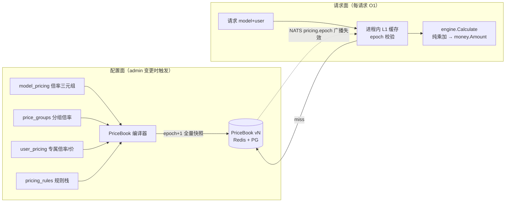
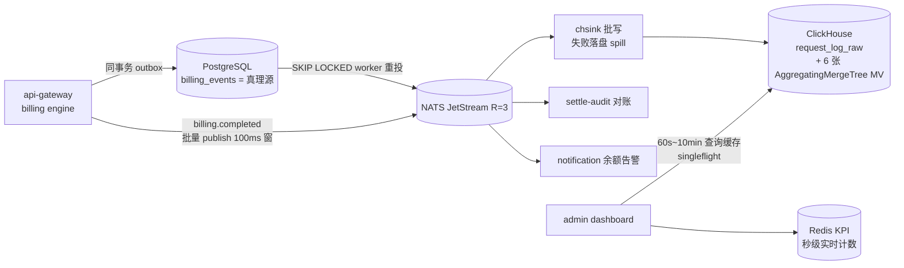
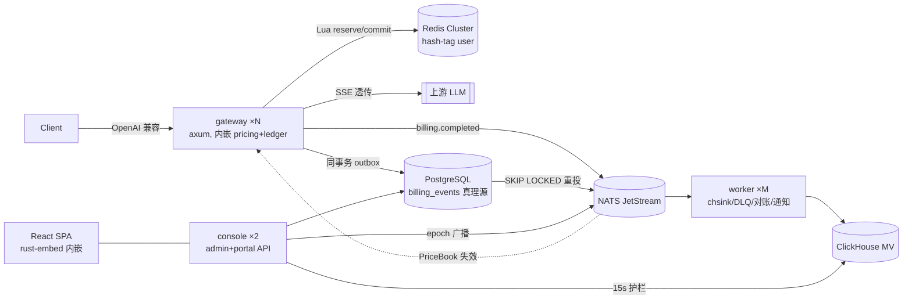

# Okapi（ok-api v2）重构设计：倍率计费模型 + 高并发计费统计架构

> 状态：调研 + 设计稿（2026-08-29）
> 前身：[qiaojinxia/ok-api](https://github.com/qiaojinxia/ok-api)
> 调研来源：[new-api 倍率设置文档](https://www.newapi.ai/zh/docs/guide/console/settings/rate-settings)、
> [new-api relay/helper/price.go](https://github.com/QuantumNous/new-api/blob/main/relay/helper/price.go)、
> ok-api `OK_API_SYSTEM_DESIGN.md` / `internal/billing/README.md` / `docs/adr/scale-architecture-500m.md`

## 0. 结论速览

1. **计费对外视图切换为行业通用的"倍率制"**（模型倍率 / 补全倍率 / 分组倍率，与 new-api 公式对齐、配置可直接互导），**内部记账保持 ok-api 现有的强类型金额制**（micro-USD 整数），两者只是同一价格的两种视图，换算关系固定。
2. **现有计费流水线资产全部保留**：billing-core Pipeline（预扣/Commit/Refund）、`billing_events_v2` 事件溯源、outbox、DLQ、chsink → ClickHouse。重构的是**定价域（pricing）**，不是记账域（ledger）。
3. **现有灵活性（用户专属定价、折扣/加价/量级/时段规则叠加）保留**，重新定义为倍率公式之后的"修饰器栈（modifier stack）"，每一步落审计快照。
4. 千万级/日的计费统计在现架构容量之内（ok-api ADR 已按 5 亿/天设计）；本次重构顺带做三件性能事：**定价解析编译缓存**、**Redis 预扣/结算 Lua 合并**、**Redis Cluster 分片预留**。
5. 命名推荐 **Okapi**（霍加狓），品牌延续 ok-api，详见 §7。
6. 后端可选 **Rust 重写**（§8）：7 微服务合并为 3 角色（gateway/console/worker），单二进制多角色；前端 React SPA + shadcn/ui，构建产物嵌入二进制单文件部署（§9）。
7. **配套文档**：实施定案、里程碑与验收见 [IMPLEMENTATION.md](IMPLEMENTATION.md)；存储层全量 schema 与契约见 [docs/database.md](docs/database.md)（本文 §4 为定价域示意）。

---

## 1. 调研：new-api 的计费模式（行业事实标准）

new-api（及其上游 one-api、衍生的 one-hub/done-hub 等）已经把"倍率"变成了中转站行业的价格语言——站长和用户都用"这个站 gpt-4o 倍率多少"来沟通价格。核心机制：

### 1.1 配额（quota）体系

- 内部记账单位是整数 quota，**$1 = 500,000 quota**（`QuotaPerUnit`）。
- 倍率基准：**倍率 1.0 = $0.002 / 1K tokens = $2 / 1M tokens**（1 token × 倍率1 = 1 quota）。

### 1.2 三层倍率公式（按 token 计费）

```
配额消耗 = (输入tokens + 输出tokens × 补全倍率) × 模型倍率 × 分组倍率
```

| 倍率 | 作用域 | 含义 |
| --- | --- | --- |
| 模型倍率 ModelRatio | 模型 | 相对基准单价（$2/1M input）的倍数，反映模型成本差异 |
| 补全倍率 CompletionRatio | 模型 | 输出 token 相对输入 token 的倍数（如 GPT-4o 为 4） |
| 分组倍率 GroupRatio | 用户组 | 分组差异化定价（default/vip/svip…） |

优先级：**用户专属倍率 > 分组倍率 > 默认倍率（1.0）**。

### 1.3 其他计费形态

| 形态 | 公式 / 机制 |
| --- | --- |
| 按次计费 | `模型固定价格 × 分组倍率 × 500,000`（quota） |
| 缓存 token | 缓存命中部分按 `CacheRatio` 打折（如 0.25/0.5） |
| 图像 | `ImagePriceRatio` 修正固定价 |
| 阶梯计费 | `billing_expr` 表达式（$/1M 价格表达式 → quota），按 token 区间分段 |
| 免费模型 | 模型倍率/固定价为 0 或分组倍率为 0 → 免预扣 |

### 1.4 两阶段扣费

1. **预消费**：请求前按预估 tokens × 倍率预扣 quota；
2. **结算**：上游返回真实 usage 后按实际 tokens 重算，多退少补。

与 ok-api 现有 reservation（预占）→ Commit/Refund 模型同构，**这一块两边思路一致，无需改**。

---

## 2. 现状盘点：ok-api 的计费模型

### 2.1 现有定价结构（绝对价格制）

```
最终价格 = 基础费用 × 用户倍率 × 负载系数 − 折扣
基础费用 = input_price × 输入tokens + output_price × 输出tokens   （$/1K，绝对美元价）
```

| 层 | 载体 | 说明 |
| --- | --- | --- |
| 模型基础价 | `models.input_price / output_price / request_price / image_price / audio_price / cached_*` | 6 种 pricing_type：token/request/time/hybrid/image/audio |
| 用户专属价 | `user_pricing`（user × model 覆盖价，优先级最高） | 完全替换模型基础价 |
| 用户倍率 | `users.price_multiplier`、子账户 `price_multiplier` | 0.8 = 八折 |
| 规则叠加 | `pricing_rules`：base/discount/surge/volume/time_based | 夜间折扣、量级折扣、加价等 |

### 2.2 与 new-api 的差异

| 维度 | new-api | ok-api 现状 | 结论 |
| --- | --- | --- | --- |
| 价格表达 | 倍率（行业习惯） | 绝对美元价 | **改**：倍率为主视图 |
| 记账单位 | int quota（$1=500k，精度 $2e-6） | `money.Amount` 6 位小数（精度 $1e-6） | **保留金额制**，精度更高且天然对齐美元 |
| 输出定价 | 补全倍率（相对输入） | 独立 output_price | 改为补全倍率，换算无损 |
| 分组定价 | 分组倍率 | 无分组概念（只有用户倍率） | **新增用户分组** |
| 用户专属 | 用户专属倍率 | user_pricing 专属绝对价 | 保留，统一表达为"专属倍率或专属价" |
| 规则引擎 | 无（只有倍率乘法） | 5 类规则可叠加 | **保留**，ok-api 的差异化优势 |
| 阶梯计费 | billing_expr 表达式 | 无 | 借鉴，纳入规则栈 |
| 记账链路 | 直接 UPDATE 余额 | 事件溯源 + outbox + DLQ + CH | **保留 ok-api**，明显更强 |

### 2.3 保留的资产（不重写）

- `internal/billing/` 全套：`money/`（强类型金额）、`tokens/`、`state/`（状态机）、`core/`（Pipeline 唯一入口）、`eventstore/`、`chsink/`、`dlq/`、`projector/`；
- 同步路径 Redis 预扣 / Commit / KPI，异步路径 NATS JetStream → ClickHouse 6 张 AggregatingMergeTree MV；
- 500M/天 扩容 ADR 的存储分层与 MV 矩阵设计。

> 若采用 §8 的 Rust 重写方案，本节"保留"指**协议、语义与黑盒资产**保留：pytest API parity 套件、
> SQL migration / CH schema、Redis Lua 脚本、K8s/compose 编排全部语言无关可直接复用；
> Go 代码本身按 §8.3 的 crate 映射做语义移植。

---

## 3. 目标计费模型 v3：倍率为视图，金额为真理

### 3.1 设计原则

1. **单一真理源**：模型定价的真理源是倍率组（model_ratio / completion_ratio / cache_ratio / cache_write_ratio），绝对价格（$/1M）是派生视图，管理后台双向换算展示、双向可编辑（编辑任一侧，落库为倍率）。
2. **记账不变**：`engine.Calculate` 的输出仍是 `money.Amount`（micro-USD int64）；quota 视图 = USD × 500,000，仅用于对外展示/导出兼容 new-api 生态。
3. **解析与计算分离**：请求路径上只做 O(1) 的"已编译价格表"查找 + 纯乘加运算；所有规则匹配、优先级仲裁在配置变更时离线编译完成。
4. **每笔账可解释**：计费记录携带 pricing_snapshot（命中的倍率、分组、规则链、每步乘数），审计可回放。

### 3.2 统一计费公式

```
基准价 base_unit = $2 / 1M tokens（与 new-api/one-api 对齐）

token 费用 = base_unit × model_ratio
           × ( prompt_uncached                              ← 常规文本输入（五段互斥）
             + cached_tokens          × cache_ratio         ← 缓存读取（命中折扣）
             + cache_write_tokens     × cache_write_ratio   ← 缓存写入（创建加价）
             + audio_prompt_tokens    × audio_ratio         ← 音频输入（官方 16×）
             + image_prompt_tokens    × image_ratio         ← 图片输入
             + text_completion        × completion_ratio    ← 文本输出（两段互斥）
             + audio_completion_tokens× audio_out_ratio )   ← 音频输出（见下）
           × group_ratio
           × user_multiplier
           × Π rule_modifier_i        ← 规则修饰器栈（可为空）

其中 audio_out_ratio = audio_ratio × audio_completion_ratio（与 new-api 同语义：
音频输出相对音频输入再乘一档）；**但两轴均未配置（都是 1.0）时回落为 completion_ratio**
——否则文本输出按 completion_ratio（如 4×）而音频输出按 1× 计，会把既有音频输出
悄悄打折，与"模态轴缺省应零影响"的约定相悖（回归断言见 parity.rs
`openai_audio_official_pricing_parity`）。

按次费用   = per_call_price × group_ratio × user_multiplier × Π rule_modifier_i
媒体/时长  = media_price × 数量 × group_ratio × …（同上）
阶梯       = tier_expr(tokens) 求得 $/1M 后代入上式的 model_ratio 位置
```

倍率与绝对价换算（无损、双向）：

```
model_ratio            = input_price_per_1M / 2
completion_ratio       = output_price_per_1M / input_price_per_1M
cache_ratio            = cache_read_price  / input_price
cache_write_ratio      = cache_write_price / input_price
audio_ratio            = audio_input_price / input_price
audio_completion_ratio = audio_output_price / audio_input_price
image_ratio            = image_input_price / input_price
例：GPT-4o            $2.5/$10 per 1M  →  model_ratio=1.25, completion_ratio=4
例：claude-3-5-sonnet $3/$15，缓存读 $0.3、写 $3.75
    →  model_ratio=1.5, completion_ratio=5, cache_ratio=0.1, cache_write_ratio=1.25
```

**模态分轴（多模态模型的必需项）**：多模态模型各模态**不同价**。以
gpt-4o-audio-preview 官方价为例（text in $2.5/1M、text out $10/1M、audio in $40/1M、
audio out $80/1M）：反解得 model_ratio=1.25、completion_ratio=4、audio_ratio=16、
audio_completion_ratio=2。若不分轴而全按文本计，实测该场景漏收约 **80%**。

**维度交叉的近似**：OpenAI 语义中"缓存"与"模态"是交叉维度（一段音频也可能被缓存命中），
而计费需要互斥分段。本实现按互斥处理——音频/图片段先从 prompt 扣除，剩余再分
常规/缓存读/缓存写。依据是当前各家缓存均只作用于文本（Anthropic cache_control 仅接受
文本块、OpenAI 隐式缓存按文本前缀命中），交叉部分实测为 0；若未来上游开放多模态缓存，
需改为二维矩阵定价并同步本节。

**prompt 三段互斥（不可省的一段）**：`prompt_tokens` = 常规 + 缓存读 + 缓存写，
`prompt_uncached = prompt − cached − cache_write`。缓存读打折（Anthropic 0.1×）与缓存写加价
（1.25×@5m TTL / 2.0×@1h）方向相反，**必须分轴**：只有单一 cache_ratio 时，写入段会被混入常规
输入按 1.0× 计 —— 对 claude 缓存写入场景每笔漏收约 20%（回归断言见
`crates/okapi-pricing/tests/parity.rs::anthropic_cache_write_is_billed_as_separate_segment`）。
`cache_write_ratio` 缺省 1.0 = 退化为旧行为，故对无缓存写入概念的 provider（OpenAI 隐式缓存、
Gemini 显式缓存走独立 API 计费）无副作用。

### 3.3 定价解析管线（配置时编译，请求时查表）



- **PriceBook**：`(model, group) → 已编译费率行`（micro-USD/token 定点数），用户级覆盖单独一张小表；带全局单调 `pricing_epoch`。
- 运行期动态因素的处理：
  - `time_based`（时段折扣）：编译为带生效时间窗的修饰器，请求时本地时钟比较，零 IO；
  - `volume`（量级折扣）：用户月用量走现有 Redis KPI 计数器，请求时一次读缓存值与预编译阈值比较；跨过阈值不需要重编译；
  - `surge`（负载加价）：网关本地负载指标，本地判断。
- 失效路径：admin 保存 → 事务内 epoch+1 并写 PriceBook 快照 → NATS 广播 → 各实例 L1 失效重拉。广播丢失兜底：L1 每 30s 对 epoch 做一次轻量校验。

### 3.4 优先级与规则栈（保留现有灵活性）

解析顺序固定、可审计：

```
1. 模型倍率三元组          （model_pricing，真理源）
2. 用户专属覆盖            （user_pricing：专属倍率 或 专属绝对价 → 内部统一转倍率）
3. 分组倍率                （用户所属 price_group；未分组 = default 1.0）
4. 用户/子账户 multiplier   （users.price_multiplier，保留）
4.5 service_tier 档位修饰（Sub2API 对齐）：有效 model_ratio = model_ratio × tier_ratio(结算档)。
    tier_ratio 配置在 model_pricing.tier_ratios（JSONB，如 {"flex":"0.5","priority":"2.0"}；NULL=全档 1.0）；
    结算档 = 请求声明档与上游响应报告档中倍率较低者（**只降不升**：不为未享受的档位付费，也不因上游擅自
    升档而多收）；未配置档位名按 1.0。快照记录 service_tier 与 tier_ratio（账单可解释）。
5. 规则修饰器栈             （按 rule_type 固定序 volume → time_based → discount → surge，
                            同类按 priority、rule_code 排序；每步输出乘数或增量，写入快照）
   四类规则的触发输入：volume 读 Redis `tok:{uid}:<yyyymm>`（本月累计 token，结算后累加）；
   time_based 读站点本地分钟窗；discount 无条件；surge 读单 gateway 进程在途计费请求数与
   `settings.surge_inflight_threshold` 比较（缺省 0 = 永不触发）。volume 与 surge 的输入采集
   均由价簿内是否存在该类启用规则门控，无规则时热路径不产生任何额外读取。
```

pricing_snapshot（存入 billing_records，jsonb）示例：

```json
{
  "epoch": 1042,
  "model_ratio": 1.25, "completion_ratio": 4, "cache_ratio": 0.5,
  "cache_write_ratio": 1.25, "audio_ratio": 16, "audio_completion_ratio": 2,
  "group": "vip", "group_ratio": 0.9,
  "user_multiplier": 1.0,
  "rules": [
    {"code": "night-discount", "type": "time_based", "multiplier": 0.8}
  ],
  "final_unit_price_input_per_1m_usd": 1.8
}
```

### 3.5 生态兼容

- **导入**：支持直接粘贴 new-api / one-api 的 ModelRatio / CompletionRatio / CreateCacheRatio / GroupRatio JSON，一键生成 model_pricing（老站迁移零成本；`create_cache_ratio` 键映射到本站 `cache_write_ratio`）。
- **导出/展示**：用户端价格页同时展示 倍率 与 $/1M 两列；`/api/pricing` 端点输出 new-api 兼容格式，便于聚合比价工具收录。
- **quota 视图**：用户余额展示可切换 USD / quota（×500,000），记账仍是 micro-USD。

---

## 4. 数据模型（定价域 v3）

> 本节为定价域示意；全量 DDL、索引与分区以 [docs/database.md](docs/database.md) 为准。

```
model_pricing                    -- 真理源：倍率制
  model_id            PK/FK
  pricing_mode        enum: ratio | per_call | tiered | media | time
  model_ratio         decimal(12,6)      -- 倍率 1.0 = $2/1M input
  completion_ratio    decimal(12,6)      -- 默认 1
  cache_ratio         decimal(6,4)       -- 缓存读取；默认 1（无缓存优惠）
  cache_write_ratio   decimal(6,4)       -- 缓存写入；默认 1（= 按常规输入计）
  audio_ratio         decimal(12,6)      -- 音频输入（相对文本；gpt-4o-audio = 16）
  audio_completion_ratio decimal(12,6)   -- 音频输出（叠乘在 audio_ratio 之上 = 2）
  image_ratio         decimal(12,6)      -- 图片输入（相对文本）
  per_call_price_micro bigint            -- micro-USD/次（per_call 模式）
  tier_expr           text               -- 阶梯表达式（tiered 模式）
  media_prices        jsonb              -- image/audio/video 单价
  effective_from      timestamptz        -- 支持定价生效时间（价格调整预告）

price_groups                     -- 新增：用户分组倍率
  group_code          PK（default/vip/svip/enterprise…）
  group_ratio         decimal(6,4)
  description, is_default

user_groups                      -- 新增：user ↔ price_groups 多对多
  user_id + group_code PK
  priority            int                -- 定价取优先级最高组；渠道可见性取并集
users.price_multiplier                    -- 保留（个人级微调）

user_pricing                     -- 保留：用户×模型专属（最高优先级）
  user_id + model_id  UK
  override_kind       enum: ratio | absolute
  custom_model_ratio / custom_completion_ratio        -- ratio 模式
  custom_input_price / custom_output_price（$/1M）    -- absolute 模式（落库时同步换算 ratio）
  reason, expires_at

pricing_rules                    -- 保留：修饰器栈
  rule_code PK, rule_type enum(volume|time_based|discount|surge)
  scope        jsonb   -- 作用域：全局/分组/模型/用户 选择器
  params       jsonb   -- {"threshold":1e6,"discount_rate":0.1} 等
  priority, enabled, valid_from/valid_to

pricing_epochs                   -- PriceBook 版本
  epoch bigserial, published_at, published_by, diff_summary jsonb

billing_records                  -- 已有表，新增
  + pricing_snapshot  jsonb
  + pricing_epoch     bigint
```

迁移：写一次性 converter，把现有 `models.input_price/output_price/cached_*` 换算为倍率三元组灌入 `model_pricing`；老列保留只读一个版本周期后下线。

---

## 5. 高并发计费统计架构（千万级/日，向亿级平滑扩展）

### 5.1 容量定位

| 量级 | 平均 QPS | 峰值 QPS（×8） | 结论 |
| --- | --- | --- | --- |
| 1000 万/天 | ~116 | ~1,000 | 单体/小集群即可，现架构裕量巨大 |
| 1 亿/天 | ~1,160 | ~9,000 | 现微服务架构 + 单 Redis 已接近上限（16k QPS） |
| 5 亿/天 | ~5,800 | ~46,000 | 需 Redis Cluster + gateway 水平扩容（ADR 已有方案） |

> ok-api 现有瓶颈公式：Redis 单节点 80k ops/s ÷ 每请求 5 次操作 ≈ 16k QPS。
> 本次重构把"每请求 5 次 Redis 操作"压到 2 次（见 5.2），单节点上限即提升到 ~40k QPS；
> 再配合 Redis Cluster 按 user_id hash-tag 分片，容量线性扩展。

### 5.2 同步路径（毫秒级，决定用户体验）

```
Client → api-gateway（内嵌 billing engine）
  1. 鉴权 + 限流 + PriceBook L1 查表          （进程内，0 IO）
  2. Lua-1 预扣：EVALSHA reserve(user, est)   （余额检查+预占+TPM 计数，原子）
  3. → proxy-service → 上游 LLM（SSE 透传）
  4. Lua-2 结算：EVALSHA commit(user, actual) （多退少补，原子；KPI 走同连接 pipeline）
  5. PG 事务：billing_records + billing_events + outbox（同事务）
```

变化点（相对现状）：

- 5 次散装 Redis 操作合并为 **2 个 Lua 脚本**（reserve / commit），减少 RTT 与竞态窗口；
- 定价解析从"每请求查规则表"变为"查 L1 编译价格表"，规则引擎脱离热路径；
- 余额 key 采用 `{user_id}` hash-tag，为 Redis Cluster 分片预留（单机模式无感）。

### 5.3 异步路径（1–3 秒新鲜度，承载千万级统计）



- 事件量 = 请求量（千万级/天 ≈ 峰值 ~1k msg/s），JetStream 与 CH async_insert 轻松承载；亿级时靠 chsink 批量参数（batch 5000 / flush 1s）与 CH 分片；
- 统计三档新鲜度（沿用 ADR）：Redis KPI 秒级 → CH MV 1-3s → CH 明细 ad-hoc（15s 超时护栏）；
- 对账三方不变：Redis 余额 ↔ PG 事件流 ↔ CH 汇总，reconciler 周期巡检。

### 5.4 微服务拓扑（沿用 7 服务，职责微调）

| 服务 | 变化 |
| --- | --- |
| api-gateway | 不变：内嵌 billing engine（同步路径低延迟的关键决策，保留）；新增 PriceBook L1 |
| billing-service | 继续跑 chsink / 对账 / DLQ / 计费 gRPC；**新增 PriceBook 编译器 + epoch 发布** |
| admin-service | 定价 CRUD 改为倍率制双视图；新增 new-api 配置导入/导出 |
| proxy/auth/user/notification | 不变 |

单体模式（monolith）继续保留同构入口，部署形态矩阵（BT 单机 → Compose 多机 → K8s）沿用 ADR 方案 A–D。

---

## 6. 实施路线

> 本节为**老 Go 仓库就地改造**的备选路线；Rust 全新实现的正式里程碑（M0–M4 与验收）以 [IMPLEMENTATION.md](IMPLEMENTATION.md) §13 为准。

| 阶段 | 内容 | 验收 |
| --- | --- | --- |
| P0 定价域 | model_pricing/price_groups/pricing_epoch 表 + 换算 converter + PriceBook 编译器 + L1 缓存 | 新老引擎双跑，pytest 计费 parity 套件（现有 `--scope p0`）分差为 0 |
| P1 规则栈 | pricing_rules 迁入修饰器栈 + pricing_snapshot 落库 | pricing_stacking 用例全绿；每笔账可回放 |
| P2 热路径 | reserve/commit Lua 合并、批量 publish、hash-tag 分片 key | 压测：单 Redis 峰值 QPS ≥ 2.5 倍现状 |
| P3 生态 | 倍率双视图 UI、new-api JSON 导入导出、/api/pricing 兼容端点 | 用 new-api 官方 ratio 配置一键导入成功 |
| P4 清理 | 老价格列下线、旧计费公式代码删除 | guard 脚本 + CI 拦截旧路径 |

回滚策略：P0–P1 期间新老引擎同进程双算（新引擎影子记账），对账差异告警为零后再切正式，随时可回退到老引擎。

---

## 7. 命名

推荐：**Okapi**（folder：`okapi`，Go module：`github.com/qiaojinxia/okapi`）

- ok-api 去掉连字符即是 okapi，品牌无缝延续，老用户零认知成本；
- okapi = 霍加狓，真实动物（长颈鹿科、腿部条纹），有现成吉祥物/logo 题材，"条纹"还暗合"倍率分层"的视觉隐喻；
- 简短、可读、可作 CLI 名（`okapi serve`）。
- 注意：FOLIO 项目（图书馆领域）有同名网关、Okapi Framework 是本地化工具，均为不同领域，冲突风险低；GitHub 仓库名 `qiaojinxia/okapi` 可用即可。

备选：

| 名字 | 理由 | 顾虑 |
| --- | --- | --- |
| Tollgate | 收费站 = 网关 + 计费双关 | 中文社区不直观 |
| RelayKit | 直白表达中转 | 平淡，one-api 系命名俗套 |
| 保持 ok-api | 零迁移成本，文件夹改回 `ok-api` | 放弃品牌升级机会 |

> 当前工作区文件夹为 `o-api`，确定名字后建议直接改名为 `okapi`（在 IDE 外执行 `mv ~/o-api ~/okapi` 后重新打开工作区）。

---

## 8. 后端技术栈选型：Rust 方案

### 8.1 结论：适合，但要认清买到什么、付出什么

**2026 年的生产先例已充分**：TensorZero（Rust + axum + ClickHouse，与本项目架构选型几乎同构，实测 10k QPS 下网关自身 P99 开销 <1ms）、Helicone AI Gateway（Rust + axum，约 15MB 二进制 / 64MB 内存跑 3k RPS）、Cloudflare Pingora。Rust 做 LLM 网关已过验证期，不是冒险。

**买到的**：

| 收益 | 说明 |
| --- | --- |
| 长连接密度 | SSE 流式代理是本项目主要资源形态。无 GC、每连接内存小，单节点可稳定持有 10 万级并发 SSE（现 Go proxy HPA max=20 全集群才 15-25k in-flight） |
| 尾延迟 | 无 GC 停顿，网关自身开销 P99 可压到 1-2ms 内，SSE 首字节更稳 |
| 计费正确性 | i64 micro-USD newtype + enum 状态机在**编译期**封死"裸 float 进计费路径""非法状态转移"——现 Go 仓库靠 guard 脚本 + CI 拦的问题变成编译错误 |
| 部署足迹 | 静态单二进制 ~20MB，嵌前端后仍 <50MB，比 7 个 Go 镜像 + Consul 轻一个量级 |
| 产品差异化 | new-api 系全是 Go；"Rust 高性能网关"在中转站圈是可感知的卖点 |

**付出的**：

| 成本 | 缓解 |
| --- | --- |
| 前期开发速度约为 Go 的 1/2–2/3（async Rust 曲线、tower 中间件泛型） | 范围收敛：M1 只做 chat completions 最小闭环 |
| provider 适配器要自己写（Go 有 one-api 系海量参考实现可抄） | 参考 async-openai / TensorZero 适配层；逻辑照抄老仓库 Go 实现 |
| 145 commits 的 Go 代码不能直接复用 | **黑盒资产全部保留**：pytest parity 套件、SQL migration、CH schema、Lua 脚本、编排文件，全部语言无关，直接做新实现的验收标准 |
| 协作者门槛更高 | 单人/小团队影响有限 |

**判断标准**：目标是"几周内在老仓库上线倍率计费"→ 留 Go，直接实施 §1–6；全新仓库、把性能作为产品卖点、接受 1.5–2 倍前期投入 → Rust 值得。**不建议 Go/Rust 混合**（双工具链的运维与心智成本超过收益，Rust 完全胜任控制面 CRUD）。

### 8.2 服务拓扑：7 微服务 → 3 角色

Rust 单节点能力强，不再需要按功能拆小服务来腾资源；拆分维度改为**故障域 + 发布节奏**：

| 角色 | 职责 | 吸收原服务 | 扩缩容 |
| --- | --- | --- | --- |
| **gateway**（数据面） | 鉴权、限流、预扣/结算、路由、SSE 透传、KPI 计数 | api-gateway + proxy-service | 按连接数/CPU HPA，无状态 |
| **console**（控制面） | 管理后台 + 用户门户 API、JWT/OAuth、定价 CRUD、PriceBook 编译发布 | admin + auth + user-service | 2 副本足够 |
| **worker**（异步面） | chsink→CH、outbox relay、DLQ、对账 reconciler、通知 | billing + notification-service | 按 JetStream consumer 分区 |

关键简化：

- **热路径零跨服务调用**：鉴权走 Redis 缓存 + 本地 JWT 验签，定价走进程内 PriceBook，gateway 每请求只碰 Redis 和上游 LLM；
- 服务间无常驻 gRPC 依赖（控制面 → 数据面通过 PG + NATS epoch 广播通信），**Consul 直接砍掉**（K8s DNS / 静态配置）；
- **单二进制多角色**：`okapi all`（单机模式，对齐现 monolith 哲学）/ `okapi gateway|console|worker`（分布式），部署形态矩阵沿用 ADR 方案 A–D。



### 8.3 Cargo workspace 布局

```
okapi/
├── crates/
│   ├── okapi-domain     # money（i64 microUSD newtype，禁 float）/ tokens / 计费状态机（enum + 穷举转移）
│   ├── okapi-pricing    # PriceBook 编译器 + ArcSwap L1 缓存 + epoch 订阅
│   ├── okapi-ledger     # Redis Lua 预扣/结算 + PG 事件溯源 append + outbox（对应现 billing-core Pipeline）
│   ├── okapi-providers  # Provider trait + openai/claude/gemini/deepseek SSE 适配器
│   ├── okapi-store      # sqlx(PG) / fred(Redis) / clickhouse / async-nats 薄封装
│   └── okapi-api        # OpenAI 兼容 DTO（serde）+ utoipa OpenAPI 文档
├── bins/okapi           # 单二进制多角色入口（clap 子命令）
└── frontend/            # React SPA，构建产物 rust-embed 进二进制
```

### 8.4 crate 选型

| 用途 | 选型 | 理由 |
| --- | --- | --- |
| HTTP 服务 | axum + tower + hyper 1.x（rustls） | TensorZero / Helicone 同款，中间件生态最全 |
| 上游客户端 | reqwest 流式（HTTP/2 连接池） | SSE 透传、超时/重试分层控制 |
| Redis | fred | cluster / pipeline / Lua 脚本缓存支持最好 |
| PostgreSQL | sqlx | 编译期 SQL 校验，契合现有 fail-fast 文化 |
| ClickHouse | clickhouse crate | RowBinary 批写 + async_insert |
| 消息 | async-nats | 官方维护，JetStream 完整支持 |
| token 计数 | tiktoken-rs | — |
| 配置热切换 | arc-swap（PriceBook）+ moka（TTL 缓存） | 读路径无锁 |
| 限流 | governor（本地兜底）+ Redis GCRA（全局） | 对齐现有两级限流 |
| 可观测 | tracing + OTLP + metrics-exporter-prometheus | 对齐现有 Jaeger/Prom |
| 金额 | 自研 i64 micro-USD newtype；rust_decimal 仅展示层 | 计费路径禁浮点，编译期保证 |

### 8.5 分布式关键设计（语言无关部分沿用 §5）

- **优雅下线**：SIGTERM → 停接新请求 → 在途 SSE 排水（上限 5min）→ flush CH/PG 批写 → 退出；
- **PriceBook 热更新**：console 发布 epoch → NATS 广播 → gateway ArcSwap 原子替换指针，读路径零锁零 IO；
- **背压**：JetStream max_ack_pending + chsink 失败 spill 落盘重放（沿用现设计）；
- **演进路径**：单机 `okapi all` + compose → 上量后 gateway 先独立水平扩 → console/worker 再拆，任一阶段不改代码只改部署。

### 8.6 Rust 实施里程碑（验收标准与 §6 相同）

> 已在 [IMPLEMENTATION.md](IMPLEMENTATION.md) §13 展开为 M0–M4 并细化验收，以该文档为准。

| 里程碑 | 内容 | 验收 |
| --- | --- | --- |
| M0 | okapi-domain + okapi-pricing 纯逻辑 crate | property test + 与 new-api 公式对拍（同输入同输出） |
| M1 | gateway 最小闭环：/v1/chat/completions（流式+非流式）+ API key 鉴权 + 预扣/结算 + PG 记账 | 老仓库 pytest p0 parity 套件直接打新服务，全绿 |
| M2 | worker（outbox/chsink/DLQ/对账）+ console 定价 CRUD + PriceBook 发布 | p1 套件 + 三方对账零差异 |
| M3 | 多 provider / image / audio / embeddings + 前端门户 | 全量 pytest + 压测报告（对标 §5.1 容量表） |

---

## 9. 前端设计

### 9.1 调研：中转站都在用什么 UI（2026-08 实测各仓库依赖）

| 流派 | 代表 | 星数 / 活跃度 | 实际 UI 栈（读自 web/package.json） |
| --- | --- | --- | --- |
| **new-api 官方新版**（行业默认） | QuantumNous/new-api | 46.7k，日更 | React + **Tailwind + shadcn 系**（Base UI、cva、cmdk、sonner、vaul、lucide）+ TanStack Router/Query/Table/Virtual + Recharts/VChart + @lobehub/icons + 多主题系统（default / classic / zr 科技风） |
| 老版保守魔改 | Veloera/Veloera | 1.6k | Semi Design（沿用旧版 new-api UI + 自定义 semi 主题），自称"原汁原味 New API 体验" |
| one-hub 系 | MartialBE/one-hub 2.9k、deanxv/done-hub 0.8k | done-hub 活跃 | MUI（Material UI）Berry 后台模板风 |
| 闭源高颜值 | VoAPI/VoAPI | 1.1k | **闭源**（仓库只有 docker 编排 + main.go），社区公认"最好看"，实时 RPM/TPM 看板 + 自定义 SEO/主题色/全局样式，Pro 商业版 |
| 周边工具 | tbphp/gpt-load | 6.3k，活跃 | Vue 3 + Naive UI |
| 社区自制美化 | openclaw-new-ui 等 | — | Next.js + Tailwind + shadcn + 玻璃拟态（Glassmorphism） |

三条结论：

1. **行业审美的默认基准就是 new-api**，而 new-api 官方已经自己完成了 Semi Design → Tailwind + shadcn 的整体迁移，并把主题系统做成一等公民（zr 主题主打发光渐变、网格背景、玻璃态卡片的"科技 AI 风"）。"组件库默认风 → Tailwind 定制现代风"是全行业明确趋势，Semi/MUI 流派属于存量。
2. **魔改站"看起来不错"的三要素**可以归纳为：暗色科技感主题、实时图表看板（RPM/TPM/趋势）、模型厂商图标墙 + 公开价格/测速页。VoAPI 正是靠这三件套 + 精细统计做出溢价（且闭源收费）。
3. 本设计 §9.2 的选型与行业收敛点一致（等于和 new-api 新版同流派，用户零适应成本），在此基础上补齐三件套即可形成"开源里最好看"的定位：@lobehub/icons、多主题 + 站长自定义主色/SEO、实时 RPM/TPM 看板（数据源 §5 的 Redis KPI 已具备，别人要额外做，我们是白送）。

### 9.2 技术栈

| 层 | 选型 | 说明 |
| --- | --- | --- |
| 框架 | Vite + React 19 + TypeScript | 纯 SPA（自托管后台无 SSR 需求），沿用现有技术栈心智 |
| 路由/数据 | TanStack Router + TanStack Query | 类型安全路由；服务端状态缓存、自动重试 |
| UI | Tailwind CSS v4 + shadcn/ui | 现代后台风格、暗色模式默认、深度可定制 |
| 表格 | TanStack Table + 虚拟滚动 | 用量日志/账单等数据密集场景 |
| 图表 | Recharts（复杂图用 VChart） | shadcn 生态默认搭配，new-api 新版同款 |
| 模型图标 | @lobehub/icons | LLM 厂商/模型图标标准库，价格页/渠道页的视觉基础 |
| 主题 | next-themes + CSS 变量多主题 | 亮/暗 + 科技风主题；站长可自定义主色/Logo/SEO（对标 VoAPI 卖点） |
| 国际化 | i18next（中/英） | 中转站用户群双语 |
| 部署 | 构建产物经 rust-embed 嵌入 okapi 二进制 | 单文件部署（new-api 同款运维体验） |

备选已排除：Semi Design（Veloera 等老版流派沿用，new-api 官方已迁出）、MUI Berry（one-hub/done-hub 系，后台模板感重）、Ant Design Pro（与国产后台同质化严重）。

### 9.3 信息架构（用户门户 + 管理后台同一 SPA，按角色分区）

**用户侧 `/console`**：

| 页面 | 要点 |
| --- | --- |
| 概览 | 余额（USD/quota 双显）、今日消耗、7/30 天费用趋势面积图、Top 模型 |
| API Keys | 创建/限额/过期/分组绑定、用量 sparkline、一键复制 |
| 模型价格 | **倍率 + $/1M 双列**、按分组切换视角、搜索/能力标签 |
| 用量日志 | 明细表（模型/tokens/费用/耗时/状态）+ 筛选导出，行展开显示账单解释 |
| 充值/账单 | 在线充值、额度流水 |
| Playground | 聊天测试台（可选，提升粘性） |

**管理侧 `/admin`**：

| 页面 | 要点 |
| --- | --- |
| 运营仪表盘 | 实时 QPS/在途 SSE（5s 轮询 Redis KPI）、收入/成本/毛利、错误率、渠道健康红绿灯 |
| 渠道管理 | 上游 key 池、权重/优先级、熔断状态、一键测活、上游余额抓取 |
| 模型 & 定价 | 倍率三元组编辑器（**倍率 ↔ $/1M 双视图实时换算**）、new-api JSON 导入向导、定价生效时间、epoch 版本历史 diff |
| 用户 & 分组 | price_groups 分组倍率、用户余额/分组/multiplier、子账户 |
| 计费规则 | 修饰器栈可视化（拖拽排 priority）+ 规则命中模拟器 |
| 计费记录/对账 | pricing_snapshot 展开、DLQ 列表与 requeue、三方对账差异报表 |
| 系统设置 | 站点/SMTP/OAuth/默认限流 |

### 9.4 三个差异化界面（相对 new-api 的体验优势）

1. **账单解释器**：任意一笔计费记录展开为逐步算式（基准价 × 模型倍率 × 补全倍率 × 分组倍率 × 规则链 = 最终价），数据来自 pricing_snapshot，"每一分钱可解释"；
2. **定价模拟器**：管理员改倍率/规则前，输入 user + model + token 量即时预览新旧账单差异，防改错价；
3. **公开价格页**：`/pricing` 免登录页 + new-api 兼容 JSON 端点，方便聚合比价工具收录（中转站获客习惯）。
