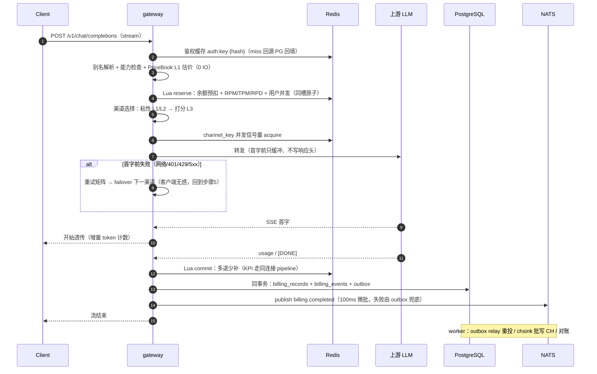

# Okapi 实施文档

> 状态：定稿 v1（2026-08-29）
> 前置阅读：[DESIGN.md](DESIGN.md)（调研结论与倍率计费模型 v3）
> 存储层唯一权威：[docs/database.md](docs/database.md)
> 本文所有「定案」为冻结决策，改动需走文档 PR 说明理由。

## 0. 文档分工

| 文档 | 内容 |
| --- | --- |
| DESIGN.md | 调研（new-api / Sub2API / UI 流派）、计费模型 v3、命名、前端设计 |
| 本文 | 选型定案、3 角色架构与时序、调度/计费/权限/MCP/i18n 实施规范、issue 吸收清单、容量与故障、M0–M4 里程碑与验收、部署附录 |
| docs/database.md | PG 全量 DDL、Redis 键空间与 Lua 契约、ClickHouse 表与 MV、NATS 拓扑 |

## 1. 选型定案

### 1.1 后端（Rust，全新实现）

| 层 | 定案 | 理由 |
| --- | --- | --- |
| 运行时/HTTP | tokio + axum + tower（hyper 1.x，rustls） | TensorZero / Helicone 同款，中间件生态最全 |
| 上游客户端 | reqwest 流式（HTTP/2 连接池） | SSE 透传，超时/重试分层控制 |
| PostgreSQL | sqlx | 编译期 SQL 校验，契合 fail-fast 文化 |
| Redis | fred | Cluster / pipeline / Lua 脚本缓存支持最好 |
| ClickHouse | clickhouse crate | RowBinary 批写 + async_insert。**M2 过渡**：自研 HTTP JSONEachRow 薄客户端（store::ch，接口已封装），官方 crate 为 M3 性能项 |
| 消息 | async-nats（JetStream） | 官方维护 |
| 金额 | 自研 i64 micro-USD newtype | 计费路径禁浮点，编译期保证；rust_decimal 仅展示层 |
| 状态机 | enum + 穷举 match | 非法状态转移变成编译错误 |
| 配置热更 | arc-swap（PriceBook）+ moka | 读路径无锁零 IO |
| token 计数 | tiktoken-rs（增量） | 流式路径 CPU 可控。**M2 过渡**：预扣估算用 chars/4 启发式（结算以上游 usage 为准），tiktoken 复核随 M3 接入 |
| 限流 | governor（本地兜底）+ Redis GCRA（全局） | 两级限流 |
| 可观测 | tracing + OTLP + metrics-exporter-prometheus | 对齐 Jaeger/Prom |
| API 文档 | utoipa | OpenAPI 自动生成 |
| 工程组织 | cargo workspace：6 crate（domain / pricing / ledger / providers / store / api）+ 单二进制 `okapi gateway\|console\|worker\|all` | 布局见 DESIGN §8.3 |

身份体系补充依赖（M3，§6.4 落地随附）：`argon2`（argon2id 密码散列）、`hmac` + `sha1`（RFC 6238 TOTP）、`aes-gcm`（TOTP 密钥信封加密）、`base32`（otpauth 编码）。支付补充依赖（M4，§11.2）：`md-5`（易支付协议签名，协议既定算法）。Realtime 补充依赖（M4，§4.4）：`tokio-tungstenite`（上游 WS 客户端）+ axum `ws` feature（入口升级）。

### 1.2 前端

Vite + React 19 + TS、TanStack Router/Query/Table、Tailwind v4 + shadcn/ui、Recharts(+VChart)、@lobehub/icons、next-themes 多主题（含科技风）、i18next、rust-embed 嵌入二进制。选型论证与信息架构见 DESIGN §9。

### 1.3 存储（定案：PG-only）

| 组件 | 角色 | 可选性 |
| --- | --- | --- |
| PostgreSQL 16+ | 唯一真理源（用户/渠道/定价/计费事件溯源 + outbox） | 必须 |
| Redis 7+ | 余额热账本（Lua reserve/commit）、限流、KPI 秒级计数 | 必须 |
| ClickHouse | 请求明细 + 聚合 MV | 可选；关闭时统计接口 fail-closed 返回 501 |
| NATS JetStream | 计费事件总线 | 分布式必须；单机 `okapi all` 可省略（outbox 由内嵌 worker SKIP LOCKED 直接消费） |

最低部署形态 = PG + Redis 两个容器 + okapi 单二进制。**不支持 MySQL/SQLite**（sqlx 编译期校验绑定单方言；new-api 系 SQLite 用户迁移走 compose 一键 PG）。

### 1.4 明确放弃项

| 放弃 | 理由 |
| --- | --- |
| Consul / 服务注册中心 | 3 角色无服务间常驻调用，K8s DNS / 静态配置足够 |
| 服务间 gRPC | 控制面→数据面通过 PG + NATS epoch 广播通信 |
| MySQL / SQLite 多方言 | 见 §1.3 |
| Semi Design / MUI | 存量流派，new-api 官方已迁出（DESIGN §9.1） |
| 统一协议中间 IR | LiteLLM 式 IR 追不上上游字段变更，按方向拆转换模块（§4.1） |
| 订阅账号转售模式 | Sub2API 商业模式踩 ToS 红线，只吸收其工程设计 |
| 跨区多活 | 单区 HA 足够，超出目标范围 |

## 2. 系统架构：3 角色

### 2.1 角色与职责

| 角色 | 职责 | 扩缩容 |
| --- | --- | --- |
| **gateway**（数据面） | 鉴权、限流、预扣/结算、渠道调度、SSE 透传、KPI 计数；热路径零跨服务调用（只碰 Redis + 上游） | 按连接数/CPU HPA，无状态 |
| **console**（控制面） | 管理后台 + 用户门户 API、定价 CRUD、PriceBook epoch 编译发布、内置 MCP 端点 | 2 副本 |
| **worker**（异步面） | outbox relay、chsink 写 CH、DLQ、对账 reconciler、通知、分区维护/过期任务 | 按 JetStream consumer 分区 |

模块图见 DESIGN §8.2。

### 2.2 一次请求的完整时序



失败分支：上游全部候选失败或空回复 → Lua refund 全额释放 → 记错误日志（log_type=错误，进 CH 可查）→ 返回标准 error_code。

### 2.3 部署形态矩阵

| 形态 | 进程 | 依赖 | 适用 |
| --- | --- | --- | --- |
| 单机 | `okapi all`（一进程含三角色） | PG + Redis（NATS/CH 可选） | 个人站长，≤千万/日裕量充足 |
| Compose 多容器 | gateway ×2 + console + worker | PG + Redis + NATS + CH | 中型站 |
| K8s | gateway HPA、console ×2、worker 按 consumer 分区 | 全量 + PG HA + Redis Cluster | 档位二/三（§12） |

任一形态间迁移只改部署不改代码。

### 2.4 控制面 → 数据面通信

- 定价发布：console 事务内 epoch+1 并写 PriceBook 快照 → NATS `pricing.epoch` 广播 → gateway ArcSwap 原子替换；广播丢失兜底：L1 每 30s 对 `pb:epoch` 轻量校验。
- 鉴权/配置失效：console 直接 DEL Redis 缓存键 + 短 TTL 兜底。
- console 宕机不影响数据面（PriceBook L1 副本继续服务）——故障隔离是 3 角色拆分的核心收益。

## 3. 渠道调度设计

### 3.1 渠道选择流水线

```
候选渠道 = 全部渠道
  → 可见性过滤（用户所属组的 group_channel_bindings 并集；严格隔离开关见 §6.3）
  → 模型过滤（channels.models ∋ canonical model）
  → 能力过滤（请求带 tools/vision/audio 时要求 channels.capabilities 支持，#4066）
  → 状态过滤（channel_keys 非 cooling/rate_limited/quota_exhausted/banned/invalid）
  → 粘性命中（L1/L2，命中直接返回该 channel_key）
  → 按 priority 分层，同层内打分取最优（L3）
```

### 3.2 三层粘性（Sub2API 吸收项 1）

| 层 | 键 | TTL | 语义 |
| --- | --- | --- | --- |
| L1 response_id 绑定 | `stick:resp:{uid}:v1:<response_id>` | 30min | Responses API 有状态续聊硬绑定；miss 返回标准「会话已过期」error_code |
| L2 session 亲和 | `stick:sess:{uid}:v1:<session_hash>` | 1h 滑动 | 会话前缀哈希 → 同 channel_key，提升上游 prompt cache 命中率（直接降低用户账单的 cache_ratio 部分） |
| L3 打分兜底 | — | — | 无粘性时进入 §3.3 |

- L2 键优先取客户端会话头（`session_id` / `x-session-id`；Responses 的 `prompt_cache_key` 随 M3 接入），缺省回退前两条消息规范化文本哈希。当前实现哈希 = SHA-256 前 8 字节（xxhash64 为 M3 性能项）。注意 Nginx 默认丢弃带下划线的请求头，部署模板须加 `underscores_in_headers on`（§14.1）。
- 键内嵌哈希算法版本号 `v1`；升级时双写双读一个 TTL 周期后下线旧版。
- 粘性目标 key 已进入不可用状态时跳过粘性、走 L3 并刷新映射。

### 3.3 打分负载均衡（L3）

```
score = w_err  × EMA(错误率)
      + w_ttft × norm(TTFT p95)
      + w_load × (在途并发 / max_concurrency)
      + w_cost × norm(渠道单位成本 upstream_unit_cost)     ← 成本感知，默认 w_cost=0（#6950）
取同优先级层内 score 最低者；权重全局可配（settings）
```

数据源：gateway 本地滑动窗口 + Redis `ch:stat:{channel_id}` 共享 EMA（5min TTL），CH `mv_channel_5min` 做事后校准展示。

### 3.4 渠道 key 状态机（Sub2API 吸收项 3）

状态：`active / cooling / rate_limited / quota_exhausted / banned / invalid`

| 触发 | 转移 | 恢复 |
| --- | --- | --- |
| 连续 N 次网络失败/5xx（N 可配，默认 3） | active → cooling（指数退避：60s×2ⁿ，封顶 2h） | 到期自动回 active（探测式恢复为 M3 项） |
| 429 | active → rate_limited（读 Retry-After，无则默认 60s） | 到期自动回 active |
| 上游配额/余额耗尽（402 或 429+insufficient_quota body） | active → quota_exhausted | 冷却到次日 0 点（UTC）自动恢复，或人工 |
| 401/403 且凭证刷新失败 | active → invalid | 仅人工（告警通知） |
| 人工封禁/上游封号标志 | → banned | 仅人工 |

状态与 `cooldown_until` 持久化在 PG `channel_keys`，运行态镜像在 Redis `ch:cool:*`；每次状态转移写 audit_logs。

### 3.5 双层并发控制

| 层 | 键 | 说明 |
| --- | --- | --- |
| 用户级 | `conc:{uid}`（并入 reserve Lua，同槽原子） | 上限 = 用户/Key 配置，超限返回 429 error_code |
| 渠道 key 级 | `conc:ck:<channel_key_id>` | 信号量 acquire/release，防单 key 被打挂；泄漏由 TTL + 对账清理 |

### 3.6 重试矩阵（#6722，全局默认 + 渠道级 `retry_policy` 覆盖）

| 错误类别 | 同 key 重试 | failover 换渠道 | 状态机动作 | 计费 |
| --- | --- | --- | --- | --- |
| 连接失败/首字前超时 | 1 次 | 是 | 计入错误率 | 不计费 |
| 401/403 | 否 | 是 | 触发凭证刷新，失败→invalid | 不计费 |
| 429 | 否 | 是 | → rate_limited | 不计费 |
| 上游配额耗尽 | 否 | 是 | → quota_exhausted | 不计费 |
| 5xx | 1 次 | 是 | 计入错误率/冷却计数 | 不计费 |
| 400 参数错误 | 否 | 否 | — | 不计费，原样转译返回 |
| 内容策略拒绝 | 否 | 可配（默认否） | — | 不计费 |
| 首字后断流 | 不可回退 | 否 | 记切换率指标 | 按已产出计费（全局开关可改为不计费） |

### 3.7 SSE 转发器行为规范（Sub2API 吸收项 2，M1 核心）

1. **首字前只缓冲**：收到上游首个内容事件前，不向客户端写状态码/响应头；此窗口内失败可无痕 failover。
2. **空回复不计费**：流结束但零内容 token → 走 refund 路径并记错误日志。
3. 心跳：透传期间每 15s 注入 `: ping` 注释帧，防中间层空闲断连。
4. 增量 token 计数（tiktoken-rs），`trust_upstream_usage=true` 的渠道跳过本地复核直接采用上游 usage（#1790-19）。
5. prompt cache 相关请求/响应头与 usage 字段（`cached_tokens` 等）**原样透传**，parity 套件含专项用例（#3389：Codex CLI 经中转 cache 失效导致费用暴涨）。
6. 客户端提前断开：取消上游请求，按已产出 usage 结算。
7. 行缓冲上限：SSE 扫描器单行缓冲设上限（默认 64MB 可配），防上游超大 base64 图像行耗尽内存。【状态：依赖 eventsource-stream 暂无上限配置，随 M3 自实现 SSE 解析时落地】
8. 请求体上限：32MB（网关不解压请求体，即为有效字节上限；超限 413），防超大体/zip bomb。【已实现】
9. **响应头白名单**（Sub2API 吸收）：【现状（最严形态）】上游响应头默认**全部剥离**，仅重建 content-type 与 SSE 语义头——上游身份/组织/rate-limit 头零泄漏（比可配白名单更严）；cache 与 usage 语义经 body 字段透传（第 5 条），upstream request-id 内录 billing_records 不透出。可配透传名单（settings.response_header_whitelist）列 backlog：现有形态未发现客户端兼容性问题前不放宽。

### 3.8 能力感知路由与成本感知权重（M3 已实现）

- **能力感知**：请求特征探测（tools 数组非空 → needs_tools；消息含图像部件 → needs_vision）；
  渠道 `capabilities` JSONB **显式 `false` 才排除**（未声明 = 放行，迁移友好；如
  `{"tools": false}` 的渠道不再接到带工具请求）。
- **成本感知权重**：同 priority 层内 `有效权重 = weight × 1000 / relative_cost_milli`
  （`channels.upstream_unit_cost.relative_cost_milli`，整数千分比，缺省 1000 = 中性；
  越便宜权重越大）。只影响层内抽样概率，不跨层；非计费路径，不碰金额语义。

## 4. providers crate 规范

### 4.1 模块组织：按方向拆文件（Sub2API 吸收项 5）

```
okapi-providers/src/
├── openai/            # 原生 OpenAI（含 Responses API）
├── anthropic/
├── gemini/
├── deepseek/          # OpenAI 兼容薄封装（兼容通道兜底一切长尾 provider）
├── custom_pass/       # 透传渠道：任意上游路径透明代理（M3，#1454）
├── convert/           # 显式方向转换函数，不做统一 IR
│   ├── openai_to_anthropic.rs
│   ├── anthropic_to_openai.rs
│   ├── openai_to_gemini.rs
│   └── responses_to_chat.rs      # Responses → ChatCompletions 降级（M3，#5209）
└── credentials/       # static_key / oauth_refresh / cloud_sts
```

### 4.2 核心 trait

```rust
#[async_trait]
pub trait Provider: Send + Sync {
    fn id(&self) -> ProviderId;
    fn capabilities(&self) -> &Capabilities;          // tools / vision / audio / cache ...
    fn count_tokens(&self, req: &ChatRequest) -> TokenEstimate;   // 预扣估算
    async fn chat(&self, req: ChatRequest, cred: Credential, cx: CallCx)
        -> Result<ChatStream, ProviderError>;         // 统一 SSE 事件流
}

#[async_trait]
pub trait CredentialProvider: Send + Sync {
    async fn get(&self, key: &ChannelKey) -> Result<Credential, CredError>;
    async fn refresh(&self, key: &ChannelKey) -> Result<Credential, CredError>;
}
```

### 4.3 凭证刷新四步锁（Sub2API 吸收项 4，多副本必需）

```
进程内锁（同实例去重）→ Redis 分布式锁 lock:cred:<key_id>（跨副本去重）
→ 加锁后 DB 重读（他副本可能已刷新）→ 刷新；invalid_grant 时二次重读做竞争恢复
```

主线只实现 static_key；OAuth refresh / cloud STS（Vertex、Azure 托管凭证）留 trait 扩展点，不做订阅型上游主线。

### 4.4 协议覆盖矩阵（2026-08 与 new-api / Sub2API README 核对）

| 端点 | 里程碑 |
| --- | --- |
| /v1/chat/completions（流式+非流式） | M1 |
| /v1/models、/v1/embeddings【已实现：prompt-only 计费 + failover】 | M2 |
| Anthropic /v1/messages（双向：入口协议 + 上游方向）【已实现：`convert/{openai_to_anthropic,anthropic_to_openai}.rs` + 原生客户端 + x-api-key 鉴权；四象限用例全绿】 | M3 |
| Gemini generateContent 方向【已实现：`gemini.rs` + `convert/openai_to_gemini.rs`（thoughts 归 reasoning、promptTokenCount 含缓存口径）】 | M3 |
| /v1/responses（含降级 ChatCompletions）【已实现：`convert/responses_to_chat.rs`，事件骨架合成 + 两跳（responses→chat→anthropic/gemini）】 | M3 |
| /v1/rerank（#1117）、图像/音频/视频（/v1/images、/v1/audio、/v1/videos/*，媒体计费） | M3【images/generations 已实现：per_call × n（n=1..10），乘数落 pricing_snapshot.media_units；rerank 已实现（Jina/Cohere 形状，prompt-only 计费，与 embeddings 共用泛化中继）；audio 已实现——**speech：输入字符数记为 prompt_tokens 走 ratio（对齐 OpenAI 按字符计价，站长把 model_ratio 配成字符价）或模型配 per_call；transcriptions：per_call 模式必须（时长无法本地解码），上游 verbose_json 的 duration 若在则记入快照供审计**；multipart 经解析重组转发（boundary 重生成，上游无感）；**videos 已实现（M4 补齐）**：POST /v1/videos 提交即 per_call × seconds 计费（缺省 4s、clamp 1..60，乘数落 pricing_snapshot.media_units；时长无法本地验证，与 transcriptions 立场一致），上游失败退款；GET /v1/videos/{id} 轮询与 /content 流式下载按创建时渠道映射回源（Redis video:task:* 48h，键含 user_id 隔离），不计费；JSON 提交，multipart input_reference 列 backlog】 | 
| custom_pass 透传【已实现，语义定案：`/pass/{channel_id}/{*path}`（任意方法）；渠道 provider=custom_pass；settings 必填 `allowed_paths`（前缀白名单，空拒绝——SSRF 第二道闸，第一道是 api_base 固定）与 `billing_model`（models 表 per_call 模型，按次预扣/结算，禁零费裸透传）；可选 `auth_header`/`auth_scheme`（缺省 Authorization: Bearer）；请求体/查询串原样，响应流式回传仅透 content-type】 | M3 |
| thinking-to-content 转换（客户端不支持 reasoning 输出时转正文）【已实现：渠道 settings.thinking_to_content，流式+非流式】 | M3 |
| reasoning effort 模型名后缀（-high/-medium/-low、-thinking、-thinking-128 预算 → 请求参数改写，接在别名解析旁）【已实现：全名直命中优先；openai→reasoning_effort / anthropic→thinking 预算（自动抬 max_tokens）/ gemini→thinkingConfig；计费落基名】 | M3 |
| OpenAI Realtime API（WebSocket 双向 + 音频 token 计费；WS 治理见 §14.4） | M4【实现定案：入口 `GET /v1/realtime?model=`（升级 WS；鉴权 Bearer 头或 `openai-insecure-api-key.<key>` 子协议）；上游 = openai 渠道 api_base 的 ws(s) 形态；**计费时机**：连接时按模型 max_output 预扣一笔，会话内逐 `response.done` 累计 usage（text+audio tokens 合并按模型倍率，audio 独立倍率列 backlog、细分进快照），断开时按累计 commit（无产出全额退款）；治理：per-key WS 连接租约（ZSET 60s 租约/20s 续期，崩溃自然滚出，docs/database.md §2.1 ws:lease:k:*）、首消息 30s、空闲 5min。四用例已验收（双向泵计费/零产出退款/限连 429/子协议鉴权）】 |
| Responses WebSocket 入口（Codex CLI 风格 WS ingress → 上游 HTTP/SSE 桥接；出口代理 WS 不稳时全局/渠道级回退 HTTP 开关；连接治理复用 §14.4） | M4 |
| 任务型异步中转（Midjourney / Suno / 异步图像/视频：submit → poll/callback → 完成时结算；端点形状对齐生态：`/v1/images/generations/async` + `/v1/images/tasks/{task_id}`） | 开放项（M4 后）；tasks 表与 worker 轮询预留见 database.md §1.8 |

不做：Dify ChatFlow 专属模式（OpenAI 兼容通道覆盖）、订阅型上游账号池（Grok OAuth / Antigravity 等，见 §1.4）。

## 5. 计费执行链

计费公式、修饰器栈、PriceBook 编译与失效见 DESIGN §3（不重复）。执行链定案：

### 5.1 关键规则

- 预扣估算 = tiktoken 估算 prompt + `max_tokens`（缺省用模型默认上限）× 补全倍率，按 PriceBook 当前 epoch 计价。
- reserve 与 commit 可能跨 epoch：**结算一律以 reserve 时刻的 epoch 快照计价**（请求内一致性），pricing_snapshot 记录 epoch。
- 余额可短暂为负（流超预估），下一笔请求在 reserve 处拒绝。
- 免费模型（model_ratio=0 或 group_ratio=0）跳过 reserve/commit，仍记 billing_records（金额 0）与统计。
- 每笔 billing_records 带 `amount / original_amount / discount / upstream_cost` 四金额列，全链路（PG + CH）一致。

### 5.2 用户心智双层（定案）

| 层 | 呈现 | 数据 |
| --- | --- | --- |
| 价格认知层 | 价格页只显示 模型倍率 / 补全倍率 ×（所在分组倍率），附 $/1M 换算列；个人 multiplier 与规则折扣**不进标价** | model_pricing + price_groups |
| 账单明细层 | 每笔展开逐步算式（账单解释器，DESIGN §9.4）；优惠行徽章；用户端聚合「本月已为你节省 Σdiscount」；站长端让利成本报表（Σdiscount by rule_code） | pricing_snapshot + discount 列 |

### 5.3 退款与调整（事件溯源自然支持，#1790-10 / #2891）

- 管理员按日志退款：`billing_events(event_type=refund, request_id, payload.reason)`，账单与统计自动一致（CH sink 消费 refund 事件冲销）。
- 批量退款：按筛选条件生成事件批。
- 额度调整打标签：`event_type=adjust, payload.tags=[compensation|goodwill|correction]`，报表按标签聚合。
- 全部经权限点 `billing.refund` / `user.balance_adjust` + audit_logs。

## 6. 角色系统与 RBAC

### 6.1 主体链与统一四件套

主体链：**User → API Key** 为基础；**Team** 层可选启用（M4：Team → Member → Key，老 ok-api 子账户并入 Team Member）。每层主体统一四件套，执行复用 Redis 分层计数器，不新增机制：

> **轻量合作商模式（M2 已实现）**：Team 层落地前，"合作商 + 员工子账户"用 *key 即子账户* 承接——合作商 = 钱包主体 user，每位员工一把独立 key（名称/限速/日 token 上限独立）；门户 `/api/me/usage` 默认 `scope=key`（员工只见自己），`scope=user` 为合作商汇总，`/api/me/keys` 按 key 分账（mv_apikey_day）。与 Team 层的差别：员工无独立登录身份、钱包不隔离。

> **Team 层（M4 已实现）**——设计定案：**team 即 user 主体**（`users.kind='team'`，无登录凭证），
> 钱包/预扣/结算/限流/统计全线复用既有 user 机制，热路径零新分支；成员是真实用户
> （`team_members`：owner/admin/member 三角色 + `monthly_spend_limit_micro`）。
> 成员在团内自助发 key：key 归属 team 用户（`api_keys.user_id = team`，扣团钱包），
> `api_keys.member_user_id` 记归属成员（分账与限额锚点）。
> **成员月度限额**：Redis 计数器 `spend:tm:{team}:{member}:{yyyymm}`（40d TTL）——
> gateway 结算 commit 后累加，reserve 前读取比较（结算后计数的软实时语义：
> 并发窗口内可能小幅超限，账不受影响，文档明示）；超限返回 `member_limit_exceeded`。
> 管理面（web session 鉴权）：`POST /api/teams`（建团+入 owner）、
> `POST /api/teams/{id}/members`（owner/admin 加人/调限额）、
> `POST /api/teams/{id}/keys`（成员给自己发 key，明文一次）、
> `GET /api/teams/{id}/usage`（按成员分账：mv_apikey_day × member 映射）。
> OIDC group→team 映射仍留后续（依赖各 IdP 的 claim 形状）。

1. 余额/预算　2. 限速（RPM/TPM/RPD、日 token 上限，#6458/#5252）　3. 模型白名单　4. 渠道可见性

### 6.2 平台 RBAC

- 内置角色：`super_admin(100) / admin(10) / user(1)`——值对齐 new-api，迁移零成本。
- admin 的能力 = 权限点集合（`admin_roles.permissions`），支持自定义子角色（渠道管理员/财务只读/客服）。
- 权限点命名：`{资源}.{动作}[.{范围}]`，范围 `own|all`（资源表带 owner_id，#6267）：

```
channel.read[.own] / channel.write[.own] / channel.test
user.manage / user.assist（代客查看与修正令牌/分组，#1790-2，强审计）/ user.balance_adjust
pricing.read / pricing.write / pricing.publish
billing.read / billing.refund
logs.read / logs.content_read（内容审计，独立授权）
settings.write / cache.flush / dlq.manage / mcp.write
role.manage（自定义角色的创建与指派；实现上强制 super_admin，防自我提权）
```

### 6.3 分组解耦（#6623 / #6977）

group 一个实体、两种绑定：

- **定价**：price_groups.group_ratio（已有）；user↔group 多对多（user_groups），**定价取优先级最高组**。
- **渠道可见性**：group_channel_bindings 矩阵，**可见性取用户所有组的并集**。
- 全局开关 `strict_group_isolation`：开 = 未绑定渠道对该组不可见（企业硬隔离）；关 = 绑定为空视为全可见（单站长零配置）。

### 6.4 身份接入矩阵

| 方式 | 里程碑 |
| --- | --- |
| 邮箱密码（argon2id）+ 邮箱验证 | M1 |
| GitHub / LinuxDO / Telegram / Discord OAuth | M3【已实现（Telegram 除外——其登录部件非标 OAuth，M4 复评）：**配置驱动通用 authorization-code 模块**（`console/oauth.rs`），内置 github/discord/linuxdo 预设（settings.oauth_providers 只填 client_id/secret），任意标准 OAuth2/OIDC 上游可自定义 authorize/token/userinfo 三 URL 接入；state 走 Redis 一次性键；首登自动注册并绑定 (provider, subject)，回调发 web session → 前端兑 key】 |
| 通用 OIDC（含 group→role/team 映射，#1106） | M3【userinfo 模式已随上覆盖；group→role/team 映射 M4 随 Team 层】 |
| TOTP 两步验证（2FA，密钥 AES-GCM 加密落库）、Turnstile 注册风控 | M3【邮箱密码+会话+TOTP 已实现；实现定案：**web session（Redis `sess:web:*`，HttpOnly cookie）只服务 `/auth/*` 自助面**——注册/登录/2FA/兑换 key；门户与数据面保持 API key 单轨（登录成功经 `/auth/keys` 兑换 key，前端仍以 key 驱动）。TOTP 密钥 AES-256-GCM 加密（`OKAPI_MASTER_KEY`），RFC 6238 HMAC-SHA1 30s 窗 ±1；Turnstile 经 settings.turnstile_secret 配置，未配置即跳过（缺省关）】 |
| LDAP（#5703）、OIDC-IdP 反向输出（#6572） | 企业阶段（M4 后） |
| 手机注册（#6207） | SMS provider trait 扩展点，不进主线 |

### 6.5 单用户模式（M1，#1105）

配置开关 `single_user_mode`：跳过注册登录、启动时自动生成 root key 打印到日志、隐藏用户管理界面。承接「纯网关」人群，M1 顺带简化联调。

release 构建下启用本模式须同时设 `OKAPI_SINGLE_USER_CONFIRM=true`（M2，Sub2API Simple Mode 同款护栏）：防生产误开——本模式 root key 进日志且无用户管理，误暴露公网代价高。

### 6.6 内容审计三态（#924 / #417）

`content_logging = off（默认）/ user_opt_in（用户自愿）/ forced（全局强制，站长须页面明示）`。内容引用落 billing_records.content_ref，读取需 `logs.content_read` 权限点。

## 7. 内置 MCP 服务（AI 远程管理）

### 7.1 形态

- console 角色内置 `/mcp` 端点：MCP Streamable HTTP（POST JSON-RPC，单响应 `application/json` 模式，spec 2025-06-18 兼容），零额外进程（对比 new-api 生态的外挂 Go 进程方案）。
- 鉴权复用 Okapi API key；工具可见性 = key 所属用户 RBAC 权限点过滤；审计 actor 记 `mcp:{key_id}`；独立限流。
- 【M3 实现注记】只读工具面以内建 JSON-RPC 处理器实现（`console/mcp.rs`，无 session/SSE——只读单发无此需求）；rmcp SDK（官方 `StreamableHttpService`）迁移在 M4 写工具引入时复评：其 service-factory 形态与我们"每请求 API key → RBAC 过滤"的注入模式需确认匹配（session 化后 per-request 鉴权上下文）。

### 7.2 精选工具面（~25 个，不做 OpenAPI 自动生成）

| 组 | 工具 | 里程碑 |
| --- | --- | --- |
| 用户级 | query_balance / query_usage / list_my_keys / list_models_pricing / **explain_bill**（吃 pricing_snapshot，AI 向用户逐笔解释账单） | M3【已实现】 |
| 管理查询 | platform_kpi / channel_health / **usage_stats**（参数化维度模板查 CH MV，不暴露裸 SQL，继承 15s/2GiB 护栏）/ search_logs / reconciliation_status / dlq_list | M3【已实现】 |
| 管理写 | channel_create / channel_update / channel_toggle / channel_test / user_adjust_balance / user_ban / **simulate_pricing → apply_pricing**（先模拟后生效）/ redemption_create / dlq_requeue / cache_flush | M4【已实现（channel_update 并入 create/toggle 语义、redemption_create 随兑换码体系顺延）：三道闸 = settings.mcp_write_enabled（默认 OFF，关时工具隐藏）+ mcp.write 权限点 + 资源权限；user_adjust_balance/user_ban/apply_pricing/dlq_requeue 均 confirm 两段式】 |
| 诊断 | diagnose（全链路健康检查，对标老仓库 make diagnose / billing-check） | M4【已实现：PG/Redis/CH/NATS 可达 + outbox 积压 + DLQ 深度 + 冷却 key 数 + PriceBook epoch】 |

### 7.3 安全三道闸

1. 写工具全局开关（默认 OFF）；2. RBAC 权限点（`mcp.write` + 对应资源权限）；3. 危险操作 dry_run/confirm 两段式。删除类操作**不经 MCP 暴露**。

远期开放项（不进主线）：MCP 服务转发/分发按次计费（per_call 计费模式天然支持）。

## 8. i18n 工程规范（定案，非可选项）

1. 全部界面文案 key 化，禁止硬编码中英文；CI lint（前端 ESLint 规则 + 后端 guard 脚本）拦截裸文案。
2. 语言包按命名空间拆文件：`locales/{lang}/{common,console,admin,pricing,errors}.json`；社区新语言 = 新增目录 + PR，不改代码。
3. 首发 zh-CN + en；默认跟随浏览器，用户偏好落库 `users.language`。
4. **后端 API 只返回 `error_code` + 参数**，由前端语言包映射；禁止后端拼接人类语言（吸取 new-api 中文错误直传国际用户的教训）。
5. 邮件/站内通知模板按用户语言双套。
6. 公开价格页/状态页同样 i18n（获客页面）+ hreflang。
7. 日期/数字/货币用 Intl + dayjs locale。

## 9. 前端实施补充（对 DESIGN §9 的增量）

- **倍率对比与合并工作台**（M3，#1790-13）：与 new-api 默认倍率表 / 上游价格 diff、选择性合并、epoch 版本历史（配合 JSON 导入）。
- client_type 看板下钻（M3，#5277）：UA 解析 Claude Code / Codex / LobeChat 等。
- 用户消耗排行榜（#1790-11）、数据保留策略配置页（#1790-1）、通知多路配置页（#1790-8）：**M4 已实现**——`/admin/ops` 运维页三卡（排行 GET /admin/leaderboard = CH mv_user_day 聚合 + PG 补用户名，7/30/90 天切换；保留策略 settings.retention_months + worker 超期分区裁剪；通知 settings.notify_channels JSON 编辑），配套 GET /admin/settings/{key} 单键回显端点。
- 仪表盘均值类指标一律 token 加权（§10）。

## 10. 统计指标字典

| 指标 | 口径 | 来源 | 展示位 |
| --- | --- | --- | --- |
| QPS / 在途 SSE | 1s 计数 / gauge | Redis KPI + Prom | 运营仪表盘 |
| RPM / TPM | 最近 60s 滑动窗 | Redis | 日志页统计条（对齐 new-api /log/stat 语义） |
| 消耗趋势 / Top 模型 | Σcost by day / model | CH mv_user_day / mv_model_hour | 用户概览 |
| 渠道错误率 | errors/requests per 5min | CH mv_channel_5min | 渠道健康红绿灯 |
| TTFT p50/p95/p99 | quantiles(ttft_ms) | CH mv_channel_5min | 渠道健康 |
| 生成速度 | Σcompletion_tokens / Σduration（**token 加权**，#5029） | CH | 模型/渠道页 |
| 粘性命中率 | sticky_layer 分布 | CH mv_channel_5min | 调度诊断 |
| 渠道切换率 | failover_count>0 占比 | CH | 调度诊断 |
| 毛利 / 让利 | Σ(amount−upstream_cost) / Σdiscount by rule | CH | 经营报表（new-api 均缺失） |
| 本月节省 | Σdiscount by user | CH mv_user_day | 用户账单页 |
| 消耗排行 Top N | Σamount by user | CH mv_user_day | 管理排行榜 |
| client_type 分布 | UA 解析列 | CH | 看板下钻 |
| 上游配额余量 | 被动采集 rate-limit 响应头 | channel_keys.quota_snapshot | 渠道页 |

## 11. Issue 吸收清单 → 设计落点

| 来源 | 吸收点 | 落点 | 里程碑 |
| --- | --- | --- | --- |
| new-api #1790-10 / #2891 | 按日志退款、批量退款、调整打标签 | billing_events refund/adjust + tags（§5.3） | M2 |
| #1790-19 | 渠道级信任上游 usage | channels.trust_upstream_usage | M1 |
| #3389 | prompt cache 透传正确性 | parity 专项用例（§3.7-5） | M1 |
| one-api #1105 | 单用户模式 | §6.5 | M1 |
| #3001 | 模型别名/通配符 + 优先级 | model_aliases | M2 |
| #6722 | 精细化重试矩阵 | §3.6 retry_policy | M2 |
| #6267 | 渠道属主与 own/all 权限 | owner_id + 权限点范围 | M2 |
| #6623 / #6977 | user↔group 多对多、严格隔离 | user_groups + group_channel_bindings（§6.3） | M2 |
| #924 / #417 | 内容记录 | 三态开关（§6.6） | M2 |
| #6458 / #5252 / #4971 | key 级 RPD/日 token 上限、按 key 统计 | api_keys 限额列 + mv_apikey_day | M2 |
| #1790-2 / #4126 | 管理员代客操作 | user.assist 权限点 + 审计 | M2 |
| #1790-7 | 缓存清理 | console + MCP cache_flush | M2 |
| #1790-1 | 日志保留策略 | CH TTL + PG 分区滚动（M2 内置，M4 界面） | M2/M4 |
| #4066 | 能力感知路由 | §3.1 能力过滤 | M3 |
| #6950 | 成本感知调度 | §3.3 w_cost | M3 |
| #1454 | 自定义透传渠道 | custom_pass | M3 |
| #5209 / #1117 | Responses 降级、rerank/embeddings | convert 模块（§4.4） | M3 |
| #5277 | client_type 识别 | CH 列（M2 预留）+ 看板 | M2/M3 |
| #1790-13 | 倍率对比合并工作台 | §9 | M3 |
| #1790-11 / #5029 | 排行榜、token 加权均值 | §10 | M3 |
| #1790-5 / #2845 / #3388 | 兑换码增强（限用户/限 IP/兑套餐）、套餐×分组 | redemption_codes + plans | M4【已实现：plans 表（grant/加组/余额有效期三语义）+ POST /admin/plans；兑换码可绑 plan_code（核销金额取 grant 覆盖面值）/bind_user_id（他人 404 防探测）/max_per_ip（Redis 批次×IP 7d 计数，预查-闸-翻转-回退时序）；套餐附带失败不回滚入账（日志人工跟进）；max_uses 多次核销列 backlog】 |
| #1790-6 | 余额有效期 | users.balance_expires_at + worker 冻结任务 | M4【已实现：worker 5min 扫描到期用户，Redis Lua 原子 drain 可用余额（在途预扣按各自路径终结）→ expire 事件（delta 负、actor=system:worker）→ 重置 NULL 幂等防重扫；console POST /admin/users/{id}/balance-expiry 设置/取消；充值不自动延期（延期策略 backlog）】 |
| #1790-8 | 通知多路 + 事件订阅矩阵 + 频率限制 | settings.notify_channels（worker/notify.rs） | M4【已实现：webhook 通道（SMTP 列 backlog 不引新依赖），事件 drift（对账差异）/channel_cooldown（冷却 key 数）/balance_low（阈值 settings.balance_low_threshold_micro，降序 20 上限），频率闸 Redis notify:mute:* SET NX per-通道×事件（缺省 300s），失败仅日志不阻主循环】 |
| #6502 | CDN trusted-header-secret | 部署附录 §14.2 | M2 |

不吸收：长尾 provider 专属渠道（OpenAI 兼容通道覆盖）、纯 UI 细节（浮动按钮等，进前端 backlog）。

### 11.1 README 功能对照新增吸收（2026-08 核对 new-api / Sub2API README）

| 功能 | 来源 | 落点 | 里程碑 |
| --- | --- | --- | --- |
| Realtime WebSocket、任务型异步中转、视频端点、thinking-to-content、reasoning 后缀 | new-api / Sub2API | §4.4 协议矩阵 | M3–M4 |
| L2 粘性优先客户端会话头 + `underscores_in_headers` 部署项 | Sub2API | §3.2 / §14.1 | M2 |
| SSE 行缓冲上限、请求体解压后上限 | new-api 环境变量 | §3.7 | M1【请求体 ✓；SSE 行缓冲随自实现解析器（backlog，见 §3.7-7 状态）】 |
| Discord OAuth、TOTP 2FA、Turnstile 注册风控 | new-api / Sub2API | §6.4 | M3 |
| 用户×模型级限流（Redis key 后缀扩展，机制复用） | new-api | database.md §2.1 | M3【已实现：settings.model_rpm_limits + rl:{uid}:m:* 分钟桶（尽力语义），60s settings 进程缓存】 |
| 上游 URL SSRF 校验（channels.api_base） | Sub2API url_allowlist | §14.4 | M2【已实现：console/MCP 写入口校验，缺省仅 https + 禁私网/环回/localhost；settings.ssrf_policy 放开内网场景；DNS rebinding 深化 backlog】 |
| 邀请返利 aff（aff_code / inviter_id + adjust 事件 tag=aff_rebate） | 行业标配（new-api / done-hub） | database.md users 列 + §5.3 | M4【已实现：GET /api/me/aff 惰性生成 8 位邀请码 + 邀请人数/累计返利；注册带 aff_code 绑定 inviter_id（无效/自邀静默忽略不阻注册）；充值核销后按 settings.aff_percent_bp（基点，缺省 0=关闭）给邀请人 credit，事件 adjust actor=system:aff；兑换码核销不返利防套利】 |
| 敏感词/内容安全中间件（可选，与 §6.6 三态联动） | one-api 系 | settings + gateway 中间件 | M4 |
| Setup 初始化向导、key 余额公开查询端点 | new-api / Sub2API | console | M3【Setup ✓；余额查询 ✓：/v1/dashboard/billing/subscription + /usage（new-api/OpenAI 生态口径，客户端差值显示剩余）】 |
| 后台一键自升级 | Sub2API | 不吸收（单二进制 + 编排升级足够，规避自改风险） | — |

### 11.2 Sub2API README 深读二次吸收（2026-08-29 核对 Wei-Shaw/sub2api）

> 深读其 README 功能/部署/安全区后的增量结论；§11.1 已列项不重复。「已覆盖」行为审计结论，防止重复调研。

| 功能 | 来源 | 落点 | 里程碑 |
| --- | --- | --- | --- |
| 上游响应头白名单过滤（防上游身份泄漏、防上游 rate-limit 头误导客户端） | Sub2API response_headers | §3.7-9 | M2 |
| CDN 客户端 IP 头名可配列表（`True-Client-IP` 等，按序取首个有效值） | Sub2API forwarded_client_ip_headers | §14.2 | M2【已实现（常量优先序 true-client-ip/cf-connecting-ip/x-real-ip/x-forwarded-for，取首个合法 IP 落 billing/CH client_ip 列；名单可配列 backlog）】 |
| Responses WebSocket 入口（Codex CLI 生态）→ 上游 HTTP/SSE 桥接 + 协议回退开关 | Sub2API openai_ws / http_bridge / force_http | §4.4 / §14.4 | M4 |
| 自助充值支付闭环：支付 provider trait（epay 聚合覆盖支付宝/微信 + Stripe 首发）、回调幂等（order_no 唯一 + 订单状态机单向） | Sub2API 内置支付（new-api 同有） | recharge_orders（表已建）+ console 充值模块 + §13-M4 | M4 |
| 单用户模式生产二次确认（release 下须显式 `OKAPI_SINGLE_USER_CONFIRM=true`） | Sub2API Simple Mode 护栏 | §6.5 | M2【已实现：release 构建启动强制校验】 |
| 异步任务端点形状对齐 `/v1/images/generations/async` + `/v1/images/tasks/{task_id}`（生态兼容） | Sub2API 异步图片任务 | §4.4 任务型异步行 | 随原行 |
| Composite Groups（多 provider 组内模型 → 具体渠道解析） | Sub2API | **已覆盖**：§3.1 过滤流水线 + channels.model_mapping + model_aliases，不新增 | — |
| 管理后台 iframe 嵌外部系统；一键安装脚本 / Apple container；订阅账号媒体资格探测 | Sub2API | 不吸收（前端 backlog；compose/K8s 模板已覆盖；订阅模式 §1.4 已排除） | — |

### 11.3 三方复核增量（2026-08-30 核对 new-api rc.22–27 / Sub2API 0.1.164–183）

| 功能 | 来源 | 结论 |
| --- | --- | --- |
| 渠道上游模型发现（拉上游 /models 回填）+ 响应大小上限（默认 8MB） | new-api #6184/#5971 + Sub2API 0.1.180 | **本次实现**：`GET /admin/channels/{id}/fetch-models`（按协议探测，返回列表由管理员确认写入，不自动改配置） |
| 按上游响应模型计费（渠道可选实际返回模型为计费基准） | Sub2API 0.1.175 | **已实现**：channels.settings.bill_by_response_model（缺省关）；响应模型（非流式 body.model / 流式首个报告 model 的 chunk，opt-in 才解析零常态开销）≠ 请求模型且价簿有其精确名定价 → 按其算价并记账（billing_records.model_name 同步）；无价/同名回退请求 canonical（fail-open 不拒付）；别名解析不参与（结算不回 PG）。4 用例（流式/非流式/回退/关断） |
| service_tier（fast/flex）价格轴 | Sub2API 0.1.179/180 | **已实现**（DESIGN §3-4.5）：model_pricing.tier_ratios（JSONB 档位倍率表，upsert_model 可配）；有效 model_ratio ×= tier_ratio，per_call 同乘；结算档 = 请求声明档与上游响应报告档中倍率较低者（**只降不升**：不为未享受档位付费、上游擅自升档不多收）；预扣按请求档估；快照记 service_tier/tier_ratio；响应档采集与 resp_model 共用元数据通路（模型配了档位才解析，缺省零开销）。4 用例 |
| 管理接口独立限流（access token / 转账路由） | new-api rc.24 | **已实现**：login/register/totp/redeem 四爆破面每 IP 60s 固定窗（缺省 10/5/10/10 次；settings.critical_rate_limits 覆写，0=关）；IP 取 CDN 头回退直连 socket（console serve 已挂 with_connect_info），两者皆无放行；Redis crl:* 计数故障放行 |
| 渠道请求字段透传控制（管理员选择透传字段） | new-api rc.23 #6847 | **已实现**：channels.settings.strip_request_fields（字符串数组）——dispatch 前剥除请求顶层字段，方言无关（对入口原文生效，转换路径自然继承）；model/messages/stream 受保护不可剥；缺省空配置零解析开销。2 用例 |
| （对拍）时间规则区间恒真 bug | new-api rc.27 #6934 修复 | 我方无同类缺陷：minute_in_window 回绕正确、start==end 为空窗永不命中（绝不退化全天折扣）；已加回归用例钉死语义 |
| （复核 2026-08-30 下午）rc.27 沙盒 JS 插件系统 / GLM responses / Ollama 透传；Sub2API 公开说明停在 0.1.183（镜像 0.1.192 无 notes） | — | 插件运行时不吸收（§1 冻结外的框架依赖 + 热路径纯净）；GLM/Ollama 为 openai_compat 通道覆盖面，无需专门模块 |

### 11.4 老 ok-api API 面核对（2026-08-30，源码 zip 到手后完成）

架构对照：老 ok-api = Go 7 微服务（api-gateway/admin/auth/user/proxy/billing/notification，gRPC 内联），
Okapi = Rust 3 角色单二进制。核心概念同源且已继承：Redis 热路径（~5 ops/req）、NATS JetStream + outbox
SKIP LOCKED 重投、CH AggregatingMergeTree MV、查询缓存。其性能基线（3-6k QPS、15-25k in-flight SSE）
已被 Okapi 容器复测超越（10.4-10.9k RPS、2 万 SSE 零掉线缩尺）。

| 老 ok-api 能力 | Okapi 处置 |
| --- | --- |
| chat/embeddings/rerank/responses/realtime/images/audio(speech+stt)/messages/gemini、epay+Stripe、兑换码、子账户、计费试算、outbox/DLQ 管理、OAuth、TOTP、生效价查询 | **已覆盖**（语义等价或超集） |
| /v1/audio/translations | **本次补齐**（与 transcriptions 同构 per_call） |
| /v1/completions（legacy） | backlog：转 chat 降级实现，老客户端存量场景按需 |
| /v1/images/edits | backlog：multipart images，与 transcriptions 重组同构 |
| 出站代理池（proxy-groups/ips/nodes 全家桶 + 测试/统计/异常） | 不吸收全家桶（订阅模式 §1.4 已排除）；轻量版 channels.settings.proxy_url（per-channel 出站代理 + Client 缓存）列 backlog |
| 计费规则绑定（users/tags/model-groups 维度） | users/models/groups 维度 pricing_rules.scope 已支持 ✓；tags 维度随用户标签 backlog |
| model-groups（模型分组 + key 绑定组） | 等价能力已有（key model_allowlist + 渠道组可见性），不吸收结构 |
| 公告系统（admin CRUD + 公开端点） | backlog：表 + 门户卡 |
| 用户标签/批量操作、外观/api-docs 设置、密码找回、邮件/短信通知、billing 告警收件箱 | backlog（SMTP/SMS 依赖决策维持：不引 §1 冻结外依赖，webhook 已可用） |
| dashboard 细分图表端点（latency-percentiles/ttft-stats/error-trends/channel-load…） | CH MV 数据面已备（mv_channel_5min 等），端点+图表随前端 dashboard 迭代 backlog |
| 模型价格历史（price-history） | pricing_epochs 已存快照，查询端点 backlog |
| 插件市场（plugins/remote） | 不吸收（对齐 rc.27 插件系统同类决策） |
| 数据迁移 | **已实现** `okapi migrate okapi-old`（五表 JSONL；bcrypt 密码双轨 + key_encrypted 解密重哈希 + 单价→倍率，详见 §13-M4 表行） |
| 任务适配器 JS 插件沙箱 | new-api rc.27 | 不吸收（任务型异步中转为开放项，插件沙箱架构差异大） |
| 订阅账号生态（OAuth 池/设备指纹/订阅档位/重置卡/自适应协议账号） | Sub2API 主线 | 不吸收（§1.4 既有定案：不做订阅型上游） |
| quota int64 / 兑换码精度 / thinking 预算 / Composite 分组 / 分时与阶梯定价 | 双方 | 已覆盖（原生 i64 micro / code_hash 整数 / -thinking-N / §3.1+别名 / time+tiered 规则） |

### 11.5 计费心智对拍与价格轴论证（2026-08-30，直读 new-api main 源码）

**结论一：用户心智口径与主流完全一致，无需改动。**
new-api `web/src/features/pricing/lib/price.ts` 的 `calculateTokenPrice`：
`base = model_ratio × 2 × groupRatio`，输出价 `= base × completion_ratio`。
我们 `perMillionMicro = ratio × factor × 2_000_000` 与 DESIGN §3.2 的 `base_unit = $2/1M`
逐字对齐；其官方文档倍率表（gpt-4o 1.25 ↔ $2.5/1M、o1 7.5 ↔ $15/1M）反解基准恒为 $2/1M，
三层倍率（模型/补全/分组）+ 用户专属倍率的优先级链也与我们 §3.4 同构。
**定案：用户端只暴露倍率 + 由倍率派生的 $/1M 单价，不引入第二套计价心智。**

**结论二：价格轴数量是真实缺口，且缺的那根是钱。**
new-api `web/src/features/pricing/types.ts` 的 `PricingModel` 完整价格面（逐字段核对）：
`quota_type`（按量/按次）、`model_ratio`、`completion_ratio`、`model_price`（按次价）、
`cache_ratio`、`create_cache_ratio`、`image_ratio`、`audio_ratio`、`audio_completion_ratio`、
`group_ratio`、`usable_group`（模型 → 可用分组 + desc + ratio）。
即 7 根 token 轴 + 分组轴，我们原有 3 根。逐根论证后本轮补 `create_cache`
（本站命名 `cache_write_ratio`，见 §13-M4 与 DESIGN §3.2）：Anthropic 缓存**写入**官方
1.25×@5m TTL，与缓存**读取** 0.1× 方向相反；单轴无法同时表达，写入段被混入常规输入按 1.0×
计费，实测每笔漏收 ~20%（回归断言锁定 2250 micro 差额）。
余下 image / audio / audio_completion 三轴的缺失同属计费正确性问题（gpt-4o-audio 音频输入
$40/1M 是文本 $2.5/1M 的 16 倍，统一按 model_ratio 计会严重少收）——**列为下一批**，
因其还需先在 usage 解析层引入模态 token 细分（OpenAI `input_token_details`、
Gemini `promptTokensDetails.modality`），改动面比缓存轴大一档。
另 `usable_group`（每模型的可用分组清单及倍率）我们语义已由渠道可见性矩阵承载，
仅公开价格页未按模型展开（现为全局分组列表 + 按分组查看实价）——展示层 backlog。

**结论三：架构层面我们是超集，不向 new-api 对齐。**
其技术架构图（docs/assets/technical-architecture.svg）为单体 Go：
`Router → Controllers → Services → Models` + `Relay Router → Handlers → Model Adapters`，
存储仅 DB + Redis，部署仅 Docker/Compose。我们的 3 角色单二进制 + CH 明细/MV + NATS
JetStream + K8s HPA 是其严格超集（海量数据分析与横向扩缩是本项目立项差异点），
**故只吸收其"生态接口形状与用户心智"，架构不回退。**

**结论四（回答"管理端要灵活、用户端要简单"）：所有灵活性必须坍缩成一根有效倍率。**
这是本项目相对两者的结构性优势，也是后续加任何活动/套餐的硬约束：
后台可任意叠加分组、专属价、时段/量级/负载规则、service_tier 档位，但
① 每笔账必须产出 `pricing_snapshot`（规则链每步乘数 + final 单价，DESIGN §3.4），
② 用户端只呈现"有效倍率 = 基础 × 分组 × 活动 × 个人"及其展开。
new-api 的倍率是**配置态**（改价后历史账单口径随之漂移），我们的快照是**执行态**
（历史账单永久可回放）——加功能不会污染用户心智，因为出口只有一个。
待吸收的运营灵活性缺口（老 ok-api `pricing_rules` 更强的三项，均在现有 rules 框架内扩
`params` 即可、不新增表）：`stacking_mode`（stackable/exclusive/best_for_user——现为无条件
连乘，多活动并行会失控如"双十一 8 折 × 新人 9 折 = 0.72"，站长只能靠不敢同时开活动规避）、
`weekdays`（周末/工作日维度，现仅分钟窗口）、`min_monthly_spend`（按消费额而非 token 数的
量级阈值，贵模型大客户用量少但付费多）。老库的 `user_tag` / `model_group` 两个绑定维度
**不吸收**：price_groups 与 models 列表（可加前缀通配）已能表达，引入第二套用户/模型维度
只会增加认知负担。订阅制套餐（new-api `subscription_plans` + `user_subscriptions`：独立额度池
+ 周期重置 + 升降级分组 + 限购）是我们 `plans`（仅兑换码充值模板）未覆盖的**商业模式级**缺口，
单独立项评估。

**吸收判据（三方对照的统一口径）**：以 new-api 的成熟形状定生态兼容面（端点路径、错误体、
dashboard/subscription 响应形状、ratio JSON 导入），因为存量客户端和运维习惯都长在这上面；
以 Sub2API 与老 ok-api 定内部机制的取舍——**取语义、弃结构**。三条红线：
① 不引入与 §1 冻结选型冲突的依赖（故 SMTP/SMS/插件沙箱/JS 引擎一律不进）；
② 不把别人的表结构照搬进 PG——同等语义能用现有维度表达就不新增表（老库 pricing_rules
五表 → price_groups + user_pricing + tier_ratios；model_groups → key allowlist + 渠道可见性矩阵）；
③ 热路径只认 Redis + 上游，任何"看起来有用"的旁路能力（代理池全家桶、内容词表）都不进 gateway。
迁移工具是这套判据的实例：老库 key 级路由属性（base_url/weight/priority per key）是好设计，
按 key 展开成 channel 吸收进来；老库 bcrypt 存 key 哈希是坏设计（不可逆、每请求一次 bcrypt），
不迁就该形状，改走密文解密重算 SHA-256，解不出的宁缺毋滥。

### 11.6 控制面接口清单（六类面 + 权限分级，2026-08-31 补齐 CRUD 闭环）

验收口径：中转站可用性 = 管理员**不必直连数据库**即可完成全部日常运维。故每类资源
都要有"增/查（列表）/改/删"的闭环，且列表带占用计数以支撑安全删除。
路由按域拆分在 `bins/okapi/src/console/mod.rs`（`channel_routes` / `pricing_routes` /
`user_admin_routes` / `ops_routes` / `portal_routes` / `auth_routes`），与下表逐行对应。

| 接口面 | 端点 | 状态 |
| --- | --- | --- |
| **供应商接入**（渠道） | `POST/GET /admin/channels`、`PATCH/DELETE /admin/channels/{id}`、`POST {id}/credential`（凭证轮换）、`PATCH {id}/keys/{key_id}`、`POST {id}/status`、`POST {id}/groups`、`POST {id}/test`、`GET {id}/fetch-models`、`POST /admin/channels/batch`（enable/disable/delete）、`POST {id}/duplicate` | 完整 |
| **模型配置与定价** | `POST/GET /admin/models`、`DELETE /admin/models/{model}`、`POST/GET /admin/groups`、`DELETE /admin/groups/{code}`、`POST/GET /admin/plans`、`DELETE /admin/plans/{code}`、`POST/GET /admin/redemptions`、`DELETE /admin/redemptions/{batch}`（停用未核销）、`POST/GET /admin/pricing/rules`、`DELETE /admin/pricing/rules/{code}`、`POST {code}/toggle`（活动上下线）、`POST /admin/pricing/publish`、`POST /admin/pricing/import-newapi` | 完整 |
| **用户与令牌** | `GET /admin/users`（分页+搜索）、`POST /admin/users/{id}/manage`（ban/unban/promote/demote/delete，吸收 new-api 统一动作端点）、`POST {id}/groups`、`POST {id}/credit`、`POST {id}/balance-expiry`、`POST {id}/role`、`GET {id}/overview`、`GET /admin/keys`、`PATCH/DELETE /admin/keys/{id}` | 完整 |
| **统计** | `GET /admin/stats/overview`（今日/窗口双档 KPI + 毛利 + 活跃用户）、`/stats/models`、`/stats/channels`、`/stats/margin`（按日趋势 + 毛利率）、`GET /admin/leaderboard`、`GET /api/me/stats/daily`（用户自助按日） | 完整 |
| **系统设置** | `POST/GET /admin/settings`（GET 全量，敏感键脱敏）、`GET /admin/settings/{key}`、`POST /admin/cache/flush`、`GET /admin/reconciliation`、`POST /admin/billing/refund` | 完整 |
| **权限分级** | `POST/GET /admin/roles`、`DELETE /admin/roles/{code}`、`GET /admin/permissions`（权限点清单，前端角色编辑器数据源） | 完整 |
| **用户自助**（门户） | `GET /api/me`、`/api/me/usage`、`/api/me/stats/daily`、`GET /api/me/keys`、`PATCH/DELETE /api/me/keys/{id}`、`/api/me/logs`、`POST /api/me/redeem`、`GET /api/me/aff`、`POST /api/me/topup`、`GET /api/pricing`（公开） | 完整 |

**权限点读写分离**（`crates/okapi-api/src/permissions.rs`，全量清单由 `ALL` 常量导出并有
用例把关"新增常量必须登记"）：新增 `pricing.read` / `user.read` / `settings.read` 三个只读点，
使"只读运营角色"可查看模型定价与用户列表而不能改动。统计沿用 `billing.read`——统计即账务读，
不另立 `stats.read` 以免同一类资源出现两套权限点。

**删除语义定案**（`crates/okapi-store/src/mutate.rs`）：
- **软删**（channels / api_keys / users）：`billing_records` 引用这些 id，硬删会让历史账单
  失去可解释性；软删同时停用从属资源（删渠道连带停用其 key，防调度器取到孤儿 key；
  封禁/删用户连带吊销令牌并刷新鉴权缓存，否则缓存 TTL 内已发出的 key 仍能打数据面）。
- **配置类硬删 + 占用检查**（models / groups / plans / roles）：删除前查引用，被占用返回
  **409 + error_code**（`group_in_use` / `plan_in_use` / `role_in_use` / `group_is_default`）
  要求管理端先解绑——**不静默级联**，避免用户悄悄掉回默认组导致计费口径突变。
- 定价类变更响应带 `requires_publish: true`，提示需发布新 epoch（PriceBook 是编译期快照）。

**前端接入状态**（2026-08-31）：渠道页已接编辑/删除/测活/复制/批量/模型发现/凭证轮换；
用户页已接统一管理动作（封禁/解封/提权/降权/软删）；角色卡的权限点由
`GET /admin/permissions` 驱动为**勾选清单**（此前是手输逗号分隔字符串，易与后端漂移）
并支持删除角色。e2e 新增"权限分级"链路：普通用户 key 对六类管理面一律 403，
且前端在 403 下呈现可读错误而非白屏。仍待接入 UI 的端点：分组列表与删除、
模型/套餐/兑换码删除、令牌管理面、设置全量页、统计 overview 卡片、门户自助 key 管理与按日曲线。

**安全约束**：`/admin/users/{id}/manage` 不可作用于自己（`self_target`）、不可作用于
super_admin（`super_admin_protected`，防互踢导致站点失去最高权限）；批量渠道操作要求
`all` 属主范围（own 范围逐条校验会放大误操作面）；设置列表对含
secret/key/token/password/webhook/credential 的键只回 `configured` 布尔占位，明文永不出接口。

## 12. 容量阶梯与故障模式（架构 Review 结论）

### 12.1 容量三档位（前两档只改部署不改代码）

| 档位 | 量级 | 动作 |
| --- | --- | --- |
| 一 | ≤3 亿/日（覆盖「千万/日」目标约 30 倍裕量） | 单 Redis + 2 个 Lua（约 40k QPS 峰值上限）、PG 单机（峰值约 1k TPS 记账事务）、gateway 水平扩 |
| 二 | 3–10 亿/日 | Redis Cluster 按 `{user}` hash-tag 分片——**预扣/结算均为单用户单槽操作，无跨槽事务，容量线性扩展**（本设计最关键的可扩展性保证）；PG 按月分区已内置 + gateway 微批组提交（压测确认 PG 写瓶颈后引入，M1 先单事务）；CH 调批参 |
| 三 | 10 亿+/日 | 唯一架构级动作 = PG 按 user_id 分片（Citus 或手动，分片键已预留）；CH 分片 + 分布式表 |

### 12.2 故障模式表（无单点）

| 故障 | 行为 |
| --- | --- |
| Redis 挂 | 付费链路 fail-closed 拒绝（宁停不错账） |
| PG 挂 | 同上；依赖 PG HA 恢复 |
| NATS 挂 | 同事务 outbox 兜底，worker 恢复后重投 |
| CH 挂 | chsink spill 落盘重放；统计查询 fail-closed 501 |
| console 挂 | 数据面不受影响（PriceBook L1 副本 + 30s epoch 自校验） |
| worker 挂 | 多副本 leader gate / consumer 分区防重，恢复后追赶 |

### 12.3 已知边界（诚实声明）

1. 超大单用户打满单 Redis 分片——缓解：用户级限流 + 大客户拆 Team 子 key。
2. 流式 token 增量计数的 CPU 成本——tiktoken-rs 增量计数，M1 压测确认。
3. 跨区多活不在范围（单区 HA 足够）。

## 13. 里程碑与验收（M0–M4）

> 验收基线：老仓库 pytest parity 套件（语言无关黑盒资产）+ 公式与 new-api 对拍。

### M0 纯逻辑（含仓库初始化）

范围：cargo workspace 脚手架 + CI（clippy/fmt/deny + 禁 float 金额 guard 脚本移植）；`okapi-domain`（money newtype、tokens、计费状态机）；`okapi-pricing`（PriceBook 编译器、ArcSwap L1、epoch 订阅、修饰器栈求值）。
验收：property test（proptest）全绿；与 new-api 公式**同输入同输出对拍**（fixture 表覆盖三层倍率/缓存/按次/阶梯/免费）；guard 拦截裸 float 进计费路径。

### M1 最小闭环

范围：`okapi-store`（sqlx migrations、fred、连接管理）；`okapi-ledger`（reserve/commit/refund Lua + PG 同事务记账 + outbox 写入）；`okapi-providers/openai` + mock 上游；`okapi-api` DTO；gateway 角色（/v1/chat/completions 流式+非流式、鉴权中间件、限流、**SSE 转发器：首字前缓冲 + 单渠道 failover**）；单用户模式；trust_upstream_usage；cache 透传 parity 用例。
验收：pytest p0 全绿；空回复不计费、断流 failover、负余额拒绝三个专项用例；30min 混合流量 soak 无泄漏。

### M2 异步面 + 控制面

范围：worker（outbox relay SKIP LOCKED、chsink 批写 CH + spill、DLQ、三方对账 reconciler、分区维护）；console（渠道/用户/定价 CRUD、PriceBook epoch 发布广播、RBAC 权限点框架 + 三内置角色 + 自定义 admin 角色、user_groups + 渠道可见性矩阵、代客操作、缓存清理、按日志退款/调整打标）；渠道状态机 + 三层粘性 + 双层并发 + 重试矩阵；model_aliases；client_type 列；CH TTL/保留内置。
验收：24h soak 三方对账零差异；双副本并发凭证刷新压测（锁正确性）；状态机转移穷举单测；p1 套件全绿。

### M3 生态

【状态注记 2026-08-30】主线已落地：anthropic 双向 / gemini / Responses 降级 / embeddings / images（per_call×n）/ custom_pass / thinking-to-content / reasoning 后缀 / 能力+成本感知调度 / 前端（门户+管理+价格页+账单解释器+模拟器+导入+Setup）/ 邮箱密码+TOTP+通用 OAuth / MCP 只读 / i18n 双语。deepseek 方向 = openai_compat 通道复用（无独立模块必要）。顺延项：rerank、audio/videos 端点、倍率对比合并工作台、Telegram 登录（非标 OAuth）、Playwright e2e 冒烟【已达成：`frontend/e2e/smoke.spec.ts` 三链路（登录页渲染/公开价格页/注册→登录→兑 key→门户）打真实 console，3/3 绿】；MCP Inspector 走查【以自动化协议套件等价覆盖（console_mcp/console_mcp_write 共 5 套件：initialize/tools list+call/RBAC/三道闸/审计）；交互式 Inspector 连接方式：`npx @modelcontextprotocol/inspector` → Streamable HTTP `http://<console>/mcp` + Bearer key】。

范围：anthropic/gemini/deepseek 方向模块 + Responses 降级 + embeddings/rerank + custom_pass + 媒体计费（含视频端点）+ thinking-to-content + reasoning 模型名后缀；能力感知路由 + 成本感知权重；前端 SPA 全量（用户门户 + 管理后台 + 公开价格页 + 账单解释器 + 定价模拟器 + 倍率对比合并工作台 + new-api JSON 导入向导 + Setup 初始化向导）；OAuth/OIDC（含 Discord）+ TOTP 2FA + Turnstile 注册风控；MCP 只读工具面；i18n 全量。
验收：全量 pytest parity；前端 e2e 冒烟（Playwright）；MCP Inspector 走查全部只读工具；i18n lint 零裸文案；new-api 官方 ratio JSON 一键导入成功。

### M4 收尾

【状态注记 2026-08-30】已落地：`deploy/`（发布 Dockerfile：前端产物 embed-web 单二进制；compose 单机/多角色双 profile；K8s manifests 含 gateway HPA；Nginx SSE 模板）；`scripts/smoke-all.sh`——`okapi all` 单机形态冒烟（验收项）四断言全绿；rust-embed 嵌入实测；**MCP 写工具面 + diagnose**（§7.2 M4 行，三道闸 + confirm 两段式 + `mcp:{key_id}` 审计，redemption_create 随兑换码体系顺延）；**缩尺压测报告** `docs/perf-report.md`（三处压测驱动的热路径修正：非流式结算后台化 674→4016 RPS、SSE 关流不等结算 360→3098 RPS、结算写入背压闸——Linux 复测实锤记账雪崩后收口 12 处落点，ERROR 数百条→0；Linux 容器 8vCPU 限额复测 json 10874 / stream 10402 RPS 皆 0 错误，≥3k 达标超 3 倍；裸金属正式复测与 10 万 SSE 持有专项待办）；**迁移工具** `okapi migrate newapi`（JSONL 三表 + quota×2 换算 + 幂等 + dry-run，样本库演练全量校验通过——M4 验收"迁移演练"达成）+ `okapi migrate okapi-old`（老 Go 版五表：bcrypt 密码双轨免重置登录、AES-GCM 密文解 key 重哈希、providers×keys→channels、单价→倍率换算；样本库演练 1 用例含 dry-run/幂等二跑/改密不回退/无口令降级四场景全绿）；**兑换码体系**（表/console 批量生成/门户原子核销/MCP redemption_create 两段式，并发核销恰一成功用例；已按 docs §1.6 定案改 code_hash 明文不落库）；**支付闭环**（§11.2：recharge_orders 状态机单向 0→1 行级原子；epay MD5 签名下单/回调（应答纯文本 success、金额 CNY 千分比整数汇率分粒度向上取整）+ Stripe Checkout 外呼与 webhook HMAC-SHA256 验签；重放幂等与错签名拒绝均有用例；credit 事件 event_type=recharge actor=system:payment）；**audio 端点**（speech 字符计费 / transcriptions per_call + multipart 重组 + duration 入快照）；**Team 层**（§6.1 定案实现：migration 0008、成员限额软实时计数 spend:tm:*、五个计费端点统一 check/record、console 建团/成员/发 key/分账、全生命周期用例）。

范围：压测报告（对标 §12.1，含双副本并发场景）；K8s manifests + compose 模板；迁移工具（老 ok-api converter + 数据迁移）【已交付：new-api 三表 + 老 ok-api 五表双源】；MCP 写工具 + diagnose；Team 层；套餐×兑换码增强；自助充值支付闭环（epay 聚合 + Stripe，回调幂等，§11.2）；余额有效期；通知多路；保留策略/排行榜界面；Realtime WebSocket + Responses WS 入口桥接【复评 2026-08-30：Realtime 桥接已交付；Responses API 上游生态最终未落地独立 WS 形态（实时语音由 Realtime API 承载），Responses WS 不再单独实现，§14.4 的 WS 治理键由 Realtime 使用】；邀请返利 aff；敏感词/内容安全中间件（可选）【复评 2026-08-30：维持不实现——内容审计三态开关已在 settings 预留，敏感词匹配属站点合规策略差异大且有专业外置方案（前置 WAF/审核 API），网关内置词表收益低，保持热路径干净；按需求单独立项】。
验收：压测达标（单 gateway 8vCPU：混合流式 ≥3k RPS、网关自身开销 P99 <5ms、10 万并发 SSE 稳定持有）；迁移演练：老 ok-api 样本库 → Okapi 全量校验通过；`okapi all` 单机形态冒烟。

## 14. 部署与边缘安全附录

### 14.1 SSE 反直觉项清单（模板随仓库发布）

Nginx：

```nginx
underscores_in_headers on;    # http 块；带下划线的会话头（如 session_id）默认被丢弃，会破坏粘性路由

location /v1/ {
    proxy_pass http://okapi_gateway;
    proxy_http_version 1.1;
    proxy_set_header Connection "";
    proxy_buffering off;          # SSE 必须；配合响应头 X-Accel-Buffering: no
    gzip off;                     # event-stream 禁压缩缓冲
    proxy_read_timeout 1h;        # 长流；禁止默认 60s
    proxy_send_timeout 1h;
}
```

Caddy：

```
reverse_proxy okapi-gateway:8080 {
    flush_interval -1
    transport http { read_timeout 1h }
}
```

- gateway 自身**不设全局响应写超时**（等价于 Go 场景禁 WriteTimeout 的教训）；空闲检测靠 15s 心跳帧 + idle timeout。
- 压缩：仅对非 event-stream 响应启用。

### 14.2 CDN / 信任代理两模式

1. 回源 IP 段 CIDR 白名单（传统模式，需维护 CDN IP 列表）。
2. **trusted-header-secret**（#6502）：边缘注入 `X-Okapi-Edge-Key: <secret>`，验证通过才信任 `X-Forwarded-For`；免维护 IP 段。
   真实 IP 提取顺序：edge secret 验证 → XFF 最右非信任跳；不可信来源一律取 socket 对端。
   多级 CDN 场景（M2，Sub2API 吸收）：信任验证通过后可配第三方客户端 IP 头名列表（如 `True-Client-IP`，按声明序取首个有效值；头名规范化去重，上限 16）；未配置默认 XFF 规则。头名列表仅在信任验证通过后生效，不构成独立信任来源。

### 14.3 优雅下线

SIGTERM → 摘流量（readiness 置 false）→ 停接新请求 → 在途 SSE 排水（上限 5min）→ flush PG/CH 批写与 outbox → 退出。

### 14.4 入口硬化

- **上游 URL SSRF 校验**（Sub2API url_allowlist 吸收）：管理员配置 channels.api_base 时校验 scheme（默认仅 https）与目标（默认禁私网/环回/链路本地段），内网上游场景可按部署放开；配合出口侧 egress 白名单。
- WS 治理（Realtime / Responses WS 入口，M4）：per-key 客户端连接数上限（Redis 60s 租约 / 20s 续期）、首消息总超时、turn 间空闲超时。
- 请求体/行缓冲上限见 §3.7；管理后台与门户接口独立限流。

## 15. 风险与开放项

| 项 | 状态 |
| --- | --- |
| 开源协议 | 待拍板，倾向 AGPL-3.0：new-api 即 AGPLv3 + Section 7 署名附加条款，Sub2API 为 LGPL-3.0，头部项目均以 copyleft 防闭源魔改；可留商业双许可口 |
| new-api 全量 DB 迁移工具（用户/令牌/渠道/日志） | 【提前至 M4 已实现】`okapi migrate newapi --dir <dump>`：吃 JSONL 三表导出（users/tokens/channels，字段名=源库列名）；quota→micro 换算（×2，500000 quota=$1）；channels.type 映射（1→openai/14→anthropic/24,25→gemini/其余→openai_compat 并告警）；幂等（users 按 username、keys 按 key_hash、channels 按 name upsert）；余额入 PG 事件（actor system:migrate）+ Redis credit；`--dry-run` 只统计。日志表不迁（历史统计留源库，CH 从新开始）。定价由 ratio JSON 导入覆盖 |
| 老 ok-api（Go/UUID schema）迁移工具 | 【M4 已实现】`okapi migrate okapi-old --dir <dump> [--enc-passphrase X]`：吃 JSONL 五表（users/api_keys/providers/provider_api_keys/models，PG `\copy (SELECT row_to_json(t))` 导出，DECIMAL 建议 `::text` 保精度）。语义定案：① balance DECIMAL(20,8) USD → micro 定点截断（禁浮点），负余额不入账仅告警；② 密码 bcrypt 哈希原样迁移，`identity::verify_password` 按 `$2` 前缀双轨验证（老用户免重置登录，改密后写 argon2id）；③ API key 老库 key_hash 为 **bcrypt 不可逆**，改依赖 `key_encrypted`（AES-256-GCM + PBKDF2-HMAC-SHA256(100k) 派生，与老 Go `pkg/crypto` 逐字节对齐，RFC 7914 向量对拍）解出 `sk-` 明文重算 SHA-256；不可解密者**一律不落库**（宁缺毋滥：错哈希=永久鉴权失败）并计入 `keys_undecryptable` 提示用户重建；④ providers×provider_api_keys → 每 key 一 channel（`old/{code}/{key_name}`，保留独立 base_url/models/weight/priority——吸收老库"key 级路由属性"而非退化为 provider 级）；⑤ models `token` 型 USD/1K → 倍率（基准 $0.002/1K，completion/cache 由单价比推导）、`request` 型 → per_call micro，hourly/monthly 不迁告警；⑥ 幂等锚 = email/key_hash/channel name，二跑不覆盖已改密码（`COALESCE(users.password_hash, ...)`）。**不搬**老库 pricing_rules 五表（规则本体 + 4 张 binding）——Okapi 以 price_groups + user_pricing + tier_ratios 表达同等语义（吸收设计不照搬结构，见 §11.4）；plugins/proxy_ips/audit 等运维域同理不迁 |
| provider 首发范围 | 定案：openai / anthropic / gemini / deepseek + OpenAI 兼容通道兜底；长尾专属渠道不做 |
| PG-only 取舍 | 已定案（§1.3）；若未来必须兼容 SQLite 需重估 sqlx 方案，成本高，尽量不回头 |
| rmcp 协议跟进 | MCP 规范迭代快，锁定 2026-07-28 稳定版，升级走独立 PR |
| tiktoken CPU / 微批组提交 | M1/M2 压测数据驱动，不提前优化 |
