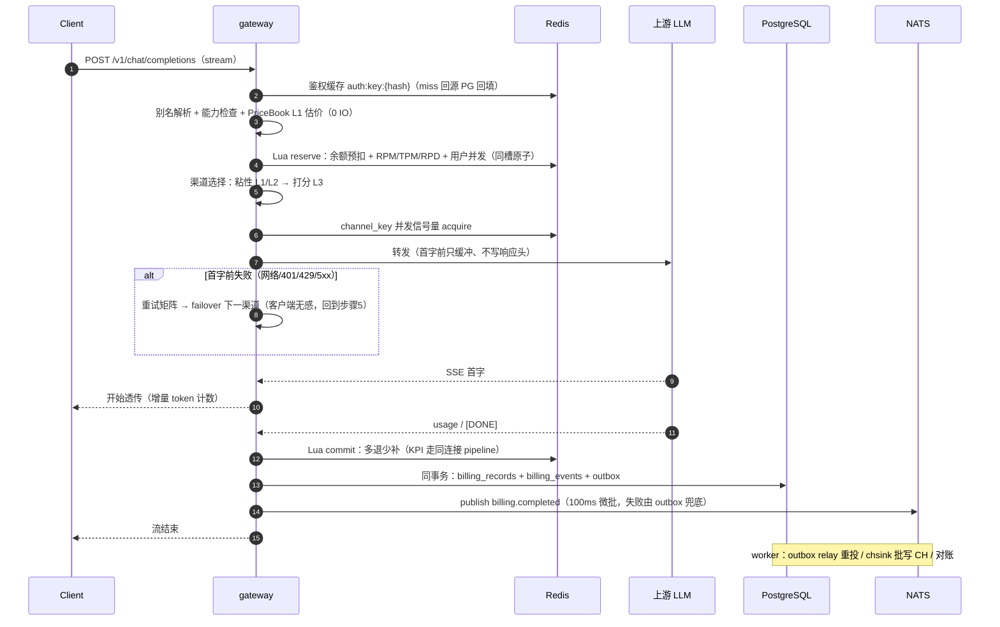

# Okapi 实施文档

> 状态：定稿 v1（2026-08-29）
> 前置阅读：[DESIGN.md](DESIGN.md)（调研结论与倍率计费模型 v3）
> 存储层唯一权威：[docs/database.md](docs/database.md)
> 本文所有「定案」为冻结决策，改动需走文档 PR 说明理由。

## 0. 文档分工

| 文档 | 内容 |
| --- | --- |
| DESIGN.md | 调研（new-api / Sub2API / UI 流派）、计费模型 v3、命名、前端设计 |
| 本文 | 选型定案、3 角色架构与时序、调度/计费/权限/MCP/i18n 实施规范、issue 吸收清单、容量与故障、M0–M4 里程碑与验收、部署附录 |
| docs/database.md | PG 全量 DDL、Redis 键空间与 Lua 契约、ClickHouse 表与 MV、NATS 拓扑 |

## 1. 选型定案

### 1.1 后端（Rust，全新实现）

| 层 | 定案 | 理由 |
| --- | --- | --- |
| 运行时/HTTP | tokio + axum + tower（hyper 1.x，rustls） | TensorZero / Helicone 同款，中间件生态最全 |
| 上游客户端 | reqwest 流式（HTTP/2 连接池） | SSE 透传，超时/重试分层控制 |
| PostgreSQL | sqlx | 编译期 SQL 校验，契合 fail-fast 文化 |
| Redis | fred | Cluster / pipeline / Lua 脚本缓存支持最好 |
| ClickHouse | clickhouse crate | RowBinary 批写 + async_insert。**M2 过渡**：自研 HTTP JSONEachRow 薄客户端（store::ch，接口已封装），官方 crate 为 M3 性能项 |
| 消息 | async-nats（JetStream） | 官方维护 |
| 金额 | 自研 i64 micro-USD newtype | 计费路径禁浮点，编译期保证；rust_decimal 仅展示层 |
| 状态机 | enum + 穷举 match | 非法状态转移变成编译错误 |
| 配置热更 | arc-swap（PriceBook）+ moka | 读路径无锁零 IO |
| token 计数 | tiktoken-rs（增量） | 流式路径 CPU 可控。**M2 过渡**：预扣估算用 chars/4 启发式（结算以上游 usage 为准），tiktoken 复核随 M3 接入 |
| 限流 | governor（本地兜底）+ Redis GCRA（全局） | 两级限流 |
| 可观测 | tracing + OTLP + metrics-exporter-prometheus | 对齐 Jaeger/Prom |
| API 文档 | utoipa | OpenAPI 自动生成 |
| 工程组织 | cargo workspace：6 crate（domain / pricing / ledger / providers / store / api）+ 单二进制 `okapi gateway\|console\|worker\|all` | 布局见 DESIGN §8.3 |

身份体系补充依赖（M3，§6.4 落地随附）：`argon2`（argon2id 密码散列）、`hmac` + `sha1`（RFC 6238 TOTP）、`aes-gcm`（TOTP 密钥信封加密）、`base32`（otpauth 编码）。支付补充依赖（M4，§11.2）：`md-5`（易支付协议签名，协议既定算法）。Realtime 补充依赖（M4，§4.4）：`tokio-tungstenite`（上游 WS 客户端）+ axum `ws` feature（入口升级）。

### 1.2 前端

Vite + React 19 + TS、TanStack Router/Query/Table、Tailwind v4 + shadcn/ui、Recharts(+VChart)、@lobehub/icons、next-themes 多主题（含科技风）、i18next、rust-embed 嵌入二进制。选型论证与信息架构见 DESIGN §9。

### 1.3 存储（定案：PG-only）

| 组件 | 角色 | 可选性 |
| --- | --- | --- |
| PostgreSQL 16+ | 唯一真理源（用户/渠道/定价/计费事件溯源 + outbox） | 必须 |
| Redis 7+ | 余额热账本（Lua reserve/commit）、限流、KPI 秒级计数 | 必须 |
| ClickHouse | 请求明细 + 聚合 MV | 可选；关闭时统计接口 fail-closed 返回 501 |
| NATS JetStream | 计费事件总线 | 分布式必须；单机 `okapi all` 可省略（outbox 由内嵌 worker SKIP LOCKED 直接消费） |

最低部署形态 = PG + Redis 两个容器 + okapi 单二进制。**不支持 MySQL/SQLite**（sqlx 编译期校验绑定单方言；new-api 系 SQLite 用户迁移走 compose 一键 PG）。

### 1.4 明确放弃项

| 放弃 | 理由 |
| --- | --- |
| Consul / 服务注册中心 | 3 角色无服务间常驻调用，K8s DNS / 静态配置足够 |
| 服务间 gRPC | 控制面→数据面通过 PG + NATS epoch 广播通信 |
| MySQL / SQLite 多方言 | 见 §1.3 |
| Semi Design / MUI | 存量流派，new-api 官方已迁出（DESIGN §9.1） |
| 统一协议中间 IR | LiteLLM 式 IR 追不上上游字段变更，按方向拆转换模块（§4.1） |
| 订阅账号转售模式 | Sub2API 商业模式踩 ToS 红线，只吸收其工程设计 |
| 跨区多活 | 单区 HA 足够，超出目标范围 |

## 2. 系统架构：3 角色

### 2.1 角色与职责

| 角色 | 职责 | 扩缩容 |
| --- | --- | --- |
| **gateway**（数据面） | 鉴权、限流、预扣/结算、渠道调度、SSE 透传、KPI 计数；热路径零跨服务调用（只碰 Redis + 上游） | 按连接数/CPU HPA，无状态 |
| **console**（控制面） | 管理后台 + 用户门户 API、定价 CRUD、PriceBook epoch 编译发布、内置 MCP 端点 | 2 副本 |
| **worker**（异步面） | outbox relay、chsink 写 CH、DLQ、对账 reconciler、通知、分区维护/过期任务 | 按 JetStream consumer 分区 |

模块图见 DESIGN §8.2。

### 2.2 一次请求的完整时序



失败分支：上游全部候选失败或空回复 → Lua refund 全额释放 → 记错误日志（log_type=错误，进 CH 可查）→ 返回标准 error_code。

### 2.3 部署形态矩阵

| 形态 | 进程 | 依赖 | 适用 |
| --- | --- | --- | --- |
| 单机 | `okapi all`（一进程含三角色） | PG + Redis（NATS/CH 可选） | 个人站长，≤千万/日裕量充足 |
| Compose 多容器 | gateway ×2 + console + worker | PG + Redis + NATS + CH | 中型站 |
| K8s | gateway HPA、console ×2、worker 按 consumer 分区 | 全量 + PG HA + Redis Cluster | 档位二/三（§12） |

任一形态间迁移只改部署不改代码。

### 2.4 控制面 → 数据面通信

- 定价发布：console 事务内 epoch+1 并写 PriceBook 快照 → NATS `pricing.epoch` 广播 → gateway ArcSwap 原子替换；广播丢失兜底：L1 每 30s 对 `pb:epoch` 轻量校验。
- 鉴权/配置失效：console 直接 DEL Redis 缓存键 + 短 TTL 兜底。
- console 宕机不影响数据面（PriceBook L1 副本继续服务）——故障隔离是 3 角色拆分的核心收益。

## 3. 渠道调度设计

### 3.1 渠道选择流水线

```
候选渠道 = 全部渠道
  → 可见性过滤（用户所属组的 group_channel_bindings 并集；严格隔离开关见 §6.3）
  → 模型过滤（channels.models ∋ canonical model）
  → 能力过滤（请求带 tools/vision/audio 时要求 channels.capabilities 支持，#4066）
  → 状态过滤（channel_keys 非 cooling/rate_limited/quota_exhausted/banned/invalid）
  → 粘性命中（L1/L2，命中直接返回该 channel_key）
  → 按 priority 分层，同层内打分取最优（L3）
```

### 3.2 三层粘性（Sub2API 吸收项 1）

| 层 | 键 | TTL | 语义 |
| --- | --- | --- | --- |
| L1 response_id 绑定 | `stick:resp:{uid}:v1:<response_id>` | 30min | Responses API 有状态续聊硬绑定；miss 返回标准「会话已过期」error_code |
| L2 session 亲和 | `stick:sess:{uid}:v1:<session_hash>` | 1h 滑动 | 会话前缀哈希 → 同 channel_key，提升上游 prompt cache 命中率（直接降低用户账单的 cache_ratio 部分） |
| L3 打分兜底 | — | — | 无粘性时进入 §3.3 |

- L2 键优先取客户端会话头（`session_id` / `x-session-id`；Responses 的 `prompt_cache_key` 随 M3 接入），缺省回退前两条消息规范化文本哈希。当前实现哈希 = SHA-256 前 8 字节（xxhash64 为 M3 性能项）。注意 Nginx 默认丢弃带下划线的请求头，部署模板须加 `underscores_in_headers on`（§14.1）。
- 键内嵌哈希算法版本号 `v1`；升级时双写双读一个 TTL 周期后下线旧版。
- 粘性目标 key 已进入不可用状态时跳过粘性、走 L3 并刷新映射。

### 3.3 打分负载均衡（L3）

```
score = w_err  × EMA(错误率)
      + w_ttft × norm(TTFT p95)
      + w_load × (在途并发 / max_concurrency)
      + w_cost × norm(渠道单位成本 upstream_unit_cost)     ← 成本感知，默认 w_cost=0（#6950）
取同优先级层内 score 最低者；权重全局可配（settings）
```

数据源：gateway 本地滑动窗口 + Redis `ch:stat:{channel_id}` 共享 EMA（5min TTL），CH `mv_channel_5min` 做事后校准展示。

### 3.4 渠道 key 状态机（Sub2API 吸收项 3）

状态：`active / cooling / rate_limited / quota_exhausted / banned / invalid`

| 触发 | 转移 | 恢复 |
| --- | --- | --- |
| 连续 N 次网络失败/5xx（N 可配，默认 3） | active → cooling（指数退避：60s×2ⁿ，封顶 2h） | 到期自动回 active（探测式恢复为 M3 项） |
| 429 | active → rate_limited（读 Retry-After，无则默认 60s） | 到期自动回 active |
| 上游配额/余额耗尽（402 或 429+insufficient_quota body） | active → quota_exhausted | 冷却到次日 0 点（UTC）自动恢复，或人工 |
| 401/403 且凭证刷新失败 | active → invalid | 仅人工（告警通知） |
| 人工封禁/上游封号标志 | → banned | 仅人工 |

状态与 `cooldown_until` 持久化在 PG `channel_keys`，运行态镜像在 Redis `ch:cool:*`；每次状态转移写 audit_logs。

### 3.5 双层并发控制

| 层 | 键 | 说明 |
| --- | --- | --- |
| 用户级 | `conc:{uid}`（并入 reserve Lua，同槽原子） | 上限 = 用户/Key 配置，超限返回 429 error_code |
| 渠道 key 级 | `conc:ck:<channel_key_id>` | 信号量 acquire/release，防单 key 被打挂；泄漏由 TTL + 对账清理 |

### 3.6 重试矩阵（#6722，全局默认 + 渠道级 `retry_policy` 覆盖）

| 错误类别 | 同 key 重试 | failover 换渠道 | 状态机动作 | 计费 |
| --- | --- | --- | --- | --- |
| 连接失败/首字前超时 | 1 次 | 是 | 计入错误率 | 不计费 |
| 401/403 | 否 | 是 | 触发凭证刷新，失败→invalid | 不计费 |
| 429 | 否 | 是 | → rate_limited | 不计费 |
| 上游配额耗尽 | 否 | 是 | → quota_exhausted | 不计费 |
| 5xx | 1 次 | 是 | 计入错误率/冷却计数 | 不计费 |
| 400 参数错误 | 否 | 否 | — | 不计费，原样转译返回 |
| 内容策略拒绝 | 否 | 可配（默认否） | — | 不计费 |
| 首字后断流 | 不可回退 | 否 | 记切换率指标 | 按已产出计费（全局开关可改为不计费） |

### 3.7 SSE 转发器行为规范（Sub2API 吸收项 2，M1 核心）

1. **首字前只缓冲**：收到上游首个内容事件前，不向客户端写状态码/响应头；此窗口内失败可无痕 failover。
2. **空回复不计费**：流结束但零内容 token → 走 refund 路径并记错误日志。
3. 心跳：透传期间每 15s 注入 `: ping` 注释帧，防中间层空闲断连。
4. 增量 token 计数（tiktoken-rs），`trust_upstream_usage=true` 的渠道跳过本地复核直接采用上游 usage（#1790-19）。
5. prompt cache 相关请求/响应头与 usage 字段（`cached_tokens` 等）**原样透传**，parity 套件含专项用例（#3389：Codex CLI 经中转 cache 失效导致费用暴涨）。
6. 客户端提前断开：取消上游请求，按已产出 usage 结算。
7. 行缓冲上限：SSE 扫描器单行缓冲设上限（默认 64MB 可配），防上游超大 base64 图像行耗尽内存。【状态：依赖 eventsource-stream 暂无上限配置，随 M3 自实现 SSE 解析时落地】
8. 请求体上限：32MB（网关不解压请求体，即为有效字节上限；超限 413），防超大体/zip bomb。【已实现】
9. **响应头白名单**（Sub2API 吸收）：【现状（最严形态）】上游响应头默认**全部剥离**，仅重建 content-type 与 SSE 语义头——上游身份/组织/rate-limit 头零泄漏（比可配白名单更严）；cache 与 usage 语义经 body 字段透传（第 5 条），upstream request-id 内录 billing_records 不透出。可配透传名单（settings.response_header_whitelist）列 backlog：现有形态未发现客户端兼容性问题前不放宽。

### 3.8 能力感知路由与成本感知权重（M3 已实现）

- **能力感知**：请求特征探测（tools 数组非空 → needs_tools；消息含图像部件 → needs_vision）；
  渠道 `capabilities` JSONB **显式 `false` 才排除**（未声明 = 放行，迁移友好；如
  `{"tools": false}` 的渠道不再接到带工具请求）。
- **成本感知权重**：同 priority 层内 `有效权重 = weight × 1000 / relative_cost_milli`
  （`channels.upstream_unit_cost.relative_cost_milli`，整数千分比，缺省 1000 = 中性；
  越便宜权重越大）。只影响层内抽样概率，不跨层；非计费路径，不碰金额语义。

## 4. providers crate 规范

### 4.1 模块组织：按方向拆文件（Sub2API 吸收项 5）

```
okapi-providers/src/
├── openai/            # 原生 OpenAI（含 Responses API）
├── anthropic/
├── gemini/
├── deepseek/          # OpenAI 兼容薄封装（兼容通道兜底一切长尾 provider）
├── custom_pass/       # 透传渠道：任意上游路径透明代理（M3，#1454）
├── convert/           # 显式方向转换函数，不做统一 IR
│   ├── openai_to_anthropic.rs
│   ├── anthropic_to_openai.rs
│   ├── openai_to_gemini.rs
│   └── responses_to_chat.rs      # Responses → ChatCompletions 降级（M3，#5209）
└── credentials/       # static_key / oauth_refresh / cloud_sts
```

### 4.2 核心 trait

```rust
#[async_trait]
pub trait Provider: Send + Sync {
    fn id(&self) -> ProviderId;
    fn capabilities(&self) -> &Capabilities;          // tools / vision / audio / cache ...
    fn count_tokens(&self, req: &ChatRequest) -> TokenEstimate;   // 预扣估算
    async fn chat(&self, req: ChatRequest, cred: Credential, cx: CallCx)
        -> Result<ChatStream, ProviderError>;         // 统一 SSE 事件流
}

#[async_trait]
pub trait CredentialProvider: Send + Sync {
    async fn get(&self, key: &ChannelKey) -> Result<Credential, CredError>;
    async fn refresh(&self, key: &ChannelKey) -> Result<Credential, CredError>;
}
```

### 4.3 凭证刷新四步锁（Sub2API 吸收项 4，多副本必需）

```
进程内锁（同实例去重）→ Redis 分布式锁 lock:cred:<key_id>（跨副本去重）
→ 加锁后 DB 重读（他副本可能已刷新）→ 刷新；invalid_grant 时二次重读做竞争恢复
```

主线只实现 static_key；OAuth refresh / cloud STS（Vertex、Azure 托管凭证）留 trait 扩展点，不做订阅型上游主线。

### 4.4 协议覆盖矩阵（2026-08 与 new-api / Sub2API README 核对）

| 端点 | 里程碑 |
| --- | --- |
| /v1/chat/completions（流式+非流式） | M1 |
| /v1/models、/v1/embeddings【已实现：prompt-only 计费 + failover】 | M2 |
| Anthropic /v1/messages（双向：入口协议 + 上游方向）【已实现：`convert/{openai_to_anthropic,anthropic_to_openai}.rs` + 原生客户端 + x-api-key 鉴权；四象限用例全绿】 | M3 |
| Gemini generateContent 方向【已实现：`gemini.rs` + `convert/openai_to_gemini.rs`（thoughts 归 reasoning、promptTokenCount 含缓存口径）】 | M3 |
| /v1/responses（含降级 ChatCompletions）【已实现：`convert/responses_to_chat.rs`，事件骨架合成 + 两跳（responses→chat→anthropic/gemini）】 | M3 |
| /v1/rerank（#1117）、图像/音频/视频（/v1/images、/v1/audio、/v1/videos/*，媒体计费） | M3【images/generations 已实现：per_call × n（n=1..10），乘数落 pricing_snapshot.media_units；rerank 已实现（Jina/Cohere 形状，prompt-only 计费，与 embeddings 共用泛化中继）；audio 已实现——**speech：输入字符数记为 prompt_tokens 走 ratio（对齐 OpenAI 按字符计价，站长把 model_ratio 配成字符价）或模型配 per_call；transcriptions：per_call 模式必须（时长无法本地解码），上游 verbose_json 的 duration 若在则记入快照供审计**；multipart 经解析重组转发（boundary 重生成，上游无感）；**videos 已实现（M4 补齐）**：POST /v1/videos 提交即 per_call × seconds 计费（缺省 4s、clamp 1..60，乘数落 pricing_snapshot.media_units；时长无法本地验证，与 transcriptions 立场一致），上游失败退款；GET /v1/videos/{id} 轮询与 /content 流式下载按创建时渠道映射回源（Redis video:task:* 48h，键含 user_id 隔离），不计费；JSON 提交，multipart input_reference 列 backlog】 | 
| custom_pass 透传【已实现，语义定案：`/pass/{channel_id}/{*path}`（任意方法）；渠道 provider=custom_pass；settings 必填 `allowed_paths`（前缀白名单，空拒绝——SSRF 第二道闸，第一道是 api_base 固定）与 `billing_model`（models 表 per_call 模型，按次预扣/结算，禁零费裸透传）；可选 `auth_header`/`auth_scheme`（缺省 Authorization: Bearer）；请求体/查询串原样，响应流式回传仅透 content-type】 | M3 |
| thinking-to-content 转换（客户端不支持 reasoning 输出时转正文）【已实现：渠道 settings.thinking_to_content，流式+非流式】 | M3 |
| reasoning effort 模型名后缀（-high/-medium/-low、-thinking、-thinking-128 预算 → 请求参数改写，接在别名解析旁）【已实现：全名直命中优先；openai→reasoning_effort / anthropic→thinking 预算（自动抬 max_tokens）/ gemini→thinkingConfig；计费落基名】 | M3 |
| OpenAI Realtime API（WebSocket 双向 + 音频 token 计费；WS 治理见 §14.4） | M4【实现定案：入口 `GET /v1/realtime?model=`（升级 WS；鉴权 Bearer 头或 `openai-insecure-api-key.<key>` 子协议）；上游 = openai 渠道 api_base 的 ws(s) 形态；**计费时机**：连接时按模型 max_output 预扣一笔，会话内逐 `response.done` 累计 usage（text+audio tokens 合并按模型倍率，audio 独立倍率列 backlog、细分进快照），断开时按累计 commit（无产出全额退款）；治理：per-key WS 连接租约（ZSET 60s 租约/20s 续期，崩溃自然滚出，docs/database.md §2.1 ws:lease:k:*）、首消息 30s、空闲 5min。四用例已验收（双向泵计费/零产出退款/限连 429/子协议鉴权）】 |
| Responses WebSocket 入口（Codex CLI 风格 WS ingress → 上游 HTTP/SSE 桥接；出口代理 WS 不稳时全局/渠道级回退 HTTP 开关；连接治理复用 §14.4） | M4 |
| 任务型异步中转（Midjourney / Suno / 异步图像/视频：submit → poll/callback → 完成时结算；端点形状对齐生态：`/v1/images/generations/async` + `/v1/images/tasks/{task_id}`） | 开放项（M4 后）；tasks 表与 worker 轮询预留见 database.md §1.8 |

不做：Dify ChatFlow 专属模式（OpenAI 兼容通道覆盖）、订阅型上游账号池（Grok OAuth / Antigravity 等，见 §1.4）。

## 5. 计费执行链

计费公式、修饰器栈、PriceBook 编译与失效见 DESIGN §3（不重复）。执行链定案：

### 5.1 关键规则

- 预扣估算 = tiktoken 估算 prompt + `max_tokens`（缺省用模型默认上限）× 补全倍率，按 PriceBook 当前 epoch 计价。
- reserve 与 commit 可能跨 epoch：**结算一律以 reserve 时刻的 epoch 快照计价**（请求内一致性），pricing_snapshot 记录 epoch。
- 余额可短暂为负（流超预估），下一笔请求在 reserve 处拒绝。
- 免费模型（model_ratio=0 或 group_ratio=0）跳过 reserve/commit，仍记 billing_records（金额 0）与统计。
- 每笔 billing_records 带 `amount / original_amount / discount / upstream_cost` 四金额列，全链路（PG + CH）一致。

### 5.2 用户心智双层（定案）

| 层 | 呈现 | 数据 |
| --- | --- | --- |
| 价格认知层 | 价格页只显示 模型倍率 / 补全倍率 ×（所在分组倍率），附 $/1M 换算列；个人 multiplier 与规则折扣**不进标价** | model_pricing + price_groups |
| 账单明细层 | 每笔展开逐步算式（账单解释器，DESIGN §9.4）；优惠行徽章；用户端聚合「本月已为你节省 Σdiscount」【已实现：门户总览"已为你节省"KPI 卡，§11.12】；站长端让利成本报表（Σdiscount by rule_code） | pricing_snapshot + discount 列 |

### 5.3 退款与调整（事件溯源自然支持，#1790-10 / #2891）

- 管理员按日志退款：`billing_events(event_type=refund, request_id, payload.reason)`，账单与统计自动一致（CH sink 消费 refund 事件冲销）。
- 批量退款：按筛选条件生成事件批。
- 额度调整打标签：`event_type=adjust, payload.tags=[compensation|goodwill|correction]`，报表按标签聚合。
- 全部经权限点 `billing.refund` / `user.balance_adjust` + audit_logs。

## 6. 角色系统与 RBAC

### 6.1 主体链与统一四件套

主体链：**User → API Key** 为基础；**Team** 层可选启用（M4：Team → Member → Key，老 ok-api 子账户并入 Team Member）。每层主体统一四件套，执行复用 Redis 分层计数器，不新增机制：

> **轻量合作商模式（M2 已实现）**：Team 层落地前，"合作商 + 员工子账户"用 *key 即子账户* 承接——合作商 = 钱包主体 user，每位员工一把独立 key（名称/限速/日 token 上限独立）；门户 `/api/me/usage`、`/api/me/stats/breakdown`、`/api/me/logs` **统一**默认 `scope=key`（员工只见自己；logs 端点的这一缺省于 2026-09-01 补齐，此前员工可翻到同钱包全部请求），`scope=user` 为合作商汇总（日志汇总视角带 key 名列以分辨发起者），`/api/me/keys` 按 key 分账（mv_apikey_day）。与 Team 层的差别：员工无独立登录身份、钱包不隔离。

> **Team 层（M4 已实现）**——设计定案：**team 即 user 主体**（`users.kind='team'`，无登录凭证），
> 钱包/预扣/结算/限流/统计全线复用既有 user 机制，热路径零新分支；成员是真实用户
> （`team_members`：owner/admin/member 三角色 + `monthly_spend_limit_micro`）。
> 成员在团内自助发 key：key 归属 team 用户（`api_keys.user_id = team`，扣团钱包），
> `api_keys.member_user_id` 记归属成员（分账与限额锚点）。
> **成员月度限额**：Redis 计数器 `spend:tm:{team}:{member}:{yyyymm}`（40d TTL）——
> gateway 结算 commit 后累加，reserve 前读取比较（结算后计数的软实时语义：
> 并发窗口内可能小幅超限，账不受影响，文档明示）；超限返回 `member_limit_exceeded`。
> 管理面（web session 鉴权）：`POST /api/teams`（建团+入 owner）、
> `POST /api/teams/{id}/members`（owner/admin 加人/调限额）、
> `POST /api/teams/{id}/keys`（成员给自己发 key，明文一次）、
> `GET /api/teams/{id}/usage`（按成员分账：mv_apikey_day × member 映射）。
> OIDC group→team 映射仍留后续（依赖各 IdP 的 claim 形状）。

1. 余额/预算　2. 限速（RPM/TPM/RPD、日 token 上限，#6458/#5252）　3. 模型白名单　4. 渠道可见性

### 6.2 平台 RBAC

- 内置角色：`super_admin(100) / admin(10) / user(1)`——值对齐 new-api，迁移零成本。
- admin 的能力 = 权限点集合（`admin_roles.permissions`），支持自定义子角色（渠道管理员/财务只读/客服）。
- 权限点命名：`{资源}.{动作}[.{范围}]`，范围 `own|all`（资源表带 owner_id，#6267）：

```
channel.read[.own] / channel.write[.own] / channel.test
user.manage / user.assist（代客查看与修正令牌/分组，#1790-2，强审计）/ user.balance_adjust
pricing.read / pricing.write / pricing.publish
billing.read / billing.refund
logs.read / logs.content_read（内容审计，独立授权）
settings.write / cache.flush / dlq.manage / mcp.write
role.manage（自定义角色的创建与指派；实现上强制 super_admin，防自我提权）
```

### 6.3 分组解耦（#6623 / #6977）

group 一个实体、两种绑定：

- **定价**：price_groups.group_ratio（已有）；user↔group 多对多（user_groups），**定价取优先级最高组**。
- **渠道可见性**：group_channel_bindings 矩阵，**可见性取用户所有组的并集**。
- 全局开关 `strict_group_isolation`：开 = 未绑定渠道对该组不可见（企业硬隔离）；关 = 绑定为空视为全可见（单站长零配置）。

### 6.4 身份接入矩阵

| 方式 | 里程碑 |
| --- | --- |
| 邮箱密码（argon2id）+ 邮箱验证 | M1 |
| GitHub / LinuxDO / Telegram / Discord OAuth | M3【已实现（Telegram 除外——其登录部件非标 OAuth，M4 复评）：**配置驱动通用 authorization-code 模块**（`console/oauth.rs`），内置 github/discord/linuxdo 预设（settings.oauth_providers 只填 client_id/secret），任意标准 OAuth2/OIDC 上游可自定义 authorize/token/userinfo 三 URL 接入；state 走 Redis 一次性键；首登自动注册并绑定 (provider, subject)，回调发 web session → 前端兑 key】 |
| 通用 OIDC（含 group→role/team 映射，#1106） | M3【userinfo 模式已随上覆盖；group→role/team 映射 M4 随 Team 层】 |
| TOTP 两步验证（2FA，密钥 AES-GCM 加密落库）、Turnstile 注册风控 | M3【邮箱密码+会话+TOTP 已实现；实现定案：**web session（Redis `sess:web:*`，HttpOnly cookie）只服务 `/auth/*` 自助面**——注册/登录/2FA/兑换 key；门户与数据面保持 API key 单轨（登录成功经 `/auth/keys` 兑换 key，前端仍以 key 驱动）。TOTP 密钥 AES-256-GCM 加密（`OKAPI_MASTER_KEY`），RFC 6238 HMAC-SHA1 30s 窗 ±1；Turnstile 经 settings.turnstile_secret 配置，未配置即跳过（缺省关）】 |
| LDAP（#5703）、OIDC-IdP 反向输出（#6572） | 企业阶段（M4 后） |
| 手机注册（#6207） | SMS provider trait 扩展点，不进主线 |

### 6.5 单用户模式（M1，#1105）

配置开关 `single_user_mode`：跳过注册登录、启动时自动生成 root key 打印到日志、隐藏用户管理界面。承接「纯网关」人群，M1 顺带简化联调。

release 构建下启用本模式须同时设 `OKAPI_SINGLE_USER_CONFIRM=true`（M2，Sub2API Simple Mode 同款护栏）：防生产误开——本模式 root key 进日志且无用户管理，误暴露公网代价高。

### 6.6 内容审计三态（#924 / #417）

`content_logging = off（默认）/ user_opt_in（用户自愿）/ forced（全局强制，站长须页面明示）`。内容引用落 billing_records.content_ref，读取需 `logs.content_read` 权限点。

## 7. 内置 MCP 服务（AI 远程管理）

### 7.1 形态

- console 角色内置 `/mcp` 端点：MCP Streamable HTTP（POST JSON-RPC，单响应 `application/json` 模式，spec 2025-06-18 兼容），零额外进程（对比 new-api 生态的外挂 Go 进程方案）。
- 鉴权复用 Okapi API key；工具可见性 = key 所属用户 RBAC 权限点过滤；审计 actor 记 `mcp:{key_id}`；独立限流。
- 【M3 实现注记】只读工具面以内建 JSON-RPC 处理器实现（`console/mcp.rs`，无 session/SSE——只读单发无此需求）；rmcp SDK（官方 `StreamableHttpService`）迁移在 M4 写工具引入时复评：其 service-factory 形态与我们"每请求 API key → RBAC 过滤"的注入模式需确认匹配（session 化后 per-request 鉴权上下文）。

### 7.2 精选工具面（~25 个，不做 OpenAPI 自动生成）

| 组 | 工具 | 里程碑 |
| --- | --- | --- |
| 用户级 | query_balance / query_usage / list_my_keys / list_models_pricing / **explain_bill**（吃 pricing_snapshot，AI 向用户逐笔解释账单） | M3【已实现】 |
| 管理查询 | platform_kpi / channel_health / **usage_stats**（参数化维度模板查 CH MV，不暴露裸 SQL，继承 15s/2GiB 护栏）/ search_logs / reconciliation_status / dlq_list | M3【已实现】 |
| 管理写 | channel_create / channel_update / channel_toggle / channel_test / user_adjust_balance / user_ban / **simulate_pricing → apply_pricing**（先模拟后生效）/ redemption_create / dlq_requeue / cache_flush | M4【已实现（channel_update 并入 create/toggle 语义、redemption_create 随兑换码体系顺延）：三道闸 = settings.mcp_write_enabled（默认 OFF，关时工具隐藏）+ mcp.write 权限点 + 资源权限；user_adjust_balance/user_ban/apply_pricing/dlq_requeue 均 confirm 两段式。dlq_requeue 与 HTTP `/admin/dlq/requeue` 共用 `console::dlq::requeue`（2026-09-01，§11.12）】 |
| 诊断 | diagnose（全链路健康检查，对标老仓库 make diagnose / billing-check） | M4【已实现：PG/Redis/CH/NATS 可达 + outbox 积压 + DLQ 深度 + 冷却 key 数 + PriceBook epoch；2026-09-01 起同一函数经 `GET /admin/diagnose` 供后台落地页使用，§11.12】 |

### 7.3 安全三道闸

1. 写工具全局开关（默认 OFF）；2. RBAC 权限点（`mcp.write` + 对应资源权限）；3. 危险操作 dry_run/confirm 两段式。删除类操作**不经 MCP 暴露**。

远期开放项（不进主线）：MCP 服务转发/分发按次计费（per_call 计费模式天然支持）。

## 8. i18n 工程规范（定案，非可选项）

1. 全部界面文案 key 化，禁止硬编码中英文；CI lint（前端 ESLint 规则 + 后端 guard 脚本）拦截裸文案。
2. 语言包按命名空间拆文件：`locales/{lang}/{common,console,admin,pricing,errors}.json`；社区新语言 = 新增目录 + PR，不改代码。
3. 首发 zh-CN + en；默认跟随浏览器，用户偏好落库 `users.language`。
4. **后端 API 只返回 `error_code` + 参数**，由前端语言包映射；禁止后端拼接人类语言（吸取 new-api 中文错误直传国际用户的教训）。
5. 邮件/站内通知模板按用户语言双套。
6. 公开价格页/状态页同样 i18n（获客页面）+ hreflang。
7. 日期/数字/货币用 Intl + dayjs locale。

## 9. 前端实施补充（对 DESIGN §9 的增量）

- **倍率对比与合并工作台**（M3，#1790-13）：与 new-api 默认倍率表 / 上游价格 diff、选择性合并、epoch 版本历史（配合 JSON 导入）。
- client_type 看板下钻（M3，#5277）：UA 解析 Claude Code / Codex / LobeChat 等。
- 用户消耗排行榜（#1790-11）、数据保留策略配置页（#1790-1）、通知多路配置页（#1790-8）：**M4 已实现**——`/admin/ops` 运维页三卡（排行 GET /admin/leaderboard = CH mv_user_day 聚合 + PG 补用户名，7/30/90 天切换；保留策略 settings.retention_months + worker 超期分区裁剪；通知 settings.notify_channels JSON 编辑），配套 GET /admin/settings/{key} 单键回显端点。
- 仪表盘均值类指标一律 token 加权（§10）。

## 10. 统计指标字典

| 指标 | 口径 | 来源 | 展示位 |
| --- | --- | --- | --- |
| QPS / 在途 SSE | 1s 计数 / gauge | Redis KPI + Prom | 运营仪表盘【QPS 已实现：kpi:* 秒桶 + /admin/stats/realtime + 仪表盘实时条，§11.12】 |
| RPM / TPM | 最近 60s 秒桶求和（带过滤退化 CH 60s 窗） | Redis / CH | 日志页统计条（对齐 new-api /log/stat 语义）【已实现：/admin/logs/stat】 |
| 错误码分布 | Σerrors by error_code + argMax 高发渠道/模型 | CH mv_error_hour | 统计页错误分布页签【已实现，§11.12】 |
| 资金流入 | 充值/兑换补偿/扣减/过期 四桶 | PG billing_events | 收入页签资金流入行【已实现，§11.12】 |
| 分组经营 | Σamount/Σdiscount/错误率 by group_code + 分组倍率 | CH mv_group_day + PG price_groups | 收入页签按分组表【已实现，§11.12】 |
| 系统健康 | 组件可达 / outbox 积压 / DLQ 深度 / 冷却 key | PG + Redis + CH ping | 落地页"需要注意"面板 + 状态芯片【已实现，§11.12】 |
| 消耗趋势 / Top 模型 | Σcost by day / model | CH mv_user_day / mv_model_hour | 用户概览 |
| 渠道错误率 | errors/requests per 5min | CH mv_channel_5min | 渠道健康红绿灯 |
| TTFT p50/p95/p99 | quantiles(ttft_ms) | CH mv_channel_5min | 渠道健康 |
| 生成速度 | Σcompletion_tokens / Σduration（**token 加权**，#5029） | CH | 模型/渠道页 |
| 粘性命中率 | sticky_layer 分布 | CH mv_channel_5min | 调度诊断 |
| 渠道切换率 | failover_count>0 占比 | CH | 调度诊断 |
| 毛利 / 让利 | Σ(amount−upstream_cost) / Σdiscount by rule | CH | 经营报表（new-api 均缺失） |
| 本月节省 | Σdiscount by user | CH mv_user_day | 用户账单页 |
| 消耗排行 Top N | Σamount by user | CH mv_user_day | 管理排行榜 |
| client_type 分布 | UA 解析列 → Σrequests/uniq users by client_type | CH mv_client_day | 统计页客户端分布页签【已实现，§11.12】 |
| 上游配额余量 | 被动采集 rate-limit 响应头 | channel_keys.quota_snapshot | 渠道页 |
| **任意维度过滤下的趋势 / 拆分 / 流向** | 过滤（user/key/channel/model/group 可组合）→ 按时间桶 / 按另一维度 / 五阶段桑基；每行占比 + 环比（同长上一窗口）+ 上期名次 | CH **mv_cube_hour** | 用量分析页（§11.13）【已实现：/admin/stats/trend（可 stack）/ breakdown / flow】 |
| 站点规模 | 用户 total/active/今日新增；key total/active/7 日用过；渠道 healthy/无可用 key/自动停用；渠道 key 六态；模型 total/priced/served | PG 计数 | 落地页站点规模条【已实现，无 CH 可用】 |
| 列表行内用量 | 今日 / 窗口消费 + 请求数 + 最近活跃日，按当页 id 批量 | mv_user_day / mv_apikey_day | 用户与密钥列表"近期用量"列【已实现：/admin/stats/entity-usage】 |
| 单渠道健康时间线 | 5 分钟桶请求 / 失败 / TTFT p50·p95 / 切换 | mv_channel_5min | 渠道页 24h 徽章 → 抽屉【已实现：/admin/stats/channels/{id}/timeline】 |
| 余额可用天数（Runway） | 余额 ÷ 钱包级窗口日均消费；与到期清零日取更近者 | mv_user_day（breakdown.wallet_window_spend_micro） | 门户余额卡副行【已实现，new-api summary cards 口径】 |

## 11. Issue 吸收清单 → 设计落点

| 来源 | 吸收点 | 落点 | 里程碑 |
| --- | --- | --- | --- |
| new-api #1790-10 / #2891 | 按日志退款、批量退款、调整打标签 | billing_events refund/adjust + tags（§5.3） | M2 |
| #1790-19 | 渠道级信任上游 usage | channels.trust_upstream_usage | M1 |
| #3389 | prompt cache 透传正确性 | parity 专项用例（§3.7-5） | M1 |
| one-api #1105 | 单用户模式 | §6.5 | M1 |
| #3001 | 模型别名/通配符 + 优先级 | model_aliases | M2 |
| #6722 | 精细化重试矩阵 | §3.6 retry_policy | M2 |
| #6267 | 渠道属主与 own/all 权限 | owner_id + 权限点范围 | M2 |
| #6623 / #6977 | user↔group 多对多、严格隔离 | user_groups + group_channel_bindings（§6.3） | M2 |
| #924 / #417 | 内容记录 | 三态开关（§6.6） | M2 |
| #6458 / #5252 / #4971 | key 级 RPD/日 token 上限、按 key 统计 | api_keys 限额列 + mv_apikey_day | M2 |
| #1790-2 / #4126 | 管理员代客操作 | user.assist 权限点 + 审计 | M2 |
| #1790-7 | 缓存清理 | console + MCP cache_flush | M2 |
| #1790-1 | 日志保留策略 | CH TTL + PG 分区滚动（M2 内置，M4 界面） | M2/M4 |
| #4066 | 能力感知路由 | §3.1 能力过滤 | M3 |
| #6950 | 成本感知调度 | §3.3 w_cost | M3 |
| #1454 | 自定义透传渠道 | custom_pass | M3 |
| #5209 / #1117 | Responses 降级、rerank/embeddings | convert 模块（§4.4） | M3 |
| #5277 | client_type 识别 | CH 列（M2 预留）+ 看板 | M2/M3 |
| #1790-13 | 倍率对比合并工作台 | §9 | M3 |
| #1790-11 / #5029 | 排行榜、token 加权均值 | §10 | M3 |
| #1790-5 / #2845 / #3388 | 兑换码增强（限用户/限 IP/兑套餐）、套餐×分组 | redemption_codes + plans | M4【已实现：plans 表（grant/加组/余额有效期三语义）+ POST /admin/plans；兑换码可绑 plan_code（核销金额取 grant 覆盖面值）/bind_user_id（他人 404 防探测）/max_per_ip（Redis 批次×IP 7d 计数，预查-闸-翻转-回退时序）；套餐附带失败不回滚入账（日志人工跟进）；max_uses 多次核销列 backlog】 |
| #1790-6 | 余额有效期 | users.balance_expires_at + worker 冻结任务 | M4【已实现：worker 5min 扫描到期用户，Redis Lua 原子 drain 可用余额（在途预扣按各自路径终结）→ expire 事件（delta 负、actor=system:worker）→ 重置 NULL 幂等防重扫；console POST /admin/users/{id}/balance-expiry 设置/取消；充值不自动延期（延期策略 backlog）】 |
| #1790-8 | 通知多路 + 事件订阅矩阵 + 频率限制 | settings.notify_channels（worker/notify.rs） | M4【已实现：webhook 通道（SMTP 列 backlog 不引新依赖），事件 drift（对账差异）/channel_cooldown（冷却 key 数）/balance_low（阈值 settings.balance_low_threshold_micro，降序 20 上限），频率闸 Redis notify:mute:* SET NX per-通道×事件（缺省 300s），失败仅日志不阻主循环】 |
| #6502 | CDN trusted-header-secret | 部署附录 §14.2 | M2 |

不吸收：长尾 provider 专属渠道（OpenAI 兼容通道覆盖）、纯 UI 细节（浮动按钮等，进前端 backlog）。

### 11.1 README 功能对照新增吸收（2026-08 核对 new-api / Sub2API README）

| 功能 | 来源 | 落点 | 里程碑 |
| --- | --- | --- | --- |
| Realtime WebSocket、任务型异步中转、视频端点、thinking-to-content、reasoning 后缀 | new-api / Sub2API | §4.4 协议矩阵 | M3–M4 |
| L2 粘性优先客户端会话头 + `underscores_in_headers` 部署项 | Sub2API | §3.2 / §14.1 | M2 |
| SSE 行缓冲上限、请求体解压后上限 | new-api 环境变量 | §3.7 | M1【请求体 ✓；SSE 行缓冲随自实现解析器（backlog，见 §3.7-7 状态）】 |
| Discord OAuth、TOTP 2FA、Turnstile 注册风控 | new-api / Sub2API | §6.4 | M3 |
| 用户×模型级限流（Redis key 后缀扩展，机制复用） | new-api | database.md §2.1 | M3【已实现：settings.model_rpm_limits + rl:{uid}:m:* 分钟桶（尽力语义），60s settings 进程缓存】 |
| 上游 URL SSRF 校验（channels.api_base） | Sub2API url_allowlist | §14.4 | M2【已实现：console/MCP 写入口校验，缺省仅 https + 禁私网/环回/localhost；settings.ssrf_policy 放开内网场景；DNS rebinding 深化 backlog】 |
| 邀请返利 aff（aff_code / inviter_id + adjust 事件 tag=aff_rebate） | 行业标配（new-api / done-hub） | database.md users 列 + §5.3 | M4【已实现：GET /api/me/aff 惰性生成 8 位邀请码 + 邀请人数/累计返利；注册带 aff_code 绑定 inviter_id（无效/自邀静默忽略不阻注册）；充值核销后按 settings.aff_percent_bp（基点，缺省 0=关闭）给邀请人 credit，事件 adjust actor=system:aff；兑换码核销不返利防套利】 |
| 敏感词/内容安全中间件（可选，与 §6.6 三态联动） | one-api 系 | settings + gateway 中间件 | M4 |
| Setup 初始化向导、key 余额公开查询端点 | new-api / Sub2API | console | M3【Setup ✓；余额查询 ✓：/v1/dashboard/billing/subscription + /usage（new-api/OpenAI 生态口径，客户端差值显示剩余）】 |
| 后台一键自升级 | Sub2API | 不吸收（单二进制 + 编排升级足够，规避自改风险） | — |

### 11.2 Sub2API README 深读二次吸收（2026-08-29 核对 Wei-Shaw/sub2api）

> 深读其 README 功能/部署/安全区后的增量结论；§11.1 已列项不重复。「已覆盖」行为审计结论，防止重复调研。

| 功能 | 来源 | 落点 | 里程碑 |
| --- | --- | --- | --- |
| 上游响应头白名单过滤（防上游身份泄漏、防上游 rate-limit 头误导客户端） | Sub2API response_headers | §3.7-9 | M2 |
| CDN 客户端 IP 头名可配列表（`True-Client-IP` 等，按序取首个有效值） | Sub2API forwarded_client_ip_headers | §14.2 | M2【已实现（常量优先序 true-client-ip/cf-connecting-ip/x-real-ip/x-forwarded-for，取首个合法 IP 落 billing/CH client_ip 列；名单可配列 backlog）】 |
| Responses WebSocket 入口（Codex CLI 生态）→ 上游 HTTP/SSE 桥接 + 协议回退开关 | Sub2API openai_ws / http_bridge / force_http | §4.4 / §14.4 | M4 |
| 自助充值支付闭环：支付 provider trait（epay 聚合覆盖支付宝/微信 + Stripe 首发）、回调幂等（order_no 唯一 + 订单状态机单向） | Sub2API 内置支付（new-api 同有） | recharge_orders（表已建）+ console 充值模块 + §13-M4 | M4 |
| 单用户模式生产二次确认（release 下须显式 `OKAPI_SINGLE_USER_CONFIRM=true`） | Sub2API Simple Mode 护栏 | §6.5 | M2【已实现：release 构建启动强制校验】 |
| 异步任务端点形状对齐 `/v1/images/generations/async` + `/v1/images/tasks/{task_id}`（生态兼容） | Sub2API 异步图片任务 | §4.4 任务型异步行 | 随原行 |
| Composite Groups（多 provider 组内模型 → 具体渠道解析） | Sub2API | **已覆盖**：§3.1 过滤流水线 + channels.model_mapping + model_aliases，不新增 | — |
| 管理后台 iframe 嵌外部系统；一键安装脚本 / Apple container；订阅账号媒体资格探测 | Sub2API | 不吸收（前端 backlog；compose/K8s 模板已覆盖；订阅模式 §1.4 已排除） | — |

### 11.3 三方复核增量（2026-08-30 核对 new-api rc.22–27 / Sub2API 0.1.164–183）

| 功能 | 来源 | 结论 |
| --- | --- | --- |
| 渠道上游模型发现（拉上游 /models 回填）+ 响应大小上限（默认 8MB） | new-api #6184/#5971 + Sub2API 0.1.180 | **本次实现**：`GET /admin/channels/{id}/fetch-models`（按协议探测，返回列表由管理员确认写入，不自动改配置） |
| 按上游响应模型计费（渠道可选实际返回模型为计费基准） | Sub2API 0.1.175 | **已实现**：channels.settings.bill_by_response_model（缺省关）；响应模型（非流式 body.model / 流式首个报告 model 的 chunk，opt-in 才解析零常态开销）≠ 请求模型且价簿有其精确名定价 → 按其算价并记账（billing_records.model_name 同步）；无价/同名回退请求 canonical（fail-open 不拒付）；别名解析不参与（结算不回 PG）。4 用例（流式/非流式/回退/关断） |
| service_tier（fast/flex）价格轴 | Sub2API 0.1.179/180 | **已实现**（DESIGN §3-4.5）：model_pricing.tier_ratios（JSONB 档位倍率表，upsert_model 可配）；有效 model_ratio ×= tier_ratio，per_call 同乘；结算档 = 请求声明档与上游响应报告档中倍率较低者（**只降不升**：不为未享受档位付费、上游擅自升档不多收）；预扣按请求档估；快照记 service_tier/tier_ratio；响应档采集与 resp_model 共用元数据通路（模型配了档位才解析，缺省零开销）。4 用例 |
| 管理接口独立限流（access token / 转账路由） | new-api rc.24 | **已实现**：login/register/totp/redeem 四爆破面每 IP 60s 固定窗（缺省 10/5/10/10 次；settings.critical_rate_limits 覆写，0=关）；IP 取 CDN 头回退直连 socket（console serve 已挂 with_connect_info），两者皆无放行；Redis crl:* 计数故障放行 |
| 渠道请求字段透传控制（管理员选择透传字段） | new-api rc.23 #6847 | **已实现**：channels.settings.strip_request_fields（字符串数组）——dispatch 前剥除请求顶层字段，方言无关（对入口原文生效，转换路径自然继承）；model/messages/stream 受保护不可剥；缺省空配置零解析开销。2 用例 |
| （对拍）时间规则区间恒真 bug | new-api rc.27 #6934 修复 | 我方无同类缺陷：minute_in_window 回绕正确、start==end 为空窗永不命中（绝不退化全天折扣）；已加回归用例钉死语义 |
| （复核 2026-08-30 下午）rc.27 沙盒 JS 插件系统 / GLM responses / Ollama 透传；Sub2API 公开说明停在 0.1.183（镜像 0.1.192 无 notes） | — | 插件运行时不吸收（§1 冻结外的框架依赖 + 热路径纯净）；GLM/Ollama 为 openai_compat 通道覆盖面，无需专门模块 |

### 11.4 老 ok-api API 面核对（2026-08-30，源码 zip 到手后完成）

架构对照：老 ok-api = Go 7 微服务（api-gateway/admin/auth/user/proxy/billing/notification，gRPC 内联），
Okapi = Rust 3 角色单二进制。核心概念同源且已继承：Redis 热路径（~5 ops/req）、NATS JetStream + outbox
SKIP LOCKED 重投、CH AggregatingMergeTree MV、查询缓存。其性能基线（3-6k QPS、15-25k in-flight SSE）
已被 Okapi 容器复测超越（10.4-10.9k RPS、2 万 SSE 零掉线缩尺）。

| 老 ok-api 能力 | Okapi 处置 |
| --- | --- |
| chat/embeddings/rerank/responses/realtime/images/audio(speech+stt)/messages/gemini、epay+Stripe、兑换码、子账户、计费试算、outbox/DLQ 管理、OAuth、TOTP、生效价查询 | **已覆盖**（语义等价或超集） |
| /v1/audio/translations | **本次补齐**（与 transcriptions 同构 per_call） |
| /v1/completions（legacy） | backlog：转 chat 降级实现，老客户端存量场景按需 |
| /v1/images/edits | backlog：multipart images，与 transcriptions 重组同构 |
| 出站代理池（proxy-groups/ips/nodes 全家桶 + 测试/统计/异常） | 不吸收全家桶（订阅模式 §1.4 已排除）；轻量版 channels.settings.proxy_url（per-channel 出站代理 + Client 缓存）列 backlog |
| 计费规则绑定（users/tags/model-groups 维度） | users/models/groups 维度 pricing_rules.scope 已支持 ✓；tags 维度随用户标签 backlog |
| model-groups（模型分组 + key 绑定组） | 等价能力已有（key model_allowlist + 渠道组可见性），不吸收结构 |
| 公告系统（admin CRUD + 公开端点） | **已实现**（2026-09-01，§11.12）：settings.site_notice + `GET /api/notice` + 全站横幅，不新增表 |
| 用户标签/批量操作、外观/api-docs 设置、密码找回、邮件/短信通知、billing 告警收件箱 | backlog（SMTP/SMS 依赖决策维持：不引 §1 冻结外依赖，webhook 已可用） |
| dashboard 细分图表端点（latency-percentiles/ttft-stats/error-trends/channel-load…） | CH MV 数据面已备（mv_channel_5min 等），端点+图表随前端 dashboard 迭代 backlog |
| 模型价格历史（price-history） | pricing_epochs 已存快照，查询端点 backlog |
| 插件市场（plugins/remote） | 不吸收（对齐 rc.27 插件系统同类决策） |
| 数据迁移 | **已实现** `okapi migrate okapi-old`（五表 JSONL；bcrypt 密码双轨 + key_encrypted 解密重哈希 + 单价→倍率，详见 §13-M4 表行） |
| 任务适配器 JS 插件沙箱 | new-api rc.27 | 不吸收（任务型异步中转为开放项，插件沙箱架构差异大） |
| 订阅账号生态（OAuth 池/设备指纹/订阅档位/重置卡/自适应协议账号） | Sub2API 主线 | 不吸收（§1.4 既有定案：不做订阅型上游） |
| quota int64 / 兑换码精度 / thinking 预算 / Composite 分组 / 分时与阶梯定价 | 双方 | 已覆盖（原生 i64 micro / code_hash 整数 / -thinking-N / §3.1+别名 / time+tiered 规则） |

### 11.5 计费心智对拍与价格轴论证（2026-08-30，直读 new-api main 源码）

**结论一：用户心智口径与主流完全一致，无需改动。**
new-api `web/src/features/pricing/lib/price.ts` 的 `calculateTokenPrice`：
`base = model_ratio × 2 × groupRatio`，输出价 `= base × completion_ratio`。
我们 `perMillionMicro = ratio × factor × 2_000_000` 与 DESIGN §3.2 的 `base_unit = $2/1M`
逐字对齐；其官方文档倍率表（gpt-4o 1.25 ↔ $2.5/1M、o1 7.5 ↔ $15/1M）反解基准恒为 $2/1M，
三层倍率（模型/补全/分组）+ 用户专属倍率的优先级链也与我们 §3.4 同构。
**定案：用户端只暴露倍率 + 由倍率派生的 $/1M 单价，不引入第二套计价心智。**

**结论二：价格轴数量是真实缺口，且缺的那根是钱。**
new-api `web/src/features/pricing/types.ts` 的 `PricingModel` 完整价格面（逐字段核对）：
`quota_type`（按量/按次）、`model_ratio`、`completion_ratio`、`model_price`（按次价）、
`cache_ratio`、`create_cache_ratio`、`image_ratio`、`audio_ratio`、`audio_completion_ratio`、
`group_ratio`、`usable_group`（模型 → 可用分组 + desc + ratio）。
即 7 根 token 轴 + 分组轴，我们原有 3 根。逐根论证后本轮补 `create_cache`
（本站命名 `cache_write_ratio`，见 §13-M4 与 DESIGN §3.2）：Anthropic 缓存**写入**官方
1.25×@5m TTL，与缓存**读取** 0.1× 方向相反；单轴无法同时表达，写入段被混入常规输入按 1.0×
计费，实测每笔漏收 ~20%（回归断言锁定 2250 micro 差额）。
余下 image / audio / audio_completion 三轴**已于 2026-08-31 补齐**（迁移 0014）：
以 gpt-4o-audio-preview 官方价对拍（text in $2.5/1M、audio in $40/1M、audio out $80/1M
→ model 1.25 / completion 4 / audio 16 / audio_completion 2），逐段核算 178000 micro
与引擎输出完全一致；同一请求若不分轴只收 35000 micro，**漏收 80%**（断言锁定差额）。

usage 解析无需起别名：`PromptTokensDetails` 的 `audio_tokens` / `image_tokens` /
`cache_write_tokens` 与 OpenAI 官方字段（openai-python `completion_usage.py`）**同名**，
上游响应可直接反序列化。Anthropic 无模态细分（图片并入 input_tokens）；
Gemini 的 `promptTokensDetails` 是带 modality 的数组，解析待接入（当前填 0，
即按文本计——保守方向，不会少收）。

实现中被测试抓出一处语义陷阱并修正：**模态轴缺省 1.0 并非零影响**。文本输出走
completion_ratio（如 4×），而音频输出走 audio × audio_completion（缺省 1×），
会把既有音频输出悄悄打折。故音频输出倍率在两轴均未配置时**回落为 completion_ratio**，
用例断言"三轴全 1 时账单与无模态分轴完全一致"。

另一处设计决策：用户专属**绝对价**覆盖时，模态轴从模型级**继承**而非退化为 1.0——
audio_ratio 表达"音频相对文本的倍数"，属模型固有属性（gpt-4o-audio 音频恒为文本 16×），
不因用户而变；若退化为 1.0，签了专属价的大客户用音频会严重少收。
另 `usable_group`（每模型的可用分组清单及倍率）**已于 2026-09-01 收口**：
`/api/pricing` 按池可见性矩阵折算每模型可用分组（入池模型仅指池分组、未入池模型仅
无池分组、strict 下无池分组无候选——与 candidates_for_model 同规则的静态视图，
key 级健康属瞬态不入价格页）；前端模型格挂分组徽章（code ×倍率），分组视角下
打不到的模型置灰 + "该分组不可用"标记而非隐藏——存在但不可用正是升级分组的动机。
验收 console_portal_pages::public_pricing_reports_usable_groups 三断言
（入池即专属 / 无池互斥 / 零渠道为空）。

**结论三：架构层面我们是超集，不向 new-api 对齐。**
其技术架构图（docs/assets/technical-architecture.svg）为单体 Go：
`Router → Controllers → Services → Models` + `Relay Router → Handlers → Model Adapters`，
存储仅 DB + Redis，部署仅 Docker/Compose。我们的 3 角色单二进制 + CH 明细/MV + NATS
JetStream + K8s HPA 是其严格超集（海量数据分析与横向扩缩是本项目立项差异点），
**故只吸收其"生态接口形状与用户心智"，架构不回退。**

**结论四（回答"管理端要灵活、用户端要简单"）：所有灵活性必须坍缩成一根有效倍率。**
这是本项目相对两者的结构性优势，也是后续加任何活动/套餐的硬约束：
后台可任意叠加分组、专属价、时段/量级/负载规则、service_tier 档位，但
① 每笔账必须产出 `pricing_snapshot`（规则链每步乘数 + final 单价，DESIGN §3.4），
② 用户端只呈现"有效倍率 = 基础 × 分组 × 活动 × 个人"及其展开。
new-api 的倍率是**配置态**（改价后历史账单口径随之漂移），我们的快照是**执行态**
（历史账单永久可回放）——加功能不会污染用户心智，因为出口只有一个。
运营灵活性三缺口（老 ok-api `pricing_rules` 更强的三项）**已于 2026-09-01 补齐**，
均在现有 rules 框架内扩 `params`、未新增表：
① `stacking_mode`（stackable/exclusive/best_for_user）——移植老 ok-api 的**桶内裁决**
语义并转为乘法版（engine `apply_modifiers` 两遍扫描）：stackable 桶全数连乘（历史行为，
缺省），exclusive 桶只留 priority 最大一条，best_for_user 桶只留乘数最小一条，平手取
code 字典序小者；三桶胜者按编译期固定序统一施加，快照顺序可审计。"双十一 8 折 × 新人
9 折 = 0.72"的失控由站长把两条活动都标 best_for_user 解决。未知值装载期整行拒绝
（fail-closed，静默当 stackable 会让排他活动错误叠加——老 ok-api 同一决策）；
② `weekdays`（time_based 星期掩码，0=周日…6=周六，缺省每天）——与分钟窗同为 UTC 钟源
（`weekday_utc` 从 now_unix 推导，将来引入站点时区两者一处同改）；空列表/非法值在
console 与装载器双双拒绝（空掩码=永不命中，与 start==end 空窗同理）；
③ `min_monthly_spend_micro`（volume 消费额轴）——与 token 轴 AND、至少一项；输入走
Redis `usd:{uid}:<yyyymm>`（与 tok 同构，独立门控 `has_spend_rules`，只用 token 阈值的
站点零新增往返）。验收：okapi-pricing 单测（桶裁决 ×3/双轴 AND/星期锚点）+
gateway_pricing_rules 端到端（消费额轴三笔递进命中、best_for_user 只乘 0.8、
console 校验拒非法星期与未知 stacking）。老库的 `user_tag` / `model_group` 两个绑定维度
**不吸收**：price_groups 与 models 列表（可加前缀通配）已能表达，引入第二套用户/模型维度
只会增加认知负担。订阅制套餐（new-api `subscription_plans` + `user_subscriptions`：独立额度池
+ 周期重置 + 升降级分组 + 限购）是我们 `plans`（仅兑换码充值模板）未覆盖的**商业模式级**缺口，
单独立项评估。

**吸收判据（三方对照的统一口径）**：以 new-api 的成熟形状定生态兼容面（端点路径、错误体、
dashboard/subscription 响应形状、ratio JSON 导入），因为存量客户端和运维习惯都长在这上面；
以 Sub2API 与老 ok-api 定内部机制的取舍——**取语义、弃结构**。三条红线：
① 不引入与 §1 冻结选型冲突的依赖（故 SMTP/SMS/插件沙箱/JS 引擎一律不进）；
② 不把别人的表结构照搬进 PG——同等语义能用现有维度表达就不新增表（老库 pricing_rules
五表 → price_groups + user_pricing + tier_ratios；model_groups → key allowlist + 渠道可见性矩阵）；
③ 热路径只认 Redis + 上游，任何"看起来有用"的旁路能力（代理池全家桶、内容词表）都不进 gateway。
迁移工具是这套判据的实例：老库 key 级路由属性（base_url/weight/priority per key）是好设计，
按 key 展开成 channel 吸收进来；老库 bcrypt 存 key 哈希是坏设计（不可逆、每请求一次 bcrypt），
不迁就该形状，改走密文解密重算 SHA-256，解不出的宁缺毋滥。

### 11.6 控制面接口清单（六类面 + 权限分级，2026-08-31 补齐 CRUD 闭环）

验收口径：中转站可用性 = 管理员**不必直连数据库**即可完成全部日常运维。故每类资源
都要有"增/查（列表）/改/删"的闭环，且列表带占用计数以支撑安全删除。
路由按域拆分在 `bins/okapi/src/console/mod.rs`（`channel_routes` / `pricing_routes` /
`user_admin_routes` / `ops_routes` / `portal_routes` / `auth_routes`），与下表逐行对应。

列表分页约定（2026-09-05 统一）：配置类列表（渠道 / 模型 / 分组 / 池 / 套餐 / 规则 / 角色 /
门户令牌 / 团队）接受可选 `?limit=&offset=`——不传回全量（下拉选项、全量校验这类调用方），
传了钳到 `MAX_PAGE`；响应一律附 `total`。渠道列表支持 `q`（名称 / 地址）、`provider`、
`status` 过滤，模型列表支持 `q`（模型名 / 展示名）、`unpriced`；令牌 / 兑换码 / 用户这类
大表不传 limit 缺省 50。前端统一经 `usePagination()` + `<Pagination>` 翻页
（`frontend/src/hooks/use-pagination.ts`），列表表格一律 `stickyHeader` 限高页内滚动。

| 接口面 | 端点 | 状态 |
| --- | --- | --- |
| **供应商接入**（渠道） | `POST/GET /admin/channels`、`PATCH/DELETE /admin/channels/{id}`、`POST {id}/credential`（凭证轮换）、`PATCH {id}/keys/{key_id}`、`POST {id}/status`、`POST {id}/groups`、`POST {id}/test`、`GET {id}/fetch-models`、`POST /admin/channels/batch`（enable/disable/delete）、`POST {id}/duplicate`、`GET /admin/diagnose/route`（路由诊断，§11.11） | 完整 |
| **模型配置与定价** | `POST/GET /admin/models`、`DELETE /admin/models/{model}`、`POST/GET /admin/groups`、`DELETE /admin/groups/{code}`、`POST/GET /admin/plans`、`DELETE /admin/plans/{code}`、`POST/GET /admin/redemptions`、`DELETE /admin/redemptions/{batch}`（停用未核销）、`POST/GET /admin/pricing/rules`、`DELETE /admin/pricing/rules/{code}`、`POST {code}/toggle`（活动上下线）、`POST /admin/pricing/publish`、`POST /admin/pricing/import-newapi` | 完整 |
| **用户与令牌** | `GET /admin/users`（分页+搜索；`user.read` 即可，2026-09-02 与导航/文档对齐）、`POST /admin/users/{id}/manage`（ban/unban/promote/demote/delete，吸收 new-api 统一动作端点）、`POST {id}/groups`、`POST {id}/credit`、`POST {id}/balance-expiry`、`POST {id}/role`、`GET {id}/overview`、`GET {id}/usage`（代客用量 + 余额变动史，§11.12）、`GET /admin/keys`、`PATCH/DELETE /admin/keys/{id}` | 完整 |
| **统计** | `GET /admin/stats/overview`（今日/昨日/窗口三档 KPI + 毛利 + 活跃用户）、`/stats/models`、`/stats/channels`、`/stats/margin`（按日趋势 + 毛利率）、`/stats/realtime`（Redis 秒桶实时 QPS/RPM/TPM，§11.12）、`/stats/errors`（错误码分布，mv_error_hour）、`/stats/cashflow`（资金流入四桶，PG-only）、`/stats/model-trend`（按模型堆叠消耗趋势，Top N + 折叠）、`/stats/clients`（客户端类型分布，mv_client_day）、`/stats/groups`（分组经营，mv_group_day）、`GET /admin/diagnose`（全链路健康，与 MCP diagnose 同源）、`GET /admin/leaderboard`、`GET /api/me/stats/daily`（用户自助按日）、`/stats/trend`·`/stats/breakdown`·`/stats/flow`（任意维度过滤的趋势 / 拆分 / 流向，mv_cube_hour，§11.13）、`/stats/inventory`（站点规模，PG）、`/stats/entity-usage`（列表行内用量）、`/stats/channels/{id}/timeline`（单渠道时间线） | 完整 |
| **审计** | `GET /admin/audit`（四维过滤 + 游标翻页 + 操作者回填）、`GET /admin/audit/actions`、`GET /api/me/logins`（用户自视登录记录）；权限点 `audit.read`（§11.15） | 完整 |
| **全站日志** | `GET /admin/logs`（CH raw 全维检索：user/key/channel/model/group/error_code/request_id/上游 ID/log_type/errors_only + 名字回填）、`GET /admin/logs/stat`（统计条：窗口累计 + RPM/TPM 双数据源） | 完整 |
| **系统设置** | `POST/GET /admin/settings`（GET 全量，敏感键脱敏；POST 同键失效进程缓存）、`GET /admin/settings/{key}`、`GET /api/notice`（公开：站点公告，白名单字段）、`POST /admin/cache/flush`、`GET /admin/reconciliation`、`GET /admin/dlq` + `POST /admin/dlq/{requeue,discard}`（死信处置，§11.12）、`POST /admin/billing/refund` | 完整 |
| **权限分级** | `POST/GET /admin/roles`（POST 按 role_code upsert，写后全量失效鉴权缓存）、`DELETE /admin/roles/{code}`、`GET /admin/permissions`（权限点清单，前端角色编辑器数据源） | 完整 |
| **用户自助**（门户） | `GET /api/me`、`/api/me/usage`（MCP query_usage 同源）、`/api/me/stats/daily`、`/api/me/stats/breakdown`（门户看板单一数据源：day×model×token 四轴 + 限流器当前速率，§11.12）、`GET /api/me/keys`、`PATCH/DELETE /api/me/keys/{id}`、`/api/me/logs`（scope 缺省 key / model / errors_only 过滤 + before 游标；回填 key 名与 ttft）、`/api/me/ledger`（账户流水：非消费动账事件 + 变动后余额）、`/api/me/orders`（充值订单含未支付态）、`POST /api/me/redeem`、`GET /api/me/aff`、`POST /api/me/topup`、`GET /api/pricing`（公开） | 完整 |

**权限点读写分离**（`crates/okapi-api/src/permissions.rs`，全量清单由 `ALL` 常量导出并有
用例把关"新增常量必须登记"）：新增 `pricing.read` / `user.read` / `settings.read` 三个只读点，
使"只读运营角色"可查看模型定价与用户列表而不能改动。统计沿用 `billing.read`——统计即账务读，
不另立 `stats.read` 以免同一类资源出现两套权限点。

**删除语义定案**（`crates/okapi-store/src/mutate.rs`）：
- **软删**（channels / api_keys / users）：`billing_records` 引用这些 id，硬删会让历史账单
  失去可解释性；软删同时停用从属资源（删渠道连带停用其 key，防调度器取到孤儿 key；
  封禁/删用户连带吊销令牌并刷新鉴权缓存，否则缓存 TTL 内已发出的 key 仍能打数据面）。
- **配置类硬删 + 占用检查**（models / groups / plans / roles）：删除前查引用，被占用返回
  **409 + error_code**（`group_in_use` / `plan_in_use` / `role_in_use` / `group_is_default`）
  要求管理端先解绑——**不静默级联**，避免用户悄悄掉回默认组导致计费口径突变。
- 定价类变更响应带 `requires_publish: true`，提示需发布新 epoch（PriceBook 是编译期快照）。

**前端接入状态**（2026-08-31）：管理后台已覆盖六类接口面——
渠道页（编辑/删除/测活/复制/批量启停删/上游模型发现/凭证轮换/**可见性矩阵勾选**）、
定价页（模型列表含四轴倍率与"未定价"高亮 + 删除、分组新建/列表/删除含占用计数、
规则启停与删除）、用户页（统一管理动作、分组覆盖、余额有效期、余额调整、角色分配）、
令牌管理页 `/admin/keys`（跨用户检索 + 停用/删除）、兑换码页（列表按状态过滤 + 按批次停用、
套餐列表与删除）、统计页（站点 KPI 概览卡 + 渠道健康 + 模型延迟 + 营收曲线）、
运维页（排行榜 + 保留策略 + 通知 + **系统设置全量表**，敏感键显示"已配置"占位）；
角色卡的权限点由 `GET /admin/permissions` 驱动为**勾选清单**（此前手输逗号分隔字符串，
易与后端漂移）并支持删除角色；门户已接自助令牌管理（改名/启停/删除）与
按模型消费分布（走 `mv_user_model_day`，与按日曲线互补：曲线答"何时花"、分布答"花在哪"）。

e2e 覆盖"权限分级"链路：普通用户 key 对六类管理面一律 403，且前端在 403 下呈现可读错误而非白屏。

Team 层 UI 已接入门户 `/portal/teams`（建团/成员增改与月度上限/自助发团 key/按成员分账），
并**补齐后端缺失的 `GET /api/teams`**——此前只有 `POST`，前端无从知道自己属于哪些团，
属 UI 驱动出的接口缺口；展示名从 `team:{name}:{短uuid}` 反解（取中间段，容忍团名含 `:`）。
Team 全部端点为 web session 鉴权（成员自助，与门户 key 单轨不同），故页面对 401
降级为"请改用邮箱密码登录"提示而非显示空列表；用例覆盖成员/非成员可见性与无会话 401。
按日志退款已接入运维页（幂等，重复提交回 already_refunded）；渠道 key 级权重与并发
已接入渠道编辑面板（并发留空提交 null = 解除上限，与"不改"区分；为此给
`ChannelKeyRow` 补上 `weight` 字段——加权随机的核心调度参数此前管理端不可见）。

TOTP 自助绑定已接入门户 `/portal/security`（两段式：取密钥 → 验证码确认；otpauth 链接以
只读输入框供手动录入，不渲染二维码——那需要引入前端库而 §1 选型已冻结，为单个绑定流程
加依赖不划算）。与 Team 层同受 session 约束，401 时统一降级为"请改用邮箱密码登录"，
e2e 有专项断言覆盖这条降级路径（避免退化成空列表或哑按钮）。

**至此六类接口面的后端与 UI 均已闭环**，管理员与用户的日常操作无需再直连数据库或 curl
（取证：74 个控制面端点逐一比对前端调用，未接入者为 0；`/pay/callback/*` 与
`/auth/oauth/*/callback` 属服务端回调，本不该由前端调用）。

该比对顺带查出一个安全缺口并已修复：**前端登出此前只清本地 key，未请服务端清
session**。邮箱密码登录会建 Redis session（Team / TOTP 页面靠它鉴权），残留 session
在共享设备上可被下一个人继续使用。现登出先调 `POST /auth/logout` 再清本地，
服务端清理失败不阻塞本地登出；e2e 有断言锁定"登出后 session 鉴权端点须回 401"。

**安全约束**：`/admin/users/{id}/manage` 不可作用于自己（`self_target`）、不可作用于
super_admin（`super_admin_protected`，防互踢导致站点失去最高权限）；批量渠道操作要求
`all` 属主范围（own 范围逐条校验会放大误操作面）；设置列表对含
secret/key/token/password/webhook/credential 的键只回 `configured` 布尔占位，明文永不出接口。

### 11.7 核心链路开箱体验（供应商 → 模型 → 渠道，2026-08-31）

对照 new-api 的"渠道配置 → 模型绑定"链路补齐两处开箱缺口。链路本身早已通
（建渠道 → 配定价 → 发布 epoch → 生效），差的是**少手填、少拼错**。

**模型名 → 供应商自动归类**（`crates/okapi-store/src/vendor.rs`）。new-api 把供应商
建成独立 `Vendor` 表并在启动时自动 upsert；我们**不新增表**——`models.vendor` 已是
字符串列，供应商在本系统只用于展示分组与筛选，没有需外键约束的属性（图标属前端资源），
符合 §11.4 吸收判据②。归类仅在 vendor 为空时生效，管理员显式值永不被覆盖。

规则不凭印象罗列：以 LiteLLM `model_prices_and_context_window.json`（3400+ 条真实
模型清单）反查覆盖率，初版只有 **76.7%**，据此补齐后达 **98.4%**。该过程暴露一个
凭印象绝对想不到的缺陷——**Bedrock/Vertex 的区域前缀**（`us.` / `eu.` / `apac.` /
`global.`）会让 `us.amazon.nova-lite-v1:0` 匹配不上任何规则，这不是加规则能解决的，
必须先剥离前缀。快照固化在 `crates/okapi-store/tests/fixtures/model_catalog.txt`，
`coverage_over_real_model_catalog` 用例把覆盖率纪律钉住（阈值 95%，留清单波动余量），
新增厂商系列漏登记会被它拦下。匹配取**最长命中**而非声明顺序首次命中，否则
`chatglm` 会被 `glm` 抢走、加规则时极易踩顺序坑。

**渠道创建时的模型选择器**：从已配定价的模型按供应商分组勾选，未定价者标红
（建了渠道却没定价，请求同样被拒）。手输框保留为兜底——上游有而本站未定价的模型
仍可手打。此前只能手输逗号分隔字符串，而模型名拼错的后果是请求直接 404 且不易排查。

**顺带修掉的测试基建缺陷**：`cargo test` 并行时每个测试二进制各建两个连接池
（setup + build_state），默认 16 连接 × 十余个池 > PG 的 100 上限，导致 `build_state`
偶发失败、测试随机红。已把 `dev-deps.sh` 的 PG `max_connections` 提到 300，
并在 `.env.example` 给出 `OKAPI_PG_POOL=6` 的本地建议值。这类随机失败比真失败更坏
——它会训练人忽略红灯。

### 11.8 后台布局与信息架构（2026-08-31）

对齐主流中转后台的三区结构（new-api 前端亦拆为 `app-sidebar` / `app-header` /
`nav-group` / `mobile-drawer`）：

- **左侧分组导航**：功能一多，平铺列表就找不着东西。管理端按运维动线分组——
  总览 → 供应商接入 → 模型与定价 → 用户与权限 → 数据统计 → 系统；门户按用户
  关心的三件事分组——用得怎么样 / 额度与账单 / 账号与协作。每项带 lucide 图标。
- **顶部栏**：当前页标题（取最长匹配的导航项，避免 `/admin` 抢走 `/admin/channels`）
  \+ 常驻身份区（余额与价格组——中转后台最常被问的两个问题，放常驻位省一次跳转）
  \+ 语言/主题/登出。
- **窄屏折叠为抽屉**（`md` 断点 + 遮罩）：渠道故障常在手机上临时处置，折叠比横向
  滚动可用得多。

**页签化拆解（2026-09-01）**：新增 `components/ui/tabs.tsx`（受控页签，无新依赖），
把"一屏堆一堆"的五处拆开——原则是**常驻上下文 + 一次只看一块**：
- 统计页：KPI 概览常驻，渠道健康/模型延迟/营收/排行四张卡改页签。此前五卡全挂，
  一进页面并发五组 CH 查询且滚动无尽头；页签后仅激活卡挂载，查询随切随发；
- 运维页：退款/对账/保留三个**不可逆动作**各自页签——同屏堆三个提交按钮正是
  误点的温床；系统设置页同理拆 全量设置表/通知 两签；
- 渠道抽屉：新建收敛为"接入/凭证/模型"三段极简线性表单（行为开关与调度参数
  走缺省——建渠道时用户根本还不知道要不要 thinking 转正文，问了也是瞎选）；
  编辑按 接入/模型/调度/行为 分页签，表单状态提升在抽屉层、切签不丢改动，
  底部"保存"提交全部页签字段，独立端点（轮换/池/每 key 参数）仍在所属页签内单独提交；
- 用户抽屉：概览常驻（改任何东西前先看清对象），状态动作/角色/余额/分组分页签
  ——此前调余额要先滚过封禁按钮，误触面太大。
页签标签全部复用既有卡片/分段的文案键，零新增文案。

**界面翻新（2026-09-02，无新依赖）**：全站过一遍"展示与操作是否原始"，分三层收口。
- **令牌与外壳**：`index.css` 补 popover/accent/sidebar 一组色、三档阴影、入场动画
  （fill-mode 一律 none——终态带 transform 会把抽屉内的 fixed 弹层困住）、等宽数字、细滚动条；
  主题持久化（`lib/theme.ts`，亮/暗/跟随系统，`index.html` 内联脚本首屏前挂类防闪）。
  外壳：侧栏可收成图标栏（localStorage 记忆，窄屏仍是全宽抽屉）、品牌标（`components/brand.tsx`
  内联 SVG 走令牌）、底部身份卡（角色/用户号/分组）、顶栏语言与主题改下拉菜单；
  余额徽章与登出按钮保持常驻（e2e 依赖其可见）。
- **共享组件**（`components/ui/`）：`toast`（模块级队列，`<Toaster/>` 挂路由根——此前每页一行
  12px 灰字当反馈，成功失败长得一样且不消失）、`tooltip`（portal，替代慢一拍的原生 title）、
  `segmented`（互斥短选项；替代"几个实心按钮并排"——那像一排动作而不是单选；仍是 `<button
  aria-pressed>`，不与 role=tab 混）、`skeleton`/`TableSkeleton`（加载不再闪一下空态）、
  `stat`/`InlineStat`（总览/门户/实时条/日志统计条四处手写的 KPI 卡合一）、`menu`、
  `copy-button`（五处静默 `clipboard.writeText` 补反馈）、`alert`、`search-input`、
  `selection-bar`（批量动作从顶部工具栏改为选中后底部浮起——勾到第 20 行时按钮不该在屏幕顶上）、
  `field`、`password-input`。既有组件只做加法：Button `loading`/`secondary`/`link`；Badge `dot`；
  Table `dense`/`stickyHeader`/`numeric`/`Tr selected`；Drawer portal + 锁滚动 + 自动聚焦 + 三档宽；
  Confirm 动画 + 回车确认；Tabs `underline` 变体 + 图标/计数；Pagination 页码；EmptyState 可带动作。
- **页面**：登录/注册/初始化改双栏品牌面 + 真 `<form>`（回车提交、密码管理器可用、显隐密码）；
  设置键值表按前缀分组 + 编辑改抽屉（此前编辑表单出现在整表**底部**）；门户充值/安全/邀请/团队
  四页补页头与结构（团队详情改抽屉，安全改两步流程）；密钥新建/改名改抽屉；日志两页行展开改为
  分区网格 + 可复制 ID；渠道/用户/模型/令牌列表页统一搜索框形态、结果计数、筛选空态与骨架屏；
  公开价格页补公共页头/页脚、搜索与粘性表头。列表页与运维卡的 `msg` 状态全部改 toast。
  e2e 冒烟 10/10 绿，四道前端守卫全绿。

**顺带修掉的 e2e 可重复性缺陷**：每个用例各注册一个用户，而 `/auth/register` 有
每 IP 限流（默认 5/分钟），反复跑必然撞 429 而红——那种红会掩盖真实回归。三处改动：
① 全文件共用一个测试账号（登出用例也复用其邮箱密码：同一账号可多次登录建新 session，
其余用例走 API key 不受登出影响）；② 注册/登录请求带轮换的 `x-real-ip`，使每轮独立
计数（限流本就按 IP，后端限流用例同样这么做）；③ 断言失败消息带上状态码，
撞限流时一眼可辨而非只看到 `Received: false`。改后连跑五轮均 6/6 绿。

### 11.9 渠道 / 模型 / key 关系五方对照与定案（2026-08-31）

对照 new-api（QuantumNous main 源码）、Sub2API、LiteLLM Router、老 ok-api（zip 源码）
与本项目。完整对照表与逐项论证见 `docs/database.md` §3.7；此处只记决策与理由。

**保留本项目原有的两处优势**

1. `channel(1) → channel_keys(N)` 建表。new-api 把每把 key 的状态存在按数组下标索引的
   JSON map（`ChannelInfo.MultiKeyStatusList map[int]int`）里，删一把 key 下标即错位，
   也无法按 key 查冷却、出统计；Sub2API（account）、LiteLLM（deployment）、
   老 ok-api（provider_api_keys）都以凭证为调度单元，20 把同端点 key 要重复 20 份
   base_url 与模型清单。建表方案两个问题都没有。
2. 全局唯一模型名 + 一等定价。老 ok-api 的 `UNIQUE(provider_id, model_code)` 让同一个
   gpt-4o 跨两家上游成为两行、要定价两次，用户侧模型名还会歧义。

**改掉的一处：`price_groups` 兼任两职**

`group_ratio` 定价 + `group_channel_bindings` 定可见性，两件事无内在关联。
"同价不同池"（stable / fast 同价）或"同池不同价"（限时促销）都得复制分组并手工
同步倍率；更要紧的是**没有任何一张表拥有"怎么在候选里选"**，导致 least_latency、
模型级 fallback 这类能力无处安放。故拆出 `channel_pools`（池 = 一组渠道 + 选路策略），
`price_groups.pool_code` 与 `api_keys.pool_override` 引用之。

可见性两侧同时约束，与改造前语义一致：**有池 = 只看池内渠道；无池 = 只看未被任何池
认领的渠道**（strict_group_isolation=true 时无候选）。"入池即专属"是刻意的——
第一版只按用户侧过滤（无池 = 全部可见），结果把高价渠道放进 vip 池后免费用户照样
打得到，池退化成标签而非隔离手段；`console_visibility` 用例正是在这里报红。
**【2026-09-02 被 §11.14 取代】**：这套三态在复核中暴露出"vip 组看不到任何公共渠道"
的不对称与 UI 文案相反两处缺陷，收敛为单一规则 + 内置 default 池，见 §11.14。

**借入的四项能力（各有出处）**

| 能力 | 出处 | 落点 |
| --- | --- | --- |
| per-key RPM 上限 | 老 ok-api `provider_api_keys.rate_limit_rpm` | `channel_keys.rpm_limit` + Redis `rpm:ck:*`；超限**摘出候选**而非拒绝请求，同渠道其它 key 仍承接 |
| per-key 日消费上限 | Sub2API account 级限额 | `channel_keys.daily_spend_cap_micro` + Redis `spend:ck:*`（结算后累加，软实时） |
| per-key 模型子集 | 老 ok-api `supported_models` | `channel_keys.model_subset`（null = 继承渠道）；同组织两把 key 的模型权限常不一致，此前只能靠拆渠道表达 |
| 可配路由策略 | 老 ok-api `routing_mode` / LiteLLM `routing_strategy` | `channel_pools.routing_strategy`：`priority_weighted`（默认，历史行为）/ `least_latency` |

`least_latency` 落到实处而非只存一个字符串：结算侧按 `new = old*0.7 + sample*0.3`
写 Redis `lat:ck:*`（只采成功请求，失败请求的耗时多是超时，混进去会把刚恢复的 key
长期压在队尾），层内按 EWMA 升序；**无样本的 key 按本层中位数参与**——给 0 会让新 key
抢下全部流量，给极大值则永远排不上。priority 分层在两种策略下都严格生效：层是运维
显式表达的"先用谁"，不该被时延推翻。

热路径成本：默认池零额外 Redis 往返；`least_latency` 池才逐 key 取 EWMA；
RPM 与日消费闸仅在该 key 配了上限时才发起 Redis 调用。

**明确不借**：老 ok-api 的 provider 分域模型（定价重复 + 名字歧义）、绝对价存储
（倍率心智已与主流对齐，§11.5）、new-api 的物化 `abilities` 表——候选查询当前不是
瓶颈，物化要额外维护一致性；待真成瓶颈再议（届时池已把可见性收敛为一次 join）。

**开放项（2026-09-01 已实现）**：`models.fallback_models`（模型级降级链）按 DESIGN
§3.4.1 定案落地。触发点收敛为 `no_available_channel` 一处（候选为空或全被
RPM/日消费/并发闸摘除，即 `try_model` 零 attempted）——上游 4xx/5xx 是"打过了没
打通"，绝不降级；单跳由"降级请求携带空链"结构性保证（`fallback_billing` 置
`fallback_models = []`，不递归消费降级模型自己的链）。计费按实际服务模型重建
`CalcContext`（价簿无价的环直接跳过，否则结算 fail-closed 退款让用户白等），
`pricing_snapshot` 仅降级时追加 `requested_model`；降级目标同样受 key
`model_allowlist` 约束（在 handle_chat 过滤，降级不是白名单后门）。配套：console
upsert 校验链条目须为已存在模型（≤8、去重去自引用），删除模型时被引用回 409
`model_in_fallback_chain`（静默删链等于兜底悄悄变短）；前端模型抽屉 TagInput 编辑。
验收 `gateway_fallback.rs` 五用例：零候选降级计费口径（2× 倍率 + 快照）/ 4xx 不触发 /
单跳 / 跳过幽灵与无价环 / 白名单闸。

### 11.10 迁移压平与开发环境重置（2026-08-31）

发布前把 `migrations/0001–0016` 压成单文件。理由：项目无生产部署，16 个增量里一半
是"加一列"，且 0015 把 0004 建的表整张替换掉——保留链条只会让新读者沿着已被推翻的
中间态读一遍。

压平的等价性用机器验证而非肉眼 diff：按增量链条建的库与按压平文件建的库逐项对拍
列定义 / 索引 / 约束（328 列、74 约束全等，唯一差异是一个索引名——旧路径先建 `code`
列再改名 `code_hash`，索引名留在了旧名上，压平后名字反而与列一致）。此后由
`bins/okapi/tests/schema_shape.rs` 长期守形状：关键列在、废弃表不在、明文列不在、
池策略 CHECK 生效；该守卫做过变异验证（故意加一个不存在的必需列与一张废弃表，
两处都被抓出）。

**`scripts/dev-reset.sh`**：改 0001 后已应用的库会因校验和不符报
`Migrate(VersionMismatch)`；而只重建 PG 又会让 Redis 与 ClickHouse 里旧 user_id 的
存量数据串味——PG 的 id 从 1 重新开始，旧聚合会被算进新用户的账，表现为对账与 CH
用例莫名失败（本轮实际踩到两次）。故三处必须一起清，脚本一条命令完成重置并灌注
演示数据（超管 / 模型含多模态轴 / 三个池 / 五条渠道 / 分组绑池 / 发布 epoch）。


### 11.11 路由诊断器（2026-09-01）

五方调研（§11.9）暴露的共同故障形态是"链路断在中间看不见"：new-api FAQ 的
"无可用渠道"要自查 用户分组/渠道分组/渠道模型 三处，老 ok-api 还多一层
"渠道绑定 vs 自动发现"之谜。Okapi 概念正交化后链路是 令牌→分组→池→渠道→key
四跳，跳数没变少，可见性问题一样存在——故补 `GET /admin/diagnose/route`
（channel.read；入口在渠道页工具栏），一次调用回答"为什么这个请求没有候选"：

- **逐环报告**：模型（别名感知、区分 不存在/已停用/未定价——未定价时有渠道也
  没用，结论必须指向真正的病根）→ 分组与池（`pool` 参数模拟令牌 pool_override，
  优先于分组；报告 strict 开关与选路策略）→ 渠道与 key 全集（含被淘汰者，
  淘汰原因：channel_disabled / not_in_pool / pool_claimed / strict_isolation /
  key 六态 / model_subset_mismatch）→ 降级链逐环可投性预览（与网关
  fallback_billing 同判据）。
- **口径不漂移**：幸存者集合直接复用生产查询 `candidates_for_model`，诊断只负责
  给"没进集合的"找原因（`diagnose_channels` 提供不过滤的事实底座）；用例断言
  诊断结论与生产候选数一致。
- **边界**：只诊断配置层淘汰（占"无可用渠道"工单的绝大多数）；RPM/日消费/并发
  等 Redis 运行期闸只展示已配置的上限，不读实时计数——那些是分钟级自愈的瞬态，
  诊断快照没有行动价值。
- 验收 `console_diagnose.rs` 五用例：池认领 vs 钉池、模型侧三结论、key 级原因、
  降级链预览、权限 403。

### 11.12 统计展示面三方对齐（2026-09-01，new-api §3.5 基线 + 老 ok-api dashboard 源码拆解）

**调研底座**：new-api 的字段级对照此前已在 docs/database.md §3.5 完成（logs 表 +
quota_data 看板 + 日志页 Stat 统计条，2026-08 逐字段核对）——数据列早已是超集，
但**查询出口与展示面存在四处真实缺口**；老 ok-api 的 dashboard 面（zip 源码
`internal/admin/{handler,service}/dashboard*.go`）拆出 11 个端点逐一对照。
本轮把"存了但看不到"的部分补齐：

| 缺口 | 对照来源 | 落点 |
| --- | --- | --- |
| **管理端全站日志页完全缺位**（此前只有门户"我自己的日志"与 MCP search_logs——后者查 PG，没有渠道/TTFT/重试等排障列） | new-api 日志页（运维最高频面） | `GET /admin/logs`（CH raw，全维过滤 + 名字回填）+ 前端 `/admin/logs` 页。时间窗两制：四档相对预设（1h/24h/7d/30d）+ **绝对起止**（`from`/`to` RFC3339，对账"某一天的账"；new-api 日志页同有）——两者互斥，填了起止预设熄灭；地址栏与后端只认 UTC，`datetime-local` 输入在前端换算，避免时区随浏览器漂移；**非法时间 400 而非静默回落相对窗口**（要"8 月 30 日"却拿到"最近 24 小时"比报错糟得多），统计条同一套过滤 |
| **日志页统计条** | new-api /log/stat + docs §3.5 末条定案 | `GET /admin/logs/stat`：窗口累计恒走 CH；RPM/TPM **无过滤走 Redis 秒桶、带过滤退化 CH 60s 窗**（响应带 rate_source 标注，前端徽章区分"实时/60s 窗口"） |
| **Redis KPI 计数从未落地**（docs §2.2 "M2 与看板一起接入"欠账；DESIGN §9 称实时看板是"白送的差异化"，实际连写入方都没有） | 设计自身欠账 | `kpi_record`（单 Lua 四序列秒桶累加，挂在 `settle_write` 收口处——七个计费端点一处全覆盖；只计 log_type 2/5，退款与管理事件不抬流量读数）+ `kpi_window`（MGET 整窗，刻意跳过累加中的当前秒）+ `GET /admin/stats/realtime` + 仪表盘实时条（5s 轮询 + sparkline） |
| **错误分布**（"错误率 3%"不可行动，"三成是某渠道的 429"才可行动） | 老 ok-api error-breakdown / error-trends | 新增 **mv_error_hour**（仅失败行的预聚合：error_code×hour×channel×model）+ `GET /admin/stats/errors`（按码归并 + argMax 高发渠道/模型）+ 统计页"错误分布"页签，错误码可点跳日志页 |
| **资金流入概要**（看板全是"钱怎么花"，没有"钱怎么进"） | 老 ok-api RevenueSummary（deposits/consumption 分列） | `GET /admin/stats/cashflow`（PG billing_events：充值/兑换补偿/管理扣减/过期四桶，**符号进 GROUP BY**——先 SUM 再看符号会让扣减被入账吞掉；PG-only，无 CH 的最小部署也可用）+ 收入页签资金流入行 |
| **环比锚点**（"今日 1485 次"无法判断高低） | 老 ok-api Overview 的 yesterday_* 三字段 | `/admin/stats/overview` 增 `yesterday` 档（整日聚合，前端文案标"昨日"不假装同比）；KPI 卡副行改「昨日 X · 近 N 天 Y」双锚点 |
| **按模型堆叠的消耗趋势**（new-api 数据看板的招牌视图；"钱花在哪个模型、占比怎么变"此前只有全站总量曲线） | new-api 数据看板 / 老 ok-api GetModelConsumptionTrend | `GET /admin/stats/model-trend`（mv_model_hour；单日按小时、多日按天出桶；Top N 按窗口消耗排序、其余 Rust 侧折叠进 `__other`——模型名不进 SQL 省掉 IN 列表转义）+ 统计页"模型消耗"页签（堆叠柱 + Top 8 图例，设为落地页签）。测试教训：用例模型名**取固定值**——随机名每次重跑各铸一对大额"鲸鱼"序列，跑十次挤满 Top 20 造成首跑绿复跑红的自污染；固定名跨跑累加进同两条序列，恒居 Top 2 |
| **client_type 分布**（§9/§10 设计在案、无出口——与 KPI 同类欠账） | new-api #5277 | 新增 **mv_client_day**（含 `uniqState(user_id)`：请求数说"谁在刷"，去重用户数说"谁在用"）+ `GET /admin/stats/clients` + 统计页"客户端分布"页签。顺带修掉 UA 规则表的**数据质量缺陷**：原规则 `openai-python`/`openai-node` 与 Stainless 生成的官方 SDK 真实 UA（`OpenAI/Python 1.x`、`OpenAI/JS 4.x`、`Anthropic/Python`、`Anthropic/JS`）永远匹配不上，分布图里最大的一类流量会全落"未识别"；规则表扩到 30 条并按特异性降序（工具在 SDK 前——Claude Code 的 UA 同时带 anthropic SDK 标识，先匹 SDK 会归错类），三组单测钉死 |
| **用户门户看板**（new-api 数据看板的另一半受众是用户自己；我们门户只有 余额/累计/分组 三卡 + 单色按日柱 + 模型金额条，且 `scope=key` 下没有任何按模型拆分） | new-api 用户看板六卡 + 按模型堆叠趋势 + 模型分布 / 老 ok-api 用户用量页（今日消费 + **当前** RPM/TPM + 趋势/按令牌/按模型/明细四维度）/ Sub2API 的 input·cache·output 拆分 | 新增 **mv_key_model_day**（user × key × model × day + token 四轴 + amount/discount/errors；主键前缀让 key/user 两种视角都是前缀扫描）+ `GET /api/me/stats/breakdown?scope=key\|user&days=`——**一次查询喂全部视图**：六张 KPI（余额 / 窗口消费 / **已为你节省 Σdiscount**（§5.2 设计在案首次呈现）/ 请求数 + 平均 RPM / Tokens + 缓存命中率 / 当前速率）+ 三页签（消费趋势 = 按模型堆叠 Top 6 + 其他；模型分布 = 占比条 + 每次均价 + 缓存命中；**Token 构成** = input·cache read·output·reasoning 互斥四段横条 + 按模型表），切签零请求。**RPM 口径定案**：new-api 的"平均 RPM = 窗口总量 ÷ 分钟数"对个人用户恒为 0.00x（测试实锤：2 笔/2 天千分位截成 0，改百万分位保留为副行文案）；headline 采老 ok-api 的**当前速率**并叠加 Okapi 特有的一层——直接读限流器计数器 `rl:{uid}:k:*:rpm/tpm/rpd:<桶>` 与 key 上限并列显示（"12 / 60"，≥80% 转黄、触顶转红），回答"我离限流还有多远"——事后按 usage 算的速率答不了这个问题；汇总视角无单一上限，退回平均 TPM |
| **用户日志页**（new-api 用户日志页：按令牌/模型过滤、翻页、首字耗时、令牌名列；我们是无过滤固定 100 行、看不出哪把 key 发的） | new-api 用户日志页 / 老 ok-api MyUsageHistoryPage 的 record 维度 | `/api/me/logs` 增 `scope`（**缺省 key**）/`model`/`errors_only` 过滤，回填 `key_name` 与 `ttft_ms`；门户页重做：范围/模型/只看失败过滤 + `useInfiniteQuery` 游标翻页（id 倒序 + before，翻页期间新进记录不会让两页重叠）+ 汇总视角显示 key 名列 + 账单解释器保留。**顺带修掉一处隐私一致性缺陷**：此前只按 user_id 过滤，合作商的员工 key 能翻到同一钱包下所有员工的请求，与 §6.1"门户缺省 scope=key 员工只见自己"相悖；现在 usage / breakdown / logs 三端点同一套 scope 语义。**CSV 导出**（new-api issue 常年诉求）：`lib/csv.ts` 客户端生成（RFC 4180 引号 + BOM 让 Excel 认 UTF-8，金额 USD 六位小数而非 micro——读者是人和 Excel），门户与管理端日志页都接；只导出已加载行，全量导出属报表任务不该由浏览器一次拉完 |
| **账户流水**（每个付费中转站都有、我们没有：new-api 钱包页充值记录 / 老 ok-api transactions / Sub2API 同类；`billing_events` 里充值/兑换/调整/退款/过期全在，用户侧零出口——付费关系里"我的钱去哪了"是信任的第一要素） | new-api 充值记录 / 老 ok-api MyBilling transactions | `GET /api/me/ledger`（billing_events 中 `recharge/adjust/refund/expire` 且 `delta≠0`——网关失败路径的 `refund` 事件 delta=0 只释放预扣不动账，不过滤会让每笔上游失败在流水里冒一条 $0 退款；每条带 `balance_after_micro`；**actor 不原样透出**，`admin:42` 折成 `source=admin`——管理员 id 属内部信息；退款带 request_id 可跳日志核对）+ `GET /api/me/orders`（recharge_orders 含待支付/失败态——"付了钱怎么没到账"要看的是订单状态而非流水；原币种金额按 NUMERIC 文本透出不经浮点）+ 门户 `/portal/ledger` 两页签（余额变动 / 充值订单：未支付单混进流水会让余额列对不上）+ 充值页挂"查看订单与到账记录"链接（付完钱最常见的追问放在提问处）。来源/类型/标签三层文案键化，未知标签原样显示不阻塞 |
| **行内退款**（按日志退款 #1790-10 此前藏在运维页一张卡里：先去日志页复制 request_id、再切运维页粘贴；而管理员正是在看到那条日志时决定要退的） | 人体工程学："看到问题 → 当场处置"，与深链同一原则 | 管理端日志行展开区新增退款动作（`billing.refund` 权限点不足整块不出现；只对成功且扣了钱的消费行显示）：理由输入 → 确认框（复用 `useConfirm`）→ 同一后端端点（幂等，重复回 already_refunded）→ 行内回显结果。运维页退款卡保留——凭工单里贴来的 UUID 退款仍是它的场景 |
| **代客用量视图**（管理员调余额、判退款前要先知道"他平时花多少、上次动过什么账"——抽屉里此前只有静态资料） | 老 ok-api 用户详情 UsageOverviewTab + UsageTrendChart | `GET /admin/users/{id}/usage`（`user.assist` + 审计 `user.assist.usage`）：近 N 天按日消费 + Top 模型（mv_key_model_day 用户前缀）+ 最近 10 条余额变动（billing_events，**含 actor**——与门户端点隐去管理员 id 相反：管理面要看得见谁调的账）。**CH 未启用时用量为空数组而非整体 501**：余额变动史不依赖 CH，不该被连坐（`stats_available` 标注）。用户抽屉新增"用量"页签并设为落地签——处理用户的第一步永远是看行为，动作签在其后；调完余额自动刷新该签 |
| **全链路健康的后台出口**（`diagnose` 此前只有 MCP 出口——AI 巡检能看到组件状态，站长自己的后台反而看不到） | 老 ok-api `make diagnose` / §7.2 诊断组 | `GET /admin/diagnose` 与 MCP 工具**共用同一函数**（AI 与人看到的必须是同一份事实）；落地页"需要注意"面板接入：PG/Redis/CH 不可达为最高优先级待办（账本链路挂了付费请求全部 fail-closed）、DLQ 有死信（统计已漂移）、outbox 积压 ≥1000、冷却 key 数；卡头四枚状态芯片 PG/Redis/CH/NATS——**未启用显示为灰而非红**：单机形态没有 NATS/CH 是正常配置不是故障（后端 `clickhouse: null` 与 `false` 区分） |
| **分组经营**（`mv_group_day` 此前仅 MCP usage_stats 可查，控制面无出口——与最初的 KPI 欠账同类） | 价格分组是站长的商业分层（free / default / vip） | `GET /admin/stats/groups`（分组倍率从 PG 回填 + 收入占比 + 错误率）→ 收入页签"按分组"表：倍率与收入占比同列，才看得出"vip 打 8 折却贡献六成收入"或"free 组占一半请求量却在烧错误率" |
| **余额有效期对用户可见**（#1790-6 是本站独有机制：钱会在某天被清零，而 `/api/me` 不返回那一天——用户看不到自己的钱什么时候没） | 信任问题而非功能缺口 | `/api/me` 增 `balance_expires_at`；门户余额卡副行直说"余额 X 到期清零"顶掉分组文案（钱什么时候没比在哪个分组重要），14 天内转黄、3 天内转红 |
| **站点公告**（§11.4 backlog 项；new-api 系统公告 / 老 ok-api 公告系统；"价格变了没通知"是 new-api issue 高频抱怨，而我们没有任何触达用户的渠道） | new-api 公告 / 老 ok-api announcements | 不新增表（吸收判据②）：`settings.site_notice` JSON（enabled/title/body/level/updated_at）；公开端点 `GET /api/notice` 经 60s 进程缓存读取，**只透出四个白名单字段并做类型收口**（settings 写入口是泛型 key/value，不能假设值形状：level 收敛三档、正文截断 4000 字、多余字段不出）；横幅挂在 Shell（门户+后台所有页）与登录页（停服通知对未登录者同样成立），关闭按 `updated_at` 记忆——同一版不再弹、重新发布再弹，**critical 档不可关闭**；后台设置页新增"站点公告"页签：结构化表单（级别枚举、正文换行）而非 JSON 文本框 + 所见即所得预览。**顺带修掉一处既有缺陷**：`set_setting` 只失效路由缓存不失效 `settings_cache`，同进程内任何设置变更（公告、限流阈值…）都要等 60s TTL 才生效——e2e 里"发布后立刻读"复现为空；写入口补按键失效（本机即时、多副本 TTL 收敛，与鉴权缓存同一取舍） |
| **死信队列的控制面出口**（"需要注意"里的 DLQ 待办文案说"到运维页重投或排查"，而运维页什么都没有——只有 MCP `dlq_list`/`dlq_requeue`；又一个"承诺跳转、落地没有"） | 老 ok-api outbox/DLQ 管理面（§11.4 已覆盖项在 UI 侧的缺口） | `console/dlq.rs`：`GET /admin/dlq`（billing.read；payload 摘要 request_id/用户/模型/金额——只看 id 与错误串没法判断"能不能重投"）、`POST /admin/dlq/requeue`、`POST /admin/dlq/discard`（billing.refund，与 MCP 同门槛）。**MCP 与 HTTP 共用同一 `requeue()` 函数**——AI 与人执行的必须是同一个动作。新增**丢弃**路径：毒消息（payload 本身坏的）重投只会再进 DLQ，此前无解；丢弃只置 `status=2 / resolved_at / resolved_by`（schema 里这三列一直没人用）不删行——审计要看得见"这笔账为什么没进统计"。连带修正 `diagnose` 与 MCP `dlq_list` 的口径：只数/只列 `status=0`，否则处理过的毒消息会让健康面板永远红。运维页新增"死信队列"页签：多选 + 批量（DLQ 一坏就是同一段故障期的一批，逐条点没法用）+ 每批确认（丢弃 = 永久缺席统计，重投 = 再写一次 CH）+ 错误原文不截断 |
| **渠道列表看得见"实际能不能打"**（列表"状态"列只有渠道级启用/停用：一条 3 把 key 全在冷却的渠道照样绿色"启用"——§3.4 六态状态机在最常盯的页面上完全不可见） | new-api 渠道页"自动禁用"状态 / Sub2API 账号状态视图 | 两列新增，零后端改动：**Key 状态**——全部可用静默（不加噪音）、部分不可用黄并列各态计数（冷却/限速/额度耗尽/封禁/凭证无效，hover 见最近错误）+ 最近一把恢复的剩余分钟（"几分钟后自愈"与"要人工介入"是两种事）、一把可用的都没有红"无可用 key"；**近 24h**——错误率徽章（与渠道健康卡同源同阈值）+ 请求数，点击深链到该渠道当日日志（高错误率自动附 errors_only），整表一次查询按 channel_id 分发到各行，CH 未启用静默显示 —。截图验证：`console_stats` 播种的 60 成功 + 20 失败渠道显示 25.0% 红 + 80 次。**最近测试**列（new-api 渠道页"响应时间/测试时间"对齐）：测活结果此前只在点击当下弹一次不留痕；现在 `probe_channel` 把结果写 Redis `ch:test:<id>`（30 天 TTL——提示性信息不进 PG，且会自然过期，列表上不会挂着半年前的"200ms"误导人），列表 MGET 回填：ok 给 ms（>2s 转黄）+ 时刻，失败给 HTTP 状态或 error_code；MCP `channel_test` 走同一函数同样留痕。工具栏增**测试全部启用渠道**（new-api 同有）：前端并发 3 路跑既有端点，逐条失败不中断，汇总"N 可达 / M 失败"。版面：渠道级启用/停用并入状态列（停用时 key 状态无意义直接显示"已停用"，操作列的电源图标已表达开关），名字列与地址同宽截断——长名字不该决定整表宽度；11 列 → 10 列，1440 宽下单行 |
| **看板 → 明细深链**（错误分布卡的"点错误码跳日志页"此前只跳到 `/admin/logs` 不带过滤——承诺未兑现） | 人体工程学："看到问题 → 一键到明细"，不该让人把刚看到的东西再手敲一遍 | `/admin/logs` 的**已提交过滤态 = URL search**（`validateSearch` 类型化：model/user_id/channel_id/error_code/request_id/errors_only/hours；仓内首个 search 路由），草稿为本地表单；地址变化（深链/前进后退）→ 表单跟随。五处看板维度接入：错误分布（错误码 + 同窗口）、渠道健康（渠道名；红/黄灯自动附 errors_only）、模型时延（模型名）、消耗排行（用户 id）、用户抽屉（"查看近 7 天调用明细"）。副产品：过滤后的日志页可刷新、可贴进工单 |

**实现要点**：
- 检索面吃用户输入字符串，与看板端点"只拼 clamp 整数"不同——新增
  `ChClient::query_with_params`（CH 服务端 `{name:String}` 绑定参数），转义交给
  服务端而非 Rust 手写；request_id 按 `{p:UUID}` 绑定，非法输入 fail-fast 而非全表扫。
- 三个 ClickHouse 别名陷阱被测试抓出并钉死：CH 的 WHERE/聚合参数**优先解析
  SELECT 别名**，`toString(ts) AS ts`、`sum(errors) AS errors` + `argMax(_, errors)`、
  `sum(prompt_tokens) AS prompt_tokens` 三种写法全部报错或错义——定式：聚合别名
  永不与原始列同名（JSONEachRow 本就把 DateTime64/UUID 序列化为字符串，toString 多余）。
- KPI 秒桶形态：`kpi:{kpi}:{req|tok|amt|err}:<unix_s>`（每秒 4 小键、TTL 360s、
  hash-tag 同槽使跨秒 MGET 成立），弃设计初稿的 ZSET 滑窗——后者按请求存成员，
  10k RPS × 60s = 60 万成员常驻；秒桶内存与流量无关，读侧一条 MGET 取满窗口。
  写入 fire-and-forget（账本原子、统计尽力，§2.2 末条既有纪律）。
- 权限沿用 `billing.read` 不另立 `logs.read`：日志每行都带金额与倍率快照，
  "能看日志不能看钱"是空档位（与 §11.6"统计不另立 stats.read"同判据）。
- 前端：`/admin/logs` 三段式（统计条 → 过滤器 → 明细表，行展开出工单三件套
  request_id/上游 ID/节点与调度链路）；过滤器草稿/提交两态（输入即查会把模型名
  每个前缀都打到 CH）；仪表盘实时条 CH 关闭时照常工作（只依赖 Redis）、
  拿不到时静默收起不占版面。翻页按"整页=可能有下一页"，不做 count 全扫。
- **不吸收**：老 ok-api 的 cache-stats 独立端点（cache_hit_bp 已并入统计条，
  按"命中 token/输入 token"口径——按请求数计会高估收益两个数量级）、
  latency-trends/ttft-stats 独立端点（mv_model_hour 分位已在 /admin/stats/models，
  按日趋势属图表粒度调整，不值得再开端点）、proxy 节点统计（§1.4 已排除代理池）。

验收 `console_logs.rs` 七用例：403 守卫 ×4 端点 / 检索列与名字回填 / errors_only
不混成功行 / 统计条双数据源切换（filtered→clickhouse、无过滤→redis）/ 秒桶计数
（含"跳过当前秒"语义）/ 错误分布归并与高发渠道 / 资金四桶符号分列。
`console_stats.rs` 增两用例：模型趋势 Top N 折叠守恒 / 客户端分布去重用户数。
`console_portal.rs` 端到端（真网关 + mock 上游 + CH 泵）扩展：breakdown 在 key 视角
只见本 key 两笔且 token 四轴逐笔累加、缓存命中 40%、百万分位平均 RPM 非零、限流器
当日计数 ≥ 2、未配上限为 null；user 视角三笔汇总且 `live` 为 null；`/api/me/logs`
员工 B 缺省只见自己一笔（key 名 / ttft 回填）、汇总视角三笔可按 key 名分辨、
errors_only 与 model 过滤各自命中。`console_portal_pages` 的跨用户隔离用例显式改走
`scope=user`（其记录用占位 key id 写入）；新增 `me_ledger_and_orders`：五类事件按来源
分类倒序 / $0 网关退款与他人事件不入 / 退款锚 request_id / 变动后余额 / `admin:7`
不透出 / 订单待支付+已支付两态 / NUMERIC 文本金额 / 无鉴权 401。

**设计评审走截图而非想象**（`frontend/e2e/screenshots.spec.ts`，`E2E_SCREENSHOTS=1 npx playwright
test screenshots` 才启用，1440 宽渲染 11 张 PNG 到 `test-results/screens/`）：本轮所有 UI 都是
"盲写"的，tsc/oxlint/e2e 只能证明它能跑。第一轮截图抓出六处肉眼级缺陷，全部修掉：
① **Recharts 3 的 Bar 入场动画在"切签后挂载 + 父级重渲染换 data 引用"下停在零高度**——
收入页签整张图空白，等 3s 仍空，关掉 `isAnimationActive` 即出；分析图不需要入场动画，
所有 Bar/Area 统一关闭（RealtimeCard 早已如此）；② Recharts 3 `Legend` 缺省 `itemSorter="value"`
按名称字母序，"Other"被排到最前、消费最大的模型排到最后，与堆叠顺序脱节——两张堆叠图
`itemSorter={null}`；③ 统计页概览卡把 `{{value}}` 占位符裸露渲染（用了需两个参数的
`kpiWindow` 却只传 days）；④ 上游成本未采集时"毛利 = 实收"是假象，概览卡改为与营收卡
同口径的"待采集"文案；⑤ 五列 KPI 卡副行"昨日 X · 7天 Y"一行放不下被截断，拆两个 span
交给 flex-wrap；"需要注意"待办文字截断——被截掉的正是"哪 16 条、该去哪修"，改两行 clamp；
用户抽屉第五页签误用带说明的字段标签当页签名，页签栏挤成两行；⑥ 待办"9 个渠道错误率
超 5%（如 ）"括号为空——`AttentionCard` 读 `channel_name` 而端点返回 `name`，字段名错了
一直没人发现。另：e2e/截图用例给演示超管兑的 key 现在用完即删，否则每跑一轮多一把垃圾 key。
第二轮把评审扩到产品承诺的另两种渲染模式——**深色主题**（§1.2）与 **390px 窄屏**（§11.8）：
① 两张堆叠图的色板是硬编码 hex，违反 `index.css` "组件禁硬编码色值"的令牌纪律；补
`--color-chart-1..8` 分类色板进设计令牌（OKLCH 等间距色相、亮/暗各一套亮度、色相刻意
避开 destructive/success/warning 附近——一个模型被涂成红色会被读成"出错"），两处重复
色板合并为 `lib/chart.ts`；② 深色截图第一次出来是浅色的——Playwright `addInitScript`
跑在文档刚创建时 `<html>` 尚不存在、加类静默失败，改为导航后 `evaluate` 加类，这才真看到
暗底下的对比度；③ 窄屏：KPI 降两列、控件与统计条正确换行、侧栏抽屉正常，但按钮文字
被挤成两行（"Export CSV"）——在 Button 基类补 `whitespace-nowrap`（shadcn 缺省有、本仓
漏了），空间不够由工具栏 `flex-wrap` 解决；宽表格内的模型名被从中间折断，格内 `nowrap`
交给表格横向滚动；④ 待办示例"如 #0"——id=0 是"无渠道"聚合桶，示例改为优先取有名字的渠道。

**全站交互逻辑检查（2026-09-02，对照 new-api / Sub2API 后台惯例逐页过）**：把此前未评审的
17 个页面 + 两个抽屉一次截齐，发现的问题归为四类并全部修掉：
① **有列表没编辑**——规则 / 渠道池 / 套餐 / 角色四页只有删除，改一条要记住 code 重新走
"Upsert"表单；四个抽屉统一加 `initial` 编辑态（code 锁定为身份、其余回填）+ 行内铅笔。
角色一项还牵出后端缺口：`create_admin_role` 是纯 INSERT，角色一经创建不可修改而删除又被
"仍有用户绑定"拒绝——改 `ON CONFLICT (role_code) DO UPDATE` 并在写后全量失效鉴权缓存
（与改用户角色同一动作），用例断言被绑定用户**立刻**获得新权限点；
② **数据库动词泄进按钮**——"Upsert model pricing / Upsert rule / Upsert plan / 写入规则"
全部改为用户动词"新建 X"（编辑走行内）；
③ **文字按钮竖排把行高撑成两倍**——管理端令牌页与门户密钥页的 "Disabled / Edit / Delete"
（"Disabled"既像状态又像动作）统一改为与渠道页同形态的图标动作；令牌页顺带补页头、
回车搜索、过期列（已过期红 / 7 天内黄）、限模型与覆盖分组徽章、"看它的日志"深链
（日志页 URL 新增 `api_key_id`）；门户密钥页补**新建密钥**入口（此前只能在登录页兑）：
`/auth/keys` 会话鉴权，401 降级为"请改用邮箱密码登录"，明文一次性醒目框 + 复制；
④ **数值噪音与截断**——倍率 `1.000000`/`0.9000` 统一 `formatRatio`（去尾零、最多 4 位、
纯字符串处理不经浮点，对齐 new-api 倍率表写法）；模型定价页增 `$/1M 输入/输出` 换算列
（站长对上游报价单时想的是美元）与**渠道数**列（定了价却零渠道 = 与"未定价"同类的
配了一半，此前只有诊断器能查）；公开价格页可用分组徽章封顶 4 个 + "+N"、模型列
`min-w-64`——开发库近百分组时每行曾长成一列标签；兑换码页"Spend"列改"面值"并补
生成/核销时间；设置页键名过滤框；充值页金额快捷档。
顺带发现并修正一处**权限点三方不一致**：`GET /admin/users` 守 `user.manage`，而 §11.6
与侧栏导航都按 `user.read`——只读运营角色看得见"用户"入口点进去却 403（正是布局注释
反对的模式），后端改为 `user.read`（管理动作仍 `user.manage`），与 `/admin/keys` 一致。

**CI 守卫复核**（跑齐 `.github` 里接入的四道闸，两道已是红的）：① `guard-i18n.sh` 把 JSX
注释 `{/* 中文 */}` 与块注释续行当成裸文案（只按行首 `//`/`*` 放行），25 处误报全是注释——
守卫的意图是拦**用户可见**的裸中文，改为带状态剥离块注释/JSX 注释/行注释后再扫，
变异验证：注入一行 `export const x = "裸文案"` 仍被抓到；② `guard-no-float.sh` 对
okapi-pricing `src` 内 `#[cfg(test)]` 单测里的 `unwrap()` 报"计费红线"——红线本意是生产路径
禁 panic，单测断言语境的 unwrap 正当；改为从首个 `#[cfg(test)]` 起截断（测试模块置于文件
末尾是 rustfmt/社区惯例），变异验证：往 okapi-domain 生产代码注入 `unwrap()` 仍被抓到。
守卫误报比缺守卫更坏：红灯常亮会训练人忽略它。③（后续轮次）`guard-i18n-keys.py` 把
`format('HH:mm')` 尾部的 `t('HH:mm')` 当成翻译调用报缺键——正则无词边界；加前置断言
`(?<![A-Za-z0-9_.$])`，变异验证：注入真缺键仍被抓到。`guard-i18n-keys` 800/800 中英对齐（我自己
写的临时核对脚本一度报 6 个缺键，是它没处理 prettier 把长值折到下一行的键——守卫是对的）。
代客用量：`console_users`（无 CH）断言 403 / `stats_available=false` 且用量为空 /
余额变动史照常且 actor 可见；`console_logs`（有 CH）断言按模型与按日聚合命中播种三笔。
`console_logs` 再增：`/admin/diagnose` HTTP 出口字段齐备且 403 守卫；分组经营出口
（default 分组倍率回填 / 占比 / 含失败的错误率）；绝对区间（含现在的区间命中、纯过去的
区间为空且回显 from、非法 from 在检索与统计条两端都 400）；死信处置（列表摘要字段 /
重投后 payload 回到 outbox 且行消失 / 丢弃置 status=2 留痕 / 深度只数未处理 / 缺省列表不含
已丢弃而 all=true 含 / 已丢弃不可再重投 / 读写两级 RBAC）。Playwright 第 9 例增运维页
死信签可见且批量按钮未选时禁用。`console_portal` 增：
`balance_expires_at` 未设为 null、设置后以 RFC3339 透出。

**全量回归**：`cargo test --workspace` 74 个测试二进制 / 260 用例全绿（此前各轮只跑受影响子集；
本会话改了 `settle_write` 收口、`sched_redis`、CH schema 三张新 MV、门户端点 scope 语义等共享面）。

**Playwright 冒烟随本轮从 6 例扩到 10 例**（第 10 例：站点公告发布后登录页即见 / 关闭记忆 /
finally 里无论成败都下架并删 key——不把 e2e 公告留在共享环境。该用例第一次红是因为 8081 上
挂着一个旧二进制的 `okapi all`，`reuseExistingServer` 复用了它，`/api/notice` 落进 SPA 兜底
返回 index.html；e2e 依赖的服务必须是当前构建）（`frontend/e2e/smoke.spec.ts`，打真实 console，
两轮连跑 9/9）：门户总览六卡 + 三页签零请求切换 + 范围切换、门户日志页过滤卡/空态/
导出按钮空表禁用、账户流水两页签空态、充值页流水入口跳转；**管理端首次纳入 e2e**——
凭 `scripts/dev-reset.sh` 灌注的确定性演示超管（`root@okapi.local`）邮箱登录兑 key，
库里没有则 `test.skip` 而非假红；覆盖总览实时条与四枚健康芯片、日志页统计条/过滤/
`?errors_only=true` 深链落地开关为开、统计页七页签逐一激活、收入签资金流入行、
用户抽屉落地签为"用量"且含最近余额变动。跑出的两处教训：① 顶部栏"当前页标题"与
页内 h1 同名，`getByRole('heading')` 必须限定 `main`；② 开发库上千测试用户，
断言某个用户存在必须走页面自己的搜索而非默认首页。此前那条 `heading "余额"` 断言
已随门户 KPI 卡改为与管理端一致的 span 标签而更新。

### 11.13 用量分析立方体与洞察三页（2026-09-02，new-api 新前端 dashboard / rankings / flow + Sub2API DashboardStats 字段级复核）

**调研底座**（本轮直读源码，不凭印象）：
- new-api `web/src/features/`（前端已重写为 features 结构）：`dashboard` 分 overview（summary cards 含
  **Runway = 余额 ÷ 近 24h 消费**与 healthy / low balance / depleted 三态、performance-health、uptime、
  announcements / FAQ / API-info）、models（consumption distribution + trend / proportion / top）、
  users（Top Users 排名与趋势）、**flow**（user → node → token → group → model → channel 桑基，
  metric 可切 quota / tokens / requests，每列 Top N + overflow 折叠、敏感标签可打码）；`rankings` 页
  （模型榜：rank / previous_rank / share / growth_pct、vendor share 100% 堆叠、top movers & droppers）；
  `performance-metrics`（per model × group 的 ttft / latency / success_rate / tps 序列）；
  `usage-logs` 的 timing cell（首字 / 总时长按阈值着色、stream TPS、stream_status 软错误计数）。
- Sub2API `backend/internal/pkg/usagestats/usage_log_types.go`：`DashboardStats`（用户 total /
  today_new / active / hourly_active；key total / active；账号四态计数；token 四轴 today / total；
  cost / actual_cost / account_cost 三口径；rpm / tpm 近 5 分钟）、`TrendParams`（user / api_key /
  model / account / group / request_type / stream / billing_type **全维可组合过滤**）、`UserBreakdown`
  （某模型 / 分组 / 端点下"谁在用"，可按 8 列排序）、users / keys 列表的 batch usage（today / total
  行内显示）、`EndpointStat`（inbound / upstream / path 三种端点口径）。
- 老 ok-api `features/dashboard/types/dashboard.types.ts`：Overview 的 total_users / total_api_keys /
  channels total-active-healthy / today rpm·tpm·success_rate·cache_hit_rate、ErrorTrendPoint、
  LatencyPercentile、CacheStats（tokens_saved / cost_saved）、RevenueSummary、ChannelHealthGrid。
- issue：new-api #7150（**数据看板支持日志页的高级筛选**——open）、#7134（客户端取消的流被计为
  模型失败污染成功率——**我方无此缺陷**：`settle_stream` 对 client_gone 按已产出正常结算、不计错）、
  #7146（渠道加供应商网站跳转）、#7111（兑换码一键复制——我方生成抽屉已有"复制全部"；列表只存
  hash 无明文，不可复制属正确的安全设计，不改）、#5713（列表显示姓名而非用户名——我方 username
  即展示名）；Sub2API #6517（"这个 ×2 是什么意思"——倍率心智的解释成本，公开价格页已有 $/1M
  换算列承担）、#1686（自定义时间窗限额——backlog）。

**结论：差距在"维度组合"而不在"字段"。** 数据列早是超集（docs §3.5），单维 MV 也各答一个
固定问题；但 new-api 的 quota_data 八维表与 Sub2API 的 raw 表索引查询能回答**带任意过滤的任意
维度拆分**——"这条渠道的流量谁在打""这个用户走了哪些渠道""gpt-4o 的钱流向哪几家上游"——
我们此前一个都答不了（要么扫 raw，要么没有出口）。故本轮核心是一张分析立方体 + 三个端点 + 一页：

| 缺口 | 对照来源 | 落点 |
| --- | --- | --- |
| **任意维度过滤的趋势 / 拆分 / 流向** | new-api #7150 + Flow / Sub2API TrendParams + UserBreakdown | 新 MV **mv_cube_hour**（hour × user × key × group × model × channel；token 四轴 / amount / discount / upstream_cost / errors / latency_sum / ttft_sum·samples，database.md §3.2）+ `console/analytics.rs`：`GET /admin/stats/trend`（时间桶，≤2 天按小时；`total` / `previous` 同长两窗；`stack=model\|channel\|group\|user\|api_key` 按第二维堆叠、Top N 折 `__other`）、`GET /admin/stats/breakdown?by=`（六维含 **provider**——provider 是 channel_id 的函数，渠道行按 PG 折叠而不进立方体键；每行 share / request_share / **delta_bp 环比 / previous_rank 上期名次**——new-api rankings 的三个字段）、`GET /admin/stats/flow`（五阶段桑基：一条 GROUP BY 五维取前 5000 组合，每阶段 Top N 折 other，`coverage_bp` 诚实标注覆盖比例）。字符串过滤走 CH 服务端绑定参数，`scope` 回填实体名字供过滤芯片显示 |
| **洞察拆三页**（旧统计页七签挤一页，三种读者都要在里面找自己那一签） | 人体工程学：产品 / 运维 / 财务三种视角 | `/admin/stats` **用量分析**（过滤条 → KPI 环比六卡 → 趋势 / 拆分 / 流向三视图；**全部状态进 URL**，拆分表每行"聚焦"= 把这行变成过滤条件，页面随即回答下一层问题，浏览器后退即上一层；已被过滤的维度在拆分分段里置灰、`effectiveBy` 自动换下一层）；`/admin/quality` **服务质量**（渠道健康 / 模型时延 / 错误分布 / 客户端）；`/admin/revenue` **经营报表**（收入与让利含资金流入与按分组 / 消耗排行）。旧 OverviewCard / ModelSpendCard / StatsPage 退役（model-trend 端点保留） |
| **站点规模**（最小部署无 CH 时落地页除实时条空空如也） | Sub2API DashboardStats 实体计数区 / 老 ok-api Overview | `GET /admin/stats/inventory`（纯 PG：用户 total / active / 今日与 7 日新增；key total / active / 7 日用过；渠道 **healthy = 启用且至少一把 key 可用** / no_key / auto_disabled / disabled；渠道 key 六态；模型 total / priced / served；分组数）+ 落地页站点规模条（四项可点进管理页；无可用 key 转黄、有自动停用转红、有未定价转黄） |
| **列表行内用量** | Sub2API users / keys 列表 batch usage | `GET /admin/stats/entity-usage?kind=user\|api_key&ids=`（≤100 id，mv_user_day / mv_apikey_day 前缀点查，今日与窗口分组 Rust 侧合并——不依赖 `sumMergeIf` 组合子）+ 用户 / 密钥列表"近期用量"列（今日 / 7 天 / 最近活跃日，点击进用量分析已过滤；无 billing.read 不发请求也不渲染列） |
| **单渠道健康时间线**（列表"近 24h 25%"只答有多糟，答不了从几点开始糟、现在还糟吗） | Sub2API AccountStatsModal / 老 ok-api ChannelHealthGrid | `GET /admin/stats/channels/{id}/timeline?hours=`（mv_channel_5min 逐桶）+ 渠道页 24h 徽章点开抽屉：6h / 24h / 7d，上图成功 / 失败堆叠柱、下图 TTFT p50 / p95；底部日志与用量分析两个深链。原 24h 徽章直跳日志改为进抽屉——"看到 25%"后的第一问是"何时开始"，第二问才是"哪些请求" |
| **Runway**（"余额 $12"无法判断够不够） | new-api summary cards | `/api/me/stats/breakdown` 增 `wallet_window_spend_micro`（**恒按钱包聚合、不随 scope 变**——合作商员工在 key 视角下若按自己那把 key 估，会把公司钱包寿命高估数倍）；门户余额卡副行按"钱什么时候没"取到期清零日与按日均烧完两者更近者，14 天内黄 / 3 天内红，余额 ≤0 直说"已用完" |
| 供应商控制台直达 | new-api #7146 | 渠道页 provider 徽章旁外链：openai / anthropic / gemini 给用量页，兼容与透传取 api_base 站点根，解析不出不显示 |

**设计取舍**：
- 立方体**不放 quantilesState**——每行一个 sketch 在这种基数下代价过高，时延只留和（avg = sum / n），
  分位仍走 mv_model_hour / mv_channel_5min；主键以 hour 开头让时间窗裁剪先生效；行数 ∝ 每小时出现过
  的五元组合数，上界请求数、实际压缩极大。
- **环比窗口 = 同长度的上一段**而非"昨日"：过滤到某个用户或渠道后"今日 vs 昨日"没有意义，"比上个
  7 天涨了 40%"才有；7 对 7、30 对 30 也避开周末效应。比率类给百分点差（pp），计数类给百分比，上期为
  0 不给数（"∞%"没有信息量），拆分表显示"新"。
- **MV 只向前聚合**：升级到本版后须按 database.md §3.2 回填 mv_cube_hour，否则用量分析页的数字会
  小于总览页（两者数据源不同）——开发库已回填并核对 7 天计数一致（6828 = 6828）。
- 前端**零填充空桶**（趋势 / 堆叠 / 时间线）：后端只回有数据的桶，7 天里一天有流量时图上是一个孤点，
  读起来像坏了；7 天时间线把 5 分钟桶并成小时（2016 根柱会细成发丝），并桶时分位取**最大值**——
  时间线要答"最糟到什么程度"，均值会把一次尖峰抹平。
- 拆分表行金额保留四位（单个密钥一周可能只花 $0.0034，两位显示成 $0.00 像免费），KPI 卡万元以上
  转紧凑记法（$71.5K，六列布局下 "$71,535.31" 会被截断）。
- 流向图标签统一放节点右侧并留 190px 右边距（相邻两列左 / 右标签在同一空隙对撞是第一版截图实锤）；
  链接按来源列着色；太矮的节点不写字（悬停 title 仍可见）；节点点击 = 聚焦过滤。

**不吸收**：new-api uptime 面板（Uptime Kuma 外部依赖）、FAQ / API-info 面板（营销位，公开页承担）、
rankings 的"品类"轴（programming / roleplay… 是 OpenRouter 式市场叙事，与站长经营无关）、flow 的
node 维度（处理节点无经营含义，健康走 /admin/diagnose）；Sub2API `EndpointStat`（端点维度需给 raw
加列，模型名基本蕴含端点，待真实诉求再加）、`by_platform`（订阅平台概念，§1.4 已排除）；
老 ok-api CacheStats 独立端点（cache_hit_bp 已进 KPI 与拆分表）。

**验收**：`console_analytics.rs` 七用例——403 守卫 ×6 端点 / 趋势按 user_id 过滤命中并回填 scope
名字、小时与日桶、叠加 model 过滤、`stack=model` 序列按金额降序且逐桶求和守恒、`limit=1` 折进
`__other`、`stack=channel` 回填渠道名 / 六维拆分（模型 share 7500·2500 bp 与名次、渠道回填名与
provider、provider 折叠 channels=1、api_key 回填名字与属主用户名、group 回填倍率、非法维度 400）/
流向四跳链接守恒、覆盖率 10000bp、`limit=1` 次要模型折 other 且 label 为 null、非法 metric 400 /
站点规模无 CH 可用且把渠道 key 全置冷却后 healthy −1、no_key ≥1 / entity-usage 按用户与按 key
批量、不存在的 id 不出现、空 ids 200 空对象、非法 kind 400 / 时间线汇总与播种一致、hours 超界
clamp 到 168。`console_portal` 增：`wallet_window_spend_micro` 在员工 A / B 的 key 视角与 user 视角
三处一致。e2e 冒烟第 8 例改为洞察三页（三视图切换且 view 进 URL / `by=channel` 分段 pressed /
过滤深链落地出芯片且"模型"维度置灰 / 服务质量四签、经营两签 / 落地页站点规模条），10/10 绿；
`screenshots.spec` 增 8 张（趋势 / 堆叠 / 拆分 / 流向 / 下钻 / 服务质量 / 经营 / 渠道时间线）。
全工作区 `clippy -D warnings`、四道守卫、`sqlx prepare` 重生成均干净。

**并行会话说明**：本轮与另一会话（UI 基座重做：Stat / Segmented / Toast / Tooltip / Skeleton 等）在
同一工作区同时进行；本轮新页面已建在其新基座上（KPI 用 `Stat`、分段用 `Segmented`），期间
`ChannelsPage.tsx` 被对方整文件重写一次、本轮两处改动重新套用。两个会话同时改同一棵工作树是有
风险的操作：任一方用整文件覆盖写都会静默吞掉对方的改动，建议后续串行或分目录。

### 11.14 渠道池 / 渠道 / 分组关系模型复核与修正（2026-09-02）

**起因**：对照 new-api 现行分组体系（`service/group.go`：用户分组 × 令牌分组的二维倍率
`GetGroupGroupRatio`、`UserUsableGroups` 自选、令牌 `auto` 按序试分组）、Sub2API
（`account_groups.priority` 成员级优先级、api_key → group 自选）、LiteLLM（access 与
routing 分离）与本项目现状逐项复核。**两轴拆分（分组=付多少钱，池=打哪些上游怎么选）
方向正确，保留**；但实现层有一处语义不对称、一处 UI 文案与后端相反、三处能力缺口。

**发现（按严重度）**

| # | 问题 | 证据 |
| --- | --- | --- |
| P1 | 可见性三态不对称：有池只看池内、无池只看未入池 → **vip 组用户看不到任何公共渠道**，比 default 能用的还少，除非把每条公共渠道都复制进 vip 池 | `candidates_for_model` 两分支；`console_visibility` 从未测"vip 用户打未入池渠道"这一格（实为 503） |
| P1 | UI 三处文案描述的是被废弃的第一版语义："不入任何池 = 对所有人可见""不选 = 不限（全部渠道）" | `poolMembershipHint` / `poolUnlimited` / `groupPoolHint`；照 UI 配置会得到相反结果 |
| P1 | 新建渠道表单无入池项（后端接受 `pools`），全站分组都配了池的站点每条新渠道先对所有人不可见 | `ChannelDrawer` 仅编辑态渲染 `PoolMembership` |
| P2 | 分组只能指一个池，多分组用户只取最高优先级——没有 new-api `auto` 的"这组没有该模型就试下一组"；vip 池全冷却也不会退到 default 池 | 触发的是模型级降级（换模型）而非池级（同模型换池） |
| P3 | `pool_channels` 无成员级 priority / weight：同一渠道在 stable 池主力、fast 池备胎表达不了 | Sub2API `account_groups.priority` 有 |
| P4 | 用户不能自选档位：`user_groups` 与 `group_override` 均仅管理面 | new-api `UserUsableGroups` + 令牌分组 / Sub2API 自选组是 B2C 中转标配 |
| P5 | `okapi migrate new-api` 不读 `users.group` / `channels.group` / `tokens.group`，分组结构迁移即丢；`strict_group_isolation` 是泛型 settings 键无 UI | — |

**修正（迁移 `0002_pool_uniform.sql`，发布前压平回 0001）**

| 编号 | 改动 | 落点 |
| --- | --- | --- |
| R1 | **唯一规则：渠道只服务它所在的池。** 内置 `default` 池（不可删）；`price_groups.pool_code NOT NULL DEFAULT 'default'`；`provision::create_channel` 与 `POST /admin/channels`（不传 `pools`）缺省入 default 池，显式 `pools: []` = 孤儿（对谁都不可达，响应带 `orphan: true`）；退役 `strict_group_isolation`。迁移把未入池渠道并入 default 池、无池分组指向 default 池——老部署可见性不变 | `channels.rs::candidates_for_model` / `custom_pass_channel`（`JOIN pool_channels ... = ANY(chain)`）、`auth.rs`（`COALESCE(override, group.pool, 'default')`）、`portal::public_pricing`、`manage::diagnose_route`（`orphan_channel` / `not_in_pool` / `via_fallback`）、inventory `channels.orphan`、渠道列表"未入池"红徽章、站点规模条 |
| R2 | **池级降级** `channel_pools.fallback_pool_code`（单跳，CHECK 禁自引用；被引用的池不可删）。`AuthedKey.pool_fallback` + `pool_chain()`；候选按 `(池序, 有效优先级 DESC, key id)` 返回并按 key 去重（同渠道两池共存只按靠前的池算）；调度分层键改为 `(pool_rank, priority)`——降级池里 priority 100 的渠道也排在主池 priority 0 之后，`least_latency` 同样不能把降级池提前；候选缓存键含整条池链；**计费仍按请求者分组倍率**（测试钉死：经降级池服务的请求仍按 vip 0.5 计 120） | `scheduler.rs` / `chat.rs` / 六个计费端点 / `PoolDrawer` 降级选择 / 池列表降级列 |
| R3 | **成员级覆盖** `pool_channels.priority_override / weight_override`（NULL 继承）。`POST /admin/channels/{id}/pools` 接受 `"vip"` 或 `{"pool_code","priority_override","weight_override"}` 两种形态（老脚本不用改）；不存在的池 404 带 param 而非 FK 500 | `PoolMembershipEditor`：勾选即入池、勾上后可填覆盖、一个不勾就地红字"孤儿" |
| R4 | **用户自选档位** `price_groups.self_select`。`GET /api/me/groups` = 已分配 ∪ self_select ∪ 默认组；`POST /auth/keys` / `PATCH /api/me/keys/{id}` 接受 `group_code`（null = 跟随用户分组），不在可选集合 → 403 `group_not_selectable`（不是 404：组存在，只是他没资格选）；写后按 key 精确失效鉴权缓存 | 门户建 key / 改 key 的"档位"下拉（只有一个可选时不显示）、行内"档位：vip"、分组页"可自选"徽章与开关 |
| R5 | **三跳一处看全**：`GET /admin/pools/{code}` 返回成员（含覆盖、可用 key 数）/ 可服务模型并集 / 引用分组；分组抽屉选池即显示 `PoolReach` 摘要；新建渠道表单加入池编辑器（default 预选）；三处错误文案改写；`okapi migrate new-api` 读 `channels.group` CSV 建同名池与同名价格分组（倍率 1 占位）、`users.group` → user_groups、`tokens.group` → group_override（`auto` 跟随用户分组） | `listing::pool_detail`、`migrate.rs::ensure_group_and_pool` |

**取舍**：
- 降级只做单跳、不递归：与 `models.fallback_models` 同一纪律，链再长就成了"谁都能打到谁"，
  池的隔离意义消失；两级（专属 → 公共）已覆盖实际诉求。
- 分组仍只指一个主池而非有序池列表：`fallback_pool_code` 挂在池上而非分组上，是因为"vip 池
  打不通退 default"是池的性质（对所有走 vip 池的分组与 pool_override 令牌同样成立），
  挂分组上要每个分组各配一遍。
- 不做 new-api 的二维倍率矩阵（用户组 × 令牌组）：Okapi 的价只有一个轴（分组倍率）+ 规则引擎，
  "同池不同价"用两个分组指同一池表达即可，矩阵是另一套心智。
- 成员覆盖只到渠道粒度（作用于该渠道全部 key）：key 级权重仍在 `channel_keys.weight`，池 × key
  的二维覆盖没有真实诉求。

**验收**：`channel_pools.rs` 重写为五用例（default 池缺省可见 / 专属池隔离 / 孤儿不可达 /
pool_override 优先 / 池链主池在前且 pool_rank 正确、单跳不递归 / 成员覆盖 p1 里 a(50)>b(10)、
p2 里 b(10)>a(0) 且候选带有效优先级与权重 / 删池：被分组、被降级引用均 409、default 恒 409、
缺省 pool_code 落 default）；`console_visibility` 矩阵补齐此前缺失的一格并覆盖降级计费口径、
孤儿、成员覆盖写入、404 param、自引用 400、删 default 409；`console_diagnose` 改
`not_in_pool` / `orphan_channel` / `via_fallback` / `pool_chain`；`console_portal_pages` 价格页按
池链（配降级后 vip 出现在 default 池模型上）+ `self_select` 透出；`console_auth_web` 增自选档位
端到端（403 码 / 生效分组 / 可选清单 source / PATCH 改回 null）；`migrate_newapi` 增分组映射
五断言；`schema_shape` 增 default 池、NOT NULL、自引用 CHECK；`console_analytics` 增 orphan
计数；调度单测增"降级池整体靠后"。`cargo test --workspace` 273/273，clippy `-D warnings` 干净，
e2e 冒烟 10/10。顺带把 `console_logs::realtime_kpi_counts_settlements` 从"整窗差值"改为"按写入秒
断言"——共享开发 Redis 上其它流量在 60s 窗里滚进滚出会抵消差值（实测 before=27 after=27），
与本轮改动无关但会红。

### 11.15 审计读取面与登录审计（2026-09-02）

**缺口**：`audit_logs` 自 M2 起记录每个管理写操作与 MCP 写工具（actor / action / target / detail），
但**没有任何读取端点与页面**——多管理员 + 自定义角色（§6.2）的站点里"谁改了价、谁封了这个
用户、谁在试我的密码"无处可查，写审计等于没写。Sub2API 有 AuditLogView，new-api 把管理动作
记进日志页 type=3。另：docs §3.5 写着"login = audit action `user.login`"，`auth_web::login`
从未落过审计。

**落点**（`console/audit.rs`）：
- `GET /admin/audit`：倒序 + 游标翻页（`before`，审计表只增，翻页期间新写入不重叠）；四维过滤
  `actor`（原文精确）/ `action`（**前缀**：`user.` 拿整类）/ `target`（精确）/ 时间窗（`hours`
  缺省 7 天上限 90 天，或 `from`/`to`）。全部走 PG 绑定参数。操作者回填标签：`admin:42` →
  用户名、`mcp:3` → 属主 / key 名、`user:7` → 用户名；原文保留——审计要能精确复现，标签只给人看。
- `GET /admin/audit/actions`：近 90 天出现过的动作名（过滤下拉数据源；动作名散落各处理函数，
  从数据反推比维护常量表更不会漂移）。
- 新权限点 **`audit.read`**：独立于 `settings.read`——合规 / 只读运营角色需要看审计却不该顺带
  拿到系统设置；角色编辑器按域自动列出。
- **登录审计**：`user.login` / `user.login_failed`，detail 带 ip（CDN 头回退 socket）/ ua /
  失败原因（`invalid_credentials` / `totp_required` / `totp_invalid`…，对客户端仍是同一个 401）。
  失败时按邮箱反查用户归到 `user:{id}` 名下——真实用户要能看到"有人在试我的密码"；邮箱不存在
  记 `anon`。审计写失败只打日志，不反过来拖垮登录。
- `GET /api/me/logins`：我最近 20 次登录尝试（成功 / 失败、IP、UA、原因）。这是 new-api
  "登录会话"卡的对应物之一——不做会话枚举，先回答共享设备与撞库场景下最先要问的那个问题。

**前端**：`/admin/audit`（系统分组，`audit.read`）——过滤走草稿 / 提交两态、已提交态 = URL
（`?action=user.&target=42` 可从用户抽屉深链）；表格"时间 / 操作者（标签 + 原文小字）/ 动作
（按动词后缀着色：delete·discard·ban 红，failed·disable·refund 黄）/ 对象 / 详情摘要 / IP"；
detail 缺省只露前两个键、点行展开为**键值行**而非整块 JSON（用户前面点名过"json 看不懂"）；
游标"加载更多"。门户安全页新增"最近登录"卡，紧挨两步验证——看到不是自己的记录，动作就在
左边那张卡里。

**验收**：`console_audit.rs` 三用例——`audit.read` 守卫 ×2 且 `/api/me/logins` 人人可用 /
管理写操作可查（操作者标签、detail 原样、动作前缀 + 对象过滤、按操作者过滤、`limit=1` 两页
游标严格倒序、动作清单含本轮动作、不存在的 actor 返回空）/ 登录审计（错密码归真实用户、
不存在邮箱记 anon、成功带 ip·ua、用户自视两条含原因）。冒烟 e2e 增审计页深链落地 + 点行
展开 ip 键、安全页最近登录卡；`screenshots.spec` 增两张。`permissions::ALL` 单测自动核对
新权限点已登记。

### 11.16 注册策略与邀请赠送（2026-09-02）

**调研**：new-api 的注册相关开关散在"系统设置"一页里（`RegisterEnabled` / `EmailVerificationEnabled` /
`EmailDomainRestrictionEnabled` + 白名单 / `QuotaForNewUser` / `QuotaForInviter` / `QuotaForInvitee`），
issue 里反复出现的三类痛点：① 关了注册但登录页仍显示注册入口（#2xxx 系列"点了没反应"）；② 邮箱
域名白名单只能"允许"不能"拒绝"（临时邮箱刷号要维护一份永远追不上的白名单）；③ 邀请奖励只在
"充值返利"里有，注册即送要靠手工调额。Sub2API 走邀请码 + 管理员审批，老 ok-api 只有开关。

**定案**：一个 JSON 设置键 `registration_policy`（`settings` 表，60s 进程缓存），六个字段：

- `mode`：`open` / `invite_only` / `closed`。`closed` 时登录页**不渲染注册页签**并给出说明（读公开端点
  `GET /api/registration`，不需要登录）；`invite_only` 把邀请码变成必填，缺码 403 `invite_required`。
- `email_domain_mode` + `email_domains`：`any` / `allowlist` / `blocklist`，支持 `*.edu.cn` 通配后缀。
  **allowlist 才把清单透给注册者**（"仅接受以下域名"）；blocklist 不透——那是给刷号者的对照表。
- `new_user_credit_micro` / `invitee_credit_micro` / `inviter_credit_micro`：注册成功后由
  `system:register` 入账，`billing_events` 标 `new_user_gift` / `invite_reward`，资金流入里落"送出"桶，
  与充值分列（否则会高估现金流）。被邀请人赠送叠加在新用户赠送之上；邀请人奖励在被邀请人注册
  成功即到账（充值返利仍是 `aff_percent_bp` 的事，两者不混）。
- 顺序：策略校验 → 邀请人解析 → Turnstile → 建号 → 绑邀请关系 → 入账。前三步失败不消耗任何状态。

**前端**：设置页新增"注册与风控"页签（`RegistrationCard`：分段选择器 + 域名 TagInput + 三个 USD
输入），与"通知""公告"并列而不是塞进 KV 表；登录页按公开策略渲染（隐藏注册 / 邀请码字段 /
允许域名提示 / "注册即送 $x"）。

**验收**：`console_auth_web.rs::registration_policy_gates_signup`（closed 403 / allowlist 通配 /
blocklist / invite_only 缺码 403 / 有效邀请码三方入账金额）+ `registration.rs` 单测（域名匹配、缺省策略）。

### 11.17 key 级 IP 白名单真正执行（2026-09-03）

**发现**：`api_keys.ip_allowlist JSONB` 自 schema 定稿起就在，文档也写着"来源 IP 白名单"，但网关
从未读过它——配了等于没配，属安全缺口而非功能缺失。new-api 的令牌 IP 白名单（`allow_ips`）只作用于
中继请求；Sub2API 无此项；老 ok-api 有字段同样未执行。

**定案**：

- 来源 IP 由 `clients::client_ip` 给出：**先过 §14.2 信任闸**（见 §11.19——初版漏掉这一步，
  白名单一度可被一个 `X-Forwarded-For` 绕过），可信来源才读 CDN 头 / XFF 最右非信任跳，
  否则只认 `stamp_peer_ip` 写入的内部头 `x-okapi-peer-ip`（`into_make_service_with_connect_info`
  取 socket 对端）。中间件**先剥再写**：客户端伪造内部头无效。拿不到 IP 而名单非空 → 拒
  （fail-closed）。
- 匹配：精确地址或 CIDR（v4 / v6，不跨族），`okapi_store::netmatch`。空名单 = 不限。
- **只约束数据面** `/v1/*`（`auth::authenticate_data_plane`）：门户用同一把 key 登录，若白名单也套到
  门户，用户把 key 锁到服务器 IP 后就再也进不了门户查账——这是照搬 new-api 语义时最容易做错的一处。
- 写入面：门户 `PATCH /api/me/keys/{id}` 与建 key、管理面 `PATCH /admin/keys/{id}` 接受 `ip_allowlist`
  （数组 / null 解除）；逐条校验可解析，否则 400 `param=ip_allowlist:<条目>`——一条拼错的名单会把 key
  锁死且毫无提示。去空白去重，空数组存 null。改后 `auth_del` 立即生效。
- 拒绝码 `403 ip_not_allowed`，`param` 回显识别到的来源 IP（用户排查"为什么被拒"的第一手信息）。

**前端**：门户密钥抽屉（新建 / 编辑同一张）加 IP 白名单 TagInput，提示明说"只约束 /v1、不影响登录"；
列表行名字下方"限 N 个来源"小字（悬停看清单）；管理端令牌列表加"限 N 个来源 IP"徽章（与限模型 /
覆盖分组并列——都是"这把 key 为什么打不通"的线索）。

**验收**：`gateway_ip_allowlist.rs` 两用例——CDN 头命中 / 未命中 403 + param / v6 CIDR / XFF 取首个 /
无头回退 socket 对端 / 伪造内部头无效 / 只放行本机对端的 key 靠 connect info 放行 / 无名单不受影响；
门户 PATCH 非法条目 400、合法条目去重落库、改后下一请求即按新名单判定、门户接口本身不受名单限制、
置 null 解除。

### 11.18 上游成本采集与毛利（2026-09-03）

**发现**：`billing_records.upstream_cost_micro` 与 CH `upstream_cost` 列一直存在，`/stats/margin`
也按公式返回毛利，但 chsink 硬编码 0、结算从不写——毛利永远"待采集"。渠道上早有 `relative_cost_milli`
（调度加权除数），却没有任何控制面入口能改它。

**调研**：new-api 完全没有成本概念（只有 quota），issue 里"能不能看到每个渠道赚不赚钱"是长期诉求；
Sub2API 把官方标价当成本、把倍率后的实收当收入，差值即"利润"——这在自己直连官方时成立，走折扣代理 /
自建模型时全错。取两者之长：**成本 = 官方价 × 渠道相对成本系数**，系数缺省 1.0（= Sub2API 口径），
折扣代理填 0.5、自建填 0，站长只需按渠道填一个数。

**定案**：

- 定价引擎 `Quote` 新增 `list_price`（乘分组倍率**之前**的模型标价，含档位倍率）。分组倍率是站内加价 /
  折扣，不进上游成本；`original`（含分组倍率）保持不变。per_call / images / videos 的乘张数同步缩放。
- `SettlementInput` 新增 `list_price` + `upstream_cost: Option<Money>`；**集中在 `settle_write`
  折算**（七个计费端点全部经它收口）：成功计费且选中渠道 → `list_price × cost_milli / 1000`，渠道系数
  经进程缓存（60s，`invalidate_routing_caches` 同步失效）；失败 / 退款为 None（CH 记 0）。退款 outbox
  行带负成本，MV 口径自动一致。
- `channels.upstream_unit_cost.relative_cost_milli` 成为正式配置项：`ChannelPatch.cost_milli`、
  `POST/PATCH /admin/channels` 的 `cost_milli`（0 ～ 100000，越界 400）、列表回显。
- 历史行成本为 0：所有"毛利"展示都以"窗口内有成本数据"为出现条件，避免把历史算成 100% 毛利。

**前端**：渠道抽屉"调度"页签加"相对成本 ×"输入（倍数字面，整数千分比落库，计费链路不碰浮点）；
收入页合计徽章加"上游成本"与"毛利 · 毛利率"（负毛利红），柱图加成本柱；分析拆解表加"毛利"列
（按渠道 / 分组拆解时最该回答的问题：折扣组打在贵渠道上是不是在亏）；KPI 消费卡副行优先显示毛利；
管理日志详情账单块加成本与单笔毛利。

**验收**：`gateway_upstream_cost.rs`——vip ×2 分组 + 系数 0.5 渠道：实收 = 2 × 官方价、成本 = 官方价 / 2
（分组倍率不进成本）、outbox 载荷带成本、管理面改系数为 0 后下一笔成本为 0 且列表回显、负系数 400。

### 11.19 转发头信任闸：IP 白名单曾可被一个请求头绕过（2026-09-04）

**发现**：§11.17 把 key 级 IP 白名单接到了 `detect_client_ip` 上，而后者**无条件**信任
`X-Forwarded-For` / `CF-Connecting-IP` 等转发头并取最左值。转发头是调用方可写的：

```
curl -H "Authorization: Bearer <泄露的 key>" -H "X-Forwarded-For: <白名单内 IP>" https://gw/v1/chat/completions
```

直连部署下这直接绕过白名单；**套上项目自带的 `deploy/nginx-sse.conf` 也绕得过**——
`$proxy_add_x_forwarded_for` 是**追加**而非覆盖，客户端塞的值原样留在链首，而我们取的正是
链首。同一条路让日志 `client_ip` 列、登录 / 注册 / TOTP / 兑换码的每 IP 限流一起失真；
白名单尤其致命，因为它是**访问控制**而非统计口径。§14.2 早就写明了正确做法（"edge secret
验证 → XFF 最右非信任跳；不可信来源一律取 socket 对端"），实现却只落了"按序取首个有效值"
那半句，信任闸从未存在。

**定案**（补齐 §14.2 两模式，`gateway::clients::TrustPolicy`）：

- **来源可信才读转发头**。可信 = 对端落在 `OKAPI_TRUSTED_PROXIES`（地址 / CIDR 名单）内，
  或请求带着对得上 `OKAPI_EDGE_KEY` 的 `X-Okapi-Edge-Key`（模式二 #6502，免维护回源段）。
  缺省（**未设置**该变量）= 仅信任环回，同机反代开箱即用；显式设空串 = 谁都不信，
  网关直连公网时的正确配置。**容器 / K8s 里反代与网关不同 IP，必须显式配网段**——
  `deploy/docker-compose.yml` 已给出私网缺省值。
- 不可信来源一律取 socket 对端（`stamp_peer_ip` 中间件写入的内部头，先剥再写）。
  **拿不到对端且无边缘凭证 → 不可信**：不知道你从哪来，不该换来"那就信你自己说的"。
- 可信来源下 XFF 取**最右非信任跳**：反代追加的那一段才是它亲眼看到的对端，更左侧全是
  上一跳转述。整条链都在信任域内时取最左。
- `stamp_peer_ip` 同步挂到 console 路由：登录 / 兑换的每 IP 限流与审计 IP 走同一把闸。
- 反代模板同步硬化：`X-Real-IP` 补设，`CF-Connecting-IP` / `True-Client-IP` /
  `X-Okapi-Peer-IP` 一律清空后由反代重设——nginx 默认原样透传这些头，网关"信任来源"
  只能保证**这台反代**可信，保证不了它转述的内容干净。

**验收**：`clients.rs` 五个单测（不可信来源四类头全部无效 / 无对端不退化为信头 /
最右非信任跳含伪造链首 / 边缘凭证给信任且错凭证不给 / 可信下 CDN 头优先且回落对端）+
`gateway_ip_allowlist.rs` 补伪造链首用例（链首写白名单内地址、真实对端在最右 → 403 且
param 回显真实对端）+ `gateway_compat.rs` client_ip 断言改最右跳。

### 11.20 接真实上游实测计费全链路（2026-09-04）

**做法**：清库重置后接一个真实的聚合型上游（OpenAI 兼容，`provider=openai`，
`cost_milli=500` 半价采购），跑「建模型定价 → 建渠道 → 发布 epoch → 测活 → 发 key 充值 →
流式对话 → 结算记账 → outbox → CH → 管理面/门户」整条链。结果：

- 快乐路径 ✓：249 帧 SSE 正常透传 + `[DONE]`；prompt 14 / completion 249（含 reasoning 197），
  `14 + 249×3 = 761` 有效 token ×`model_ratio 0.05`×基准 $2/1M = **76 micro**，与余额扣减一致；
  上游成本 `76 × 500 / 1000 = 38`，`/admin/stats/margin` 给出毛利率 **5000bp**——§11.18 在真实
  渠道上口径自洽。快照 / ttft / client_type / outbox → CH 全链无缺口，outbox 0 积压。
- 失败路径 ✓：上游 403 → 网关 502 `upstream_status`（带 request_id）、预扣**原额退回**、
  记 `log_type=5 / status=40 / amount=0 / upstream_cost=NULL`（失败不进毛利分母）。

**实测揪出的缺陷（已修）**：`billing_records.client_ip` 建了列却从没写过——`SettlementInput`
带着它、outbox 载荷里也有（所以 CH 侧一直是对的），唯独 PG 的 INSERT 列清单漏了它，
永远 NULL。docs §数据字典写的是「client_ip（PG + CH）」。**未接 ClickHouse 的部署因此完全
查不到来源 IP**，且这列会静默说谎。修：INSERT 补 `$31::text::inet`（按 text 绑定再 cast，
不为一列去开 sqlx 的 ipnetwork feature；值只可能来自已 parse 的 `clients::client_ip`）。

**实测暴露、尚未处置的三项**：

1. **上游 403 会把渠道 key 打成「永久失效」且控制面没有复活入口**。403/401 → `KeyFailure::Invalid`
   → `status=6, cooldown_until=NULL`，冷却恢复 worker 只捞 `status IN (2,3,4)`，
   `PATCH /admin/channels/{id}/keys/{key_id}` 只认 `weight` / `max_concurrency`（传 `status`
   被静默忽略并返回 `ok:true`）——唯一能拉回 `status=1` 的路径是**重置凭证**。
   对聚合型上游这条很扎手：它们用 403 表达「这个模型你的套餐没有」而 key 本身完全有效，
   一次调用一个未开通的模型就会连带把该渠道所有模型打死。至少要区分「凭证无效」与
   「该模型无权」，并补一个显式的 key 重新启用端点 + 前端按钮。
2. **渠道测活只验凭证与连通性，不验模型可用性**：`probe_channel` 打的是 `{base}/models`，
   请求体里的 `model` 字段被忽略。实测里 `gpt-5.2` 测活报 `ok:true / http 200`，真调用却是 403。
3. **`settings.record_ip_log` 开关从未实现**：docs 对齐表把它标了 ✓（对齐 new-api 的用户级
   RecordIpLog），但全仓无任何引用——来源 IP 一律记录，站长关不掉，属隐私合规缺口。

### 11.21 补齐「引擎实现了、控制面配不了」的五个缺口（2026-09-04）

§11.20 用真实上游把计费链路跑了一遍，暴露出的不是算错账，而是**配不出来**与**救不回来**。
逐项处置：

**① 上游 403 不再一律判凭证失效。** 401 = 没通过认证 → 凭证必然有问题；403 = 认证过了但
不被允许，本质是**按资源**的判定。聚合型上游普遍拿 403 表达「这个模型你的套餐没开通」
（实测原文 `access_denied / Deposit required to unlock premium models`），而 key 完全有效。
此前两者一并判 `Invalid`（`status=6`，无冷却、不自愈），于是调一次未开通的模型就把该渠道
**所有**模型打死。现在 403 只在 body 明说凭证问题（`invalid_api_key` / `unauthorized` 等
八个特征串）时才判失效，否则按瞬时失败走冷却重试。

**② 失效 key 有了复活入口。** `PATCH /admin/channels/{id}/keys/{key_id}` 增 `status`
（只收 1/2，其余状态位是状态机自己的），置状态连带清零 `failed_count / cooldown_until /
last_error`。此前该端点只认 `weight` / `max_concurrency`，传 `status` 被**静默忽略还返回
`ok:true`**；冷却恢复 worker 只捞 `status IN (2,3,4)`，`6` 谁也捞不着——唯一救法是重置凭证。
前端：key 行状态非 1 时出「重新启用」按钮，`status=6` 另给一句「不自动恢复」的说明。

**③ 渠道测活可以真验模型。** `probe_channel` 增 `model` 参数：不给 = 原样打 `/models`
（验凭证与连通性），给了 = 按协议发一次 `max_tokens=1` 的最小补全（openai / anthropic /
gemini 三种形状；custom_pass 无通用形状，明确 400）。结果加 `scope` 字段区分两种 ok，
失败带上游原文（截断 300 字）。**前端单条测活改为直接验渠道的第一个模型**——只探 `/models`
会对一个实际 403 的模型报 `ok:true`，把运维引到错误结论上（§11.20 实测复现过）。
MCP `channel_test` 同步支持。

**④ 用户个人计价系数有了写入口。** `POST /admin/users/{id}/multiplier`，权限走
`pricing.write`（它是计价链上与模型倍率、分组倍率并列的乘数，改它等于改这个人的价目表），
取值 [0, 1000]，改完刷鉴权缓存（系数随 `AuthedKey` 缓存，不刷最长一分钟仍按旧价）。
此前 `users.price_multiplier` 全仓**只读**：鉴权读它、`/admin/users` 返回它、前端用户列表
还专门有一列 `×{price_multiplier}` 在展示，却没有任何 UPDATE——那一列永远只能是 ×1。
前端：用户抽屉「余额」页签加系数编辑（与余额同属「这个人的钱」）。

**⑤ 阶梯计价有了写入口。** `UpsertModelReq` 增 `tier_expr`（`"0:2.5,128000:5"` =
from_tokens:USD_per_1M）：非空 → `upsert_model_tiered` 写 `pricing_mode='tiered'`；
空串 → 切回 ratio **并清空阶梯表**（留着它，下次误切 tiered 会拿到一张过期旧表）。
校验用新增的 `TierTable::check_expr` 在**写入这一步**拦下——阶梯表配错只会在编译价簿时炸，
那时改动早已发布，整本价簿一起装载失败。此前引擎（`PricingMode::Tiered`）、价簿加载器、
解析器、schema 用例全都在，唯独没有写入路径：三种计价模式，控制面只配得出 ratio，
per_call 还得绕 new-api 导入。前端：模型抽屉加阶梯表输入 + 当前模式提示。

**⑥ `settings.record_ip_log` 落地。** 收口在 `settle_write`（七个计费端点全经它），关掉后
PG 的 `client_ip` 列与 outbox 载荷（→ CH）同时不落；缺省 true——存量站点一直在记，
缺省关掉会让日志无声地少一列。docs 数据字典早写着「记录与否走 settings.record_ip_log」，
但此前全仓无人读它，站长关不掉，属隐私合规缺口。前端：设置页新增「隐私与留痕」页签。

**验收**：`channel_key_lifecycle.rs` 三用例（模型级 403 不打死 key / 凭证级 403 仍判失效、
复活入口含非法状态位 400、测活两种 scope 且失败带上游原文）+ `console_pricing_write.rs`
三用例（系数非法值 400 / 生效计费 / 进快照 / 404，阶梯表三种非法形态 400 + 命中档位计费 +
切回 ratio 清表，IP 开关关闭后 PG 列与 outbox 载荷同时为空）。

### 11.22 对账修复入口：热余额丢了此前不可自愈（2026-09-04）

**发现**（运维页实景排查）：三方对账页整表标红，几十个用户「账本有钱、线上余额 0」。
根因是热账本被清空过，但真正的问题在后面两层：

1. **Redis 是唯一热账本，且 `reserve.lua` 对缺键按余额 0 处理、不回源 PG**
   （`local bal = tonumber(redis.call('HGET', KEYS[1], 'avail') or '0')`）。
   所以「Redis 活着但数据没了」——没开持久化的实例重启、故障切到空副本、
   maxmemory 把 `bal:{}` 淘汰、或者谁手滑 FLUSHDB——会让全站付费请求静默拒服务
   （429 `insufficient_quota`）。DESIGN §12.2 故障模式表只覆盖了「Redis **挂了** →
   fail-closed 拒绝」，没覆盖更常见的「Redis **活着但空了**」。
2. **不会自愈，且没有任何入口能修**。`reconcile_balances` 只算差异、打 ERROR 日志、
   发 drift 通知，全仓 `BalanceDrift` 仅此三处引用，没有任何写回动作；
   `BalanceLedger` 的写操作只有 `credit`（加）/`drain`（清零），没有「设成某个值」。
   而运维页的提示文案却写着「后台对账任务会按账本自动校准」——**站长照着这句话等，
   会一直等下去**。

**定案**：

- `lua/repair.lua` + `BalanceLedger::repair(user_id, target)`：按账本权威值
  （`billing_events` 求和）重建 `avail`。**在途预扣不动**——它们各自会按结算/退款路径
  终结，抹掉会让那些请求结算时凭空多扣或少扣；故设 `avail = 账本 − Σ在途`，
  保证对账不变式 `avail + 在途 == 账本`。扫描与写入同一脚本内完成，与并发 reserve 原子互斥。
  不夹逼到 0：账本为负说明确实欠着，夹成 0 等于凭空送钱。
- `worker::repair_balance`（单用户）/ `repair_drifted`（批量）：先写 Redis 再写 PG 快照——
  Redis 是唯一决定能否扣费的那份数据，中途失败宁可留一个滞后的展示快照，
  也不要留一个仍在拒服务的热账本。两步都幂等。
- **结算窗口保护**（实测发现）：结算是响应返回后的后台任务，Redis commit 与 PG 事件落库
  之间有个窗口，窗口内 Redis 比账本**低一笔**，一遍对账分不清它和真丢数据。
  照着修等于把正在结算的钱退回去。故 `stable_drift` 采两次样（间隔 1.5s），
  两次数字完全一致才动手；批量路径同理只修「两遍都在漂且数字没变」的用户。
  单用户路径在账目变动时返回 `409 reconcile_unstable`，让管理员隔几秒重试。
- `POST /admin/reconciliation/repair`：`{"user_id":N}` 或 `{"all":true}`，
  权限 `user.balance_adjust`（它确实在改余额，尽管方向是改回账本说的数），
  两者都不给 → 400（批量改余额不该是手滑的默认行为），全程审计。
- 前端：三方对账每行加「按账本校准」、表头加「全部校准」（带二次确认说明后果），
  **并把那句错的提示改成实话**——对账只报不修，且热余额丢了不是显示问题。

**实测**（真实上游 + 真实丢数据）：`DEL bal:{3}` → 请求 **429**、对账扫出
`账本 99995946 / 线上 0` → 点校准 → `redis 0 → 99995946` → 请求 **200**、差额归零。

**验收**：`worker_reconcile_repair.rs` 三用例——按账本重建 + 幂等 + 不存在用户返回 None；
在途预扣保留（`avail = 账本 − 在途`，不变式成立）；端点权限 403 / 无参 400 /
不存在 404 / 单修与批量修生效 / **账目变动中返回 409** / 审计留痕。

**未处置**：`reserve` 侧的兜底（缺键时回源 PG 重建后再判）——那要动热路径 Lua 与并发
重建竞态，单列。当前修复是运维动作，不是自动兜底。

### 11.23 图表可读性与统计完整性复核（2026-09-04）

门户、管理趋势、质量及经营报表使用共享 `TimeChart`：主题色、面积／柱状切换、图例开关、单位、精确数据表和 CSV；按响应窗口补齐日期，比例与缺失性能留空。门户新增自定义日历日期、标价消费、缓存／成功率／耗时趋势及性能摘要；缓存写入补齐 outbox→CH→聚合→门户／个人中心，历史缺失返回 null。窄卡片为金额保留整行，单日数据保留可见标记。

此次同时复核 new-api 与 Sub2API 上游类型；**尚未全量对齐**的模型来源、端点、调用／计费类型、节点路径等维度及验收条件见 [图表对照清单](docs/chart-parity.md)。年度热力图从左下角头像进入，保留账户隔离、逐日详情与键盘操作。

### 11.23 多副本（pod 横向扩展）的三处进程内假设（2026-09-04）

**背景**：架构本身支持横向扩展——决定正确性的状态全在 Redis 且是原子 Lua（余额预扣、
rpm/tpm/rpd/并发四类准入、渠道并发槽、三层粘性、鉴权缓存、web session、Realtime WS 连接
租约、渠道时延 EWMA、月度用量/消费、团队分账），§12.1 的 `{user}` hash-tag 单槽保证也让
Redis 自身能扩到 Cluster。k8s manifest 已配 gateway HPA 2→10、console 2、worker 1。

worker 多副本也核过一遍是安全的：relay/chsink 走 `FOR UPDATE SKIP LOCKED` + JetStream
durable 消费者天然互斥；通知有 Redis `SET NX EX` 频率闸；余额到期清零靠 `drain` 的原子性
幂等；冷却恢复 / 建分区是幂等 UPDATE / `IF NOT EXISTS`；对账只读。只是**周期任务不互斥、
只是各跑各的**，而 `sweep_expired_reservations` 是全量用户扫描——多副本是 N 倍无用功，
故 `replicas: 1` 是对的，只有 chsink 吞吐不够时才值得加。

真正会随副本数变味的是三处进程内假设：

**① surge 加价的负载输入曾是进程内计数（最要紧，因为它改的是钱）。**
`state.in_flight` 是 `AtomicI64`，阈值判的是**单个 pod** 的在途数：配 100，单 pod 部署时
是「集群 100 并发触发」，扩到 10 个 pod 就变成「要 1000 并发才触发」，且只对恰好落在撞线
那个 pod 上的请求加价。surge 是**计价**规则不是限流——同一份配置在不同副本数下收不同的钱、
同一时刻不同用户按运气收不同的价，账单没法解释。

改为 Redis 集群量表 `inflight:gauge`：每个实例只写自己那格（`node → "<count>|<unix_ms>"`），
读侧求和。**为什么不用单个 INCR/DECR 计数器**：pod 崩在请求中间就再也减不回来，计数单调
漂高，surge 会永久卡在加价状态且没人察觉。按实例分格 + 带时间戳，崩掉的实例超过 10s
即不计入、超过 5min 直接删格（pod 反复重建不会把 hash 撑大）。上报每秒至多一次，
但**降到 0 立即上报**——否则实例空下来后量表还挂着它最后那个非零读数，会凭空多加价几秒。

**② `OKAPI_NODE` 缺省是固定串，多副本会挤在同一格。** 它是区分实例的唯一凭据（记账 node
列 + 上面那张量表都靠它），缺省 `"okapi-1"` 意味着 compose 的 `deploy.replicas: 2` 两个副本
互相覆盖、集群在途数直接算少。改为缺省退到 `HOSTNAME`（Docker/K8s 都会设成唯一的
容器/Pod 名），compose 没法给每个副本发不同环境变量的问题也一并解决。

**③ 管理面改配置只在本进程生效。** `invalidate_routing_caches()` 是纯本地调用，NATS 广播
此前**只覆盖 `pricing.epoch`**。于是：改定价全集群秒级生效，改 key 权限走 Redis
`auth_flush` 也是即时的，但**改渠道/池/模型/系统设置，其余 pod 要等各自 TTL**——候选集 5s、
模型 60s、settings 60s。「禁用一条出问题的渠道」这种应急操作，管理员点完看着已生效，
实际另外几个 pod 还会继续往那条渠道打近一分钟。

复用同一条 NATS 通道加 `routing.invalidate` 主题：gateway 与 console 都订阅（console 也是
多副本、各有各的缓存），收到只清本地不再转发（否则打环）。发布是 spawn 出去的
fire-and-forget——调用点近二十处且都在同步上下文，为一次通知全改 async 不值当；
丢广播由 TTL 兜底，与 epoch 同一套容错口径。无 NATS 的单机部署行为不变。

**部署侧：连接数是扩容第一个撞墙的地方。** 每个 pod 各开一套 PG 池，总连接 =
Σ(副本数 × `OKAPI_PG_POOL`)。走缺省 16 时 gateway 10 + console 2 + worker 1 = **208 条**，
而 PostgreSQL 缺省 `max_connections=100`——扩到一半开始耗尽，且现象是 `acquire_timeout`
超时而非"连不上"，很难一眼归因。故：manifest 里三个角色各自配死（12 / 8 / 16，合计 152，
文件头写明算法与「max_connections 至少 200，否则上 PgBouncer transaction 模式」），
compose 同步给出算式，`connect_pg` 启动即把生效值打进日志。

**验收**：`gateway_multipod.rs` 两用例——量表跨实例求和 + 实例空闲立即退出合计 + 脏值防御
（断言用增量而非绝对值，量表是共享 hash，拿绝对值断言就是又一个测试互相污染的坑）；
路由失效广播让另一个实例立即弃用旧缓存而非等 TTL。

**副产品（排查上面那两处时揪出的）**：`scripts/dev-reset.sh` 清 ClickHouse 时写死了 7 张表，
而 schema 早已长到 13 张——漏掉的 6 张（`mv_key_model_day` / `mv_client_day` / `mv_error_hour` /
`mv_cube_hour` / `mv_analysis_hour` / `mv_cache_write_day`）会带着**重置前的 user_id** 活下来。
PG 的 id 重置后从 1 开始，新用户正好撞上旧聚合，门户 `/api/me/stats/breakdown`（读的正是
`mv_key_model_day`）就会把上一茬用户的用量算进来——表现为 `console_portal` 偶发挂在
"requests 6 ≠ 3"。**该文件开头的注释警告的恰恰是这件事**（"三处必须一起清"），清单却自己漂了。
改成从 `system.tables` 现查，后续加表自动覆盖。

**未处置**：gateway 微批组提交。结算背压闸 `settle_gate = OKAPI_PG_POOL/2` 同样是 per-pod，
N 个副本就是 N 倍并发写压向同一个 PG，闸的效力随副本数线性稀释。§12.1 早写明这条
「压测确认 PG 写瓶颈后引入」——没有压测数据就动热路径写批，是拿正确性换想象中的性能，
故按其自身前提继续挂着。

### 11.24 请求级路由偏好与渠道数据留存声明（2026-09-05，吸收 OpenRouter）

**发现**（三方对照：OpenRouter / new-api / Sub2API / experiential）：okapi 的路由控制**全在
配置侧**——`api_keys.pool_override` > 生效分组 `price_groups.pool_code` > `default`，调用方
一点也管不着。三件事表达不了：「这次别路由到贵渠道」「这次失败就直接返回、别换渠道重试」
「只走不会留存我数据的上游」。第三件尤其要紧：`data_retention` 这个维度**全仓零命中**，
企业客户问「我的数据会不会被拿去训练」，既答不出也保证不了。

取 OpenRouter 的 `provider` 对象形状（存量客户端已经在发它），先落三个子集：

- **`zdr: true` / `data_collection: "deny"`** → 只保留声明 `data_retention='none'` 的候选。
  **未声明按不满足处理**（fail-closed）：不知道对方留不留，不能当成不留。筛空时给**专门的
  错误码** `no_zero_retention_channel`（param = 筛前候选数）而不是 `no_available_channel`
  ——后者会让运维以为渠道全挂了。
- **`max_price.{prompt,completion}`**（USD / 1M token）→ 判在**预扣之前**：超限直接
  `402 price_above_max`（param 回显是哪一轴超了、实际单价多少），不扣费也不打上游。
  比较基准取快照里的 `final_unit_price_input_per_1m_usd`——它已过模型/分组/个人系数与
  修饰器全链，正是这次真会按之的价；输出侧单价 = 它 × `completion_ratio`。
- **`allow_fallbacks: false`** → 首次失败即返回，不改投。**先判再自增 `failover_count`**：
  它记的是"这次请求换了几回渠道"，拒绝改投时一次也没换，记成 1 会把分析面的 failover
  指标虚高一截。key 状态机照常登记——这条渠道确实出过问题，不因调用方不要 failover 而当没发生。

**实现要点**：

- 解析从**原文**做（`routing_prefs::parse`），与入口方言无关，chat / responses / messages
  三个入口共用；请求体没有 `provider` 键时先做一次子串预检，零解析开销。
- **偏好写错不拒请求**：解析失败一律回落缺省。这是路由提示不是计费输入，不该让一个拼错的
  字段打断主链（与 §3.7 fail-safe 取向一致）。负数/NaN 的价格上限当没写——当成"上限 0"
  会把请求全拒光。
- **转发前必须剥掉 `provider`**：它是 okapi 自己的指令，上游不认识会 400。剥在
  `dispatch_chat` 唯一收口处，与渠道级 `strip_request_fields` 分开——那是管理员配置，
  这是协议要求，不可关。
- 渠道侧 `channels.settings.data_retention`（`none|transient|trains`，空串=清除声明），
  复用 settings 不新增表（吸收判据②）；`patch_channel` 的 settings 赋值合成一条 CASE
  ——分成两条 SET 会被 PG 判成对同列重复赋值。前端渠道抽屉「调度」页签加三档下拉。

**验收**：`routing_prefs` 六个单测（缺省回落 / 三子集解析 / `data_collection:deny` 等价 /
脏值上限当没写 / 剥指令只剥它 / 未声明 fail-closed）+ `gateway_routing_prefs.rs` 四用例
（zdr 换渠道 + 筛空给专门错误码 + 不要求时照常、上限在预扣前拒且零记账行、
`allow_fallbacks:false` 失败即返回且 failover 计数为 0、指令不出现在上游请求体里）。

**用例踩到的两个真实语义**（值得记下来）：① 第一次 failover 成功后 **L2 会话粘性**会记住
那条渠道，两次同文请求走的是粘性而非候选排序——验路由选择的用例必须逐次换文；
② 失败渠道连续 3 次转冷却后会被候选查询直接排除，"要不要改投"的前提随之消失，
用例需显式复位 key 状态。

**未取**（同轮对照的其余项）：`order/only/ignore/sort/require_parameters` 留待后续；
计费插件化与 JS 沙箱撞 §1 红线①；experiential 的 OTel trace 驱动路由优化——思路好，
但要引 collector + 热路径埋点（撞红线①③），而 okapi 的 CH 明细已含模型/渠道/时延/TTFT/
成本/错误码，规划中的 L3 打分器吃这份现成数据即可，不必再引一套遥测栈。

### 11.25 模型修饰符通用化与变体定价（2026-09-05，吸收 new-api rc.32/33）

**发现**：`§4.4` 的 reasoning 后缀只认四个写死的连字符形态（`-high/-medium/-low/-thinking[-N]`）。
三个后果：加不了新维度；表达不了组合（"高 effort 且开思考"没法说）；**没法给变体单独定价**
——`gpt-5` 开高 effort 明显更贵，站长却收不了这个差价。new-api rc.32/33 把它换成了
`base@key:value` 通用语法 + 顺序无关的规范计费名 + 变体无价时回退基座价。

**定案**（`okapi-providers::modifiers`）：

- 语法 `<base>@<key>:<value>[@…]`，分隔符取 `@` 而非 `-`——模型名里连字符太常见，
  旧后缀天生会跟真实模型（`o3-high`）撞车，只能靠"全名直命中优先"打补丁。
- **规范名与书写顺序无关**（键升序、同键后写覆盖先写）：`a@effort:high@thinking:on` 与
  `a@thinking:on@effort:high` 是同一条账。否则同一个变体会因客户端拼接顺序不同分裂成两行，
  价还得配两遍。
- **旧后缀继续可用并归一到同一个规范名**：`gpt-5-high` ≡ `gpt-5@effort:high`，
  存量调用方无感，两种写法不会分裂计费口径。
- **不认识的键直接判为"不是修饰符语法"**（→ `model_not_found`），不装懂：注入不了却照收钱
  比报个模型不存在糟得多。

**路由名与计价名必须分开**（本项最容易做错的一处）：

- 计价/记账用**规范变体名**（价簿里配了 `gpt-5@effort:high` 就按它收），
- 路由与上游请求用**基座 canonical**——渠道声明的是基座模型名，拿变体名去选候选会一个也选不到。
- 因此 `resolve_with_directive` 的规则是：**名字里带 `@` 一律按修饰符处理**（价簿里带 `@`
  的行按定义是定价变体、不是上游模型），不带 `@` 才保留"全名直命中优先"以兼容真实存在的
  `o3-high`。用例里这条踩过一次：变体一旦作为模型行存在，全名直命中就会把它当路由目标，
  直接 503。
- 变体没配价 → 回退基座价而不是拒请求：修饰符改的是上游行为，站长愿不愿意为它单独定价
  是另一回事。
- `billing_records.model_name` 改记 `bill.calc.model`（实际计价所用的名字）而非路由名，
  否则账单解释器拿 model_name 回查价会对不上。

**验收**：`modifiers` 五单测（顺序无关 / 同键后写覆盖 / 未知键与越界值不放行 /
旧后缀归一 / 指令派生含 `thinking:off`）+ `gateway_model_modifiers.rs` 四用例
（无价回退基座且上游收到基座名、配价按变体收且记账用变体名、反序书写与旧后缀都落同一条账、
未知修饰符 404 而基座照常可用）。

**未取**：`@temperature:<n>` 一类需要按协议分别注入的修饰符（reasoning 已有三向注入，
temperature 在 gemini 侧要落到 `generationConfig`）——本轮只放能复用既有注入通路的
`effort` / `thinking` 两键，键集合扩展是后续独立项。

### 11.26 reasoning 参数归一：模型名之外的另一条路（2026-09-05，吸收 OpenRouter / LiteLLM）

**发现**：`§4.4`/`§11.25` 把 reasoning 意图做全了**模型名**那条路，却漏了主流网关真正的主路
——**请求体参数**。查了一圈，OpenAI 是 `reasoning_effort`、Anthropic 是
`thinking:{type,budget_tokens}`、Gemini 是 `thinkingConfig`、OpenRouter/LiteLLM 在最前面加一层
统一形状（`reasoning:{effort,max_tokens,enabled}`）往下扇出。**名字后缀只是兼容垫片**，
存在的理由是 Cursor / Cherry Studio 这类客户端只给一个模型名输入框，没地方放 JSON。

顺着这条线发现一个静默失效：跨方言请求转换是**严格白名单**
（`request_openai_to_anthropic` 只搬 model/max_tokens/system/messages/stop_sequences/tools/tool_choice），
`reasoning_effort` 到不了 anthropic 上游——请求照样 200、思考从没开过、钱照收。
反向同样（`apply_openai` 见 `effort` 为空就直接原样返回，anthropic 客户端的预算档丢在半路）。
**同方言透传时又是好的**，所以很难被发现。这正是 `modifiers` 模块里明写着拒绝在名字那条路上
犯的错（"注入不了却照收钱"），只是它活在参数那条路上。

**定案**（`okapi-providers::reasoning`）：

- **两条来源、一个内部形状、三向注入**。`parse_request` 把三种方言的写法归一成同一个
  `ReasoningDirective`，`apply_openai/anthropic/gemini` 照旧展开。跨方言的丢失由此自愈——
  不用改任何一个白名单转换器。
- **三态而非两态**：`Unspecified`（没提，交给名字后缀）/ `Disabled`（明确关掉，压过后缀）/
  `Enabled`。这两个"没有"要是并成一个，`model=x@effort:high` + `reasoning:{enabled:false}`
  就永远关不掉。
- **参数优先于名字后缀**：参数是本次请求的显式意图，后缀是模型名里带的默认值。
- **参数不改计费名**（与 OpenRouter 一致：只有 slug 上的变体改计价，请求参数不改）。
  所以 `model=x@effort:low` + `reasoning:{effort:"high"}` 是"按 low 的变体价收、按 high 跑"。
  这不是妥协，是定价口径的定义：站长为之定价的是**他挂出来的那个模型名**。
- **翻译不了就说翻译不了**，绝不因此拒请求：OpenRouter 的 `max`/`xhigh` 之类档位返回
  `Unspecified`，同方言下它本来就会原样透传给上游，由上游判对错才对。
- 新增 `Effort::Minimal`（OpenAI gpt-5 起的真实档位），并让 `Effort::parse` **同时服务两条路**
  ——否则 `@effort:minimal` 与 `reasoning_effort:"minimal"` 会一个认一个不认。
- `Effort::budget_tokens` 补上逆映射 `effective_effort`（1024/5000/12000 为界），
  "客户端只会说预算、上游只认档位"这条路才通。**这是一处行为变更**：`-thinking-N` 打到
  openai 渠道此前不注入任何东西，现在会注入折算后的档位。
- 统一 `reasoning` 对象转发前要处理，但**只摘走已消化的键**（`strip_unified`）：
  消化过的已翻译进原生字段，留着会让不认识它的上游 400；没消化的（`exclude` 我们没实现、
  `effort:"xhigh"` 我们没看懂）必须原样送出去——上游若是另一个 OpenRouter 兼容网关很可能认得。
  一把梭全删就是把"我不懂"当成"它不存在"，正是本节要修的那类丢失。对象被摘空了才整个删。
  这里与 `§11.24` 的 `provider` 不同：`provider` 是 okapi **已经据以选完渠道**的指令，
  再转发出去会二次路由，所以那个是无条件全删。**原生的 `reasoning_effort`/`thinking` 一概不动**
  ——那是上游自己的字段。

**验收**：`reasoning` 七单测（沉默不是主张 / 三方言归一成同一形状 / Disabled 与 Unspecified
分离 / 参数压过后缀 / 只给预算也能折出档位 / 只摘已消化的键 / 不动原生字段）+
`gateway_reasoning_param.rs` 五用例。后者先按"修复前"跑过一遍确认**五条全红**，
其中 anthropic 上游收到的请求体里 `reasoning_effort` 与 `thinking` 双双不见，
正是这次要修的静默丢失。存量的 `reasoning_t2c::openai_injection_respects_explicit_field`
里"预算档对 openai 原样返回"那条断言被翻成了新行为——它断言的正是这个缺陷本身。

**未取**：`reasoning.exclude`（隐藏思考输出）。它是响应侧的事，要在流式泵送里过滤
`reasoning_content`，且三个方言只有 gemini 有对应的请求侧开关（`includeThoughts`）——
只做一半正是本节要修的那类"装作支持"。渠道级 `thinking_to_content` 已覆盖相近诉求。

## 12. 容量阶梯与故障模式（架构 Review 结论）

### 12.1 容量三档位（前两档只改部署不改代码）

| 档位 | 量级 | 动作 |
| --- | --- | --- |
| 一 | ≤3 亿/日（覆盖「千万/日」目标约 30 倍裕量） | 单 Redis + 2 个 Lua（约 40k QPS 峰值上限）、PG 单机（峰值约 1k TPS 记账事务）、gateway 水平扩 |
| 二 | 3–10 亿/日 | Redis Cluster 按 `{user}` hash-tag 分片——**预扣/结算均为单用户单槽操作，无跨槽事务，容量线性扩展**（本设计最关键的可扩展性保证）；PG 按月分区已内置 + gateway 微批组提交（压测确认 PG 写瓶颈后引入，M1 先单事务）；CH 调批参 |
| 三 | 10 亿+/日 | 唯一架构级动作 = PG 按 user_id 分片（Citus 或手动，分片键已预留）；CH 分片 + 分布式表 |

### 12.2 故障模式表（无单点）

| 故障 | 行为 |
| --- | --- |
| Redis 挂 | 付费链路 fail-closed 拒绝（宁停不错账） |
| Redis 活着但数据没了（重启无持久化 / 切空副本 / maxmemory 淘汰 `bal:{}`） | 余额读作 0 → 全站付费请求 429 拒绝，**不自愈**；对账扫出差异后走 `/admin/reconciliation/repair` 按账本重建（§11.22） |
| PG 挂 | 同上；依赖 PG HA 恢复 |
| NATS 挂 | 同事务 outbox 兜底，worker 恢复后重投 |
| CH 挂 | chsink spill 落盘重放；统计查询 fail-closed 501 |
| console 挂 | 数据面不受影响（PriceBook L1 副本 + 30s epoch 自校验） |
| worker 挂 | 多副本 leader gate / consumer 分区防重，恢复后追赶 |

### 12.3 已知边界（诚实声明）

1. 超大单用户打满单 Redis 分片——缓解：用户级限流 + 大客户拆 Team 子 key。
2. 流式 token 增量计数的 CPU 成本——tiktoken-rs 增量计数，M1 压测确认。
3. 跨区多活不在范围（单区 HA 足够）。

## 13. 里程碑与验收（M0–M4）

> 验收基线：老仓库 pytest parity 套件（语言无关黑盒资产）+ 公式与 new-api 对拍。

### M0 纯逻辑（含仓库初始化）

范围：cargo workspace 脚手架 + CI（clippy/fmt/deny + 禁 float 金额 guard 脚本移植）；`okapi-domain`（money newtype、tokens、计费状态机）；`okapi-pricing`（PriceBook 编译器、ArcSwap L1、epoch 订阅、修饰器栈求值）。
验收：property test（proptest）全绿；与 new-api 公式**同输入同输出对拍**（fixture 表覆盖三层倍率/缓存/按次/阶梯/免费）；guard 拦截裸 float 进计费路径。

### M1 最小闭环

范围：`okapi-store`（sqlx migrations、fred、连接管理）；`okapi-ledger`（reserve/commit/refund Lua + PG 同事务记账 + outbox 写入）；`okapi-providers/openai` + mock 上游；`okapi-api` DTO；gateway 角色（/v1/chat/completions 流式+非流式、鉴权中间件、限流、**SSE 转发器：首字前缓冲 + 单渠道 failover**）；单用户模式；trust_upstream_usage；cache 透传 parity 用例。
验收：pytest p0 全绿；空回复不计费、断流 failover、负余额拒绝三个专项用例；30min 混合流量 soak 无泄漏。

### M2 异步面 + 控制面

范围：worker（outbox relay SKIP LOCKED、chsink 批写 CH + spill、DLQ、三方对账 reconciler、分区维护）；console（渠道/用户/定价 CRUD、PriceBook epoch 发布广播、RBAC 权限点框架 + 三内置角色 + 自定义 admin 角色、user_groups + 渠道可见性矩阵、代客操作、缓存清理、按日志退款/调整打标）；渠道状态机 + 三层粘性 + 双层并发 + 重试矩阵；model_aliases；client_type 列；CH TTL/保留内置。
验收：24h soak 三方对账零差异；双副本并发凭证刷新压测（锁正确性）；状态机转移穷举单测；p1 套件全绿。

### M3 生态

【状态注记 2026-08-30】主线已落地：anthropic 双向 / gemini / Responses 降级 / embeddings / images（per_call×n）/ custom_pass / thinking-to-content / reasoning 后缀 / 能力+成本感知调度 / 前端（门户+管理+价格页+账单解释器+模拟器+导入+Setup）/ 邮箱密码+TOTP+通用 OAuth / MCP 只读 / i18n 双语。deepseek 方向 = openai_compat 通道复用（无独立模块必要）。顺延项：rerank、audio/videos 端点、倍率对比合并工作台、Telegram 登录（非标 OAuth）、Playwright e2e 冒烟【已达成：`frontend/e2e/smoke.spec.ts` 打真实 console，2026-09-01 扩至 9 例含管理端（演示超管凭据，缺则跳过），见 §11.12 末段】；MCP Inspector 走查【以自动化协议套件等价覆盖（console_mcp/console_mcp_write 共 5 套件：initialize/tools list+call/RBAC/三道闸/审计）；交互式 Inspector 连接方式：`npx @modelcontextprotocol/inspector` → Streamable HTTP `http://<console>/mcp` + Bearer key】。

范围：anthropic/gemini/deepseek 方向模块 + Responses 降级 + embeddings/rerank + custom_pass + 媒体计费（含视频端点）+ thinking-to-content + reasoning 模型名后缀；能力感知路由 + 成本感知权重；前端 SPA 全量（用户门户 + 管理后台 + 公开价格页 + 账单解释器 + 定价模拟器 + 倍率对比合并工作台 + new-api JSON 导入向导 + Setup 初始化向导）；OAuth/OIDC（含 Discord）+ TOTP 2FA + Turnstile 注册风控；MCP 只读工具面；i18n 全量。
验收：全量 pytest parity；前端 e2e 冒烟（Playwright）；MCP Inspector 走查全部只读工具；i18n lint 零裸文案；new-api 官方 ratio JSON 一键导入成功。

### M4 收尾

【状态注记 2026-08-30】已落地：`deploy/`（发布 Dockerfile：前端产物 embed-web 单二进制；compose 单机/多角色双 profile；K8s manifests 含 gateway HPA；Nginx SSE 模板）；`scripts/smoke-all.sh`——`okapi all` 单机形态冒烟（验收项）四断言全绿；rust-embed 嵌入实测；**MCP 写工具面 + diagnose**（§7.2 M4 行，三道闸 + confirm 两段式 + `mcp:{key_id}` 审计，redemption_create 随兑换码体系顺延）；**缩尺压测报告** `docs/perf-report.md`（三处压测驱动的热路径修正：非流式结算后台化 674→4016 RPS、SSE 关流不等结算 360→3098 RPS、结算写入背压闸——Linux 复测实锤记账雪崩后收口 12 处落点，ERROR 数百条→0；Linux 容器 8vCPU 限额复测 json 10874 / stream 10402 RPS 皆 0 错误，≥3k 达标超 3 倍；裸金属正式复测与 10 万 SSE 持有专项待办）；**迁移工具** `okapi migrate newapi`（JSONL 三表 + quota×2 换算 + 幂等 + dry-run，样本库演练全量校验通过——M4 验收"迁移演练"达成）+ `okapi migrate okapi-old`（老 Go 版五表：bcrypt 密码双轨免重置登录、AES-GCM 密文解 key 重哈希、providers×keys→channels、单价→倍率换算；样本库演练 1 用例含 dry-run/幂等二跑/改密不回退/无口令降级四场景全绿）；**兑换码体系**（表/console 批量生成/门户原子核销/MCP redemption_create 两段式，并发核销恰一成功用例；已按 docs §1.6 定案改 code_hash 明文不落库）；**支付闭环**（§11.2：recharge_orders 状态机单向 0→1 行级原子；epay MD5 签名下单/回调（应答纯文本 success、金额 CNY 千分比整数汇率分粒度向上取整）+ Stripe Checkout 外呼与 webhook HMAC-SHA256 验签；重放幂等与错签名拒绝均有用例；credit 事件 event_type=recharge actor=system:payment）；**audio 端点**（speech 字符计费 / transcriptions per_call + multipart 重组 + duration 入快照）；**Team 层**（§6.1 定案实现：migration 0008、成员限额软实时计数 spend:tm:*、五个计费端点统一 check/record、console 建团/成员/发 key/分账、全生命周期用例）。

范围：压测报告（对标 §12.1，含双副本并发场景）；K8s manifests + compose 模板；迁移工具（老 ok-api converter + 数据迁移）【已交付：new-api 三表 + 老 ok-api 五表双源】；MCP 写工具 + diagnose；Team 层；套餐×兑换码增强；自助充值支付闭环（epay 聚合 + Stripe，回调幂等，§11.2）；余额有效期；通知多路；保留策略/排行榜界面；Realtime WebSocket + Responses WS 入口桥接【复评 2026-08-30：Realtime 桥接已交付；Responses API 上游生态最终未落地独立 WS 形态（实时语音由 Realtime API 承载），Responses WS 不再单独实现，§14.4 的 WS 治理键由 Realtime 使用】；邀请返利 aff；敏感词/内容安全中间件（可选）【复评 2026-08-30：维持不实现——内容审计三态开关已在 settings 预留，敏感词匹配属站点合规策略差异大且有专业外置方案（前置 WAF/审核 API），网关内置词表收益低，保持热路径干净；按需求单独立项】。
验收：压测达标（单 gateway 8vCPU：混合流式 ≥3k RPS、网关自身开销 P99 <5ms、10 万并发 SSE 稳定持有）；迁移演练：老 ok-api 样本库 → Okapi 全量校验通过；`okapi all` 单机形态冒烟。

## 14. 部署与边缘安全附录

### 14.1 SSE 反直觉项清单（模板随仓库发布）

Nginx：

```nginx
underscores_in_headers on;    # http 块；带下划线的会话头（如 session_id）默认被丢弃，会破坏粘性路由

location /v1/ {
    proxy_pass http://okapi_gateway;
    proxy_http_version 1.1;
    proxy_set_header Connection "";
    proxy_buffering off;          # SSE 必须；配合响应头 X-Accel-Buffering: no
    gzip off;                     # event-stream 禁压缩缓冲
    proxy_read_timeout 1h;        # 长流；禁止默认 60s
    proxy_send_timeout 1h;
}
```

Caddy：

```
reverse_proxy okapi-gateway:8080 {
    flush_interval -1
    transport http { read_timeout 1h }
}
```

- gateway 自身**不设全局响应写超时**（等价于 Go 场景禁 WriteTimeout 的教训）；空闲检测靠 15s 心跳帧 + idle timeout。
- 压缩：仅对非 event-stream 响应启用。

### 14.2 CDN / 信任代理两模式

1. 回源 IP 段 CIDR 白名单（传统模式，需维护 CDN IP 列表）。
2. **trusted-header-secret**（#6502）：边缘注入 `X-Okapi-Edge-Key: <secret>`，验证通过才信任 `X-Forwarded-For`；免维护 IP 段。
   真实 IP 提取顺序：edge secret 验证 → XFF 最右非信任跳；不可信来源一律取 socket 对端。

   **【已实现，见 §11.19】** `OKAPI_TRUSTED_PROXIES`（模式一）+ `OKAPI_EDGE_KEY`（模式二），
   两者任一命中即信任来源；缺省仅环回。此前只落了"按序取首个有效值"而无信任闸，
   §11.17 的 key 级 IP 白名单因此可被一个 `X-Forwarded-For` 绕过。
   多级 CDN 场景（M2，Sub2API 吸收）：信任验证通过后可配第三方客户端 IP 头名列表（如 `True-Client-IP`，按声明序取首个有效值；头名规范化去重，上限 16）；未配置默认 XFF 规则。头名列表仅在信任验证通过后生效，不构成独立信任来源。

### 14.3 优雅下线

SIGTERM → 摘流量（readiness 置 false）→ 停接新请求 → 在途 SSE 排水（上限 5min）→ flush PG/CH 批写与 outbox → 退出。

### 14.4 入口硬化

- **上游 URL SSRF 校验**（Sub2API url_allowlist 吸收）：管理员配置 channels.api_base 时校验 scheme（默认仅 https）与目标（默认禁私网/环回/链路本地段），内网上游场景可按部署放开；配合出口侧 egress 白名单。
- WS 治理（Realtime / Responses WS 入口，M4）：per-key 客户端连接数上限（Redis 60s 租约 / 20s 续期）、首消息总超时、turn 间空闲超时。
- 请求体/行缓冲上限见 §3.7；管理后台与门户接口独立限流。

## 15. 风险与开放项

| 项 | 状态 |
| --- | --- |
| 开源协议 | 待拍板，倾向 AGPL-3.0：new-api 即 AGPLv3 + Section 7 署名附加条款，Sub2API 为 LGPL-3.0，头部项目均以 copyleft 防闭源魔改；可留商业双许可口 |
| new-api 全量 DB 迁移工具（用户/令牌/渠道/日志） | 【提前至 M4 已实现】`okapi migrate newapi --dir <dump>`：吃 JSONL 三表导出（users/tokens/channels，字段名=源库列名）；quota→micro 换算（×2，500000 quota=$1）；channels.type 映射（1→openai/14→anthropic/24,25→gemini/其余→openai_compat 并告警）；幂等（users 按 username、keys 按 key_hash、channels 按 name upsert）；余额入 PG 事件（actor system:migrate）+ Redis credit；`--dry-run` 只统计。日志表不迁（历史统计留源库，CH 从新开始）。定价由 ratio JSON 导入覆盖 |
| 老 ok-api（Go/UUID schema）迁移工具 | 【M4 已实现】`okapi migrate okapi-old --dir <dump> [--enc-passphrase X]`：吃 JSONL 五表（users/api_keys/providers/provider_api_keys/models，PG `\copy (SELECT row_to_json(t))` 导出，DECIMAL 建议 `::text` 保精度）。语义定案：① balance DECIMAL(20,8) USD → micro 定点截断（禁浮点），负余额不入账仅告警；② 密码 bcrypt 哈希原样迁移，`identity::verify_password` 按 `$2` 前缀双轨验证（老用户免重置登录，改密后写 argon2id）；③ API key 老库 key_hash 为 **bcrypt 不可逆**，改依赖 `key_encrypted`（AES-256-GCM + PBKDF2-HMAC-SHA256(100k) 派生，与老 Go `pkg/crypto` 逐字节对齐，RFC 7914 向量对拍）解出 `sk-` 明文重算 SHA-256；不可解密者**一律不落库**（宁缺毋滥：错哈希=永久鉴权失败）并计入 `keys_undecryptable` 提示用户重建；④ providers×provider_api_keys → 每 key 一 channel（`old/{code}/{key_name}`，保留独立 base_url/models/weight/priority——吸收老库"key 级路由属性"而非退化为 provider 级）；⑤ models `token` 型 USD/1K → 倍率（基准 $0.002/1K，completion/cache 由单价比推导）、`request` 型 → per_call micro，hourly/monthly 不迁告警；⑥ 幂等锚 = email/key_hash/channel name，二跑不覆盖已改密码（`COALESCE(users.password_hash, ...)`）。**不搬**老库 pricing_rules 五表（规则本体 + 4 张 binding）——Okapi 以 price_groups + user_pricing + tier_ratios 表达同等语义（吸收设计不照搬结构，见 §11.4）；plugins/proxy_ips/audit 等运维域同理不迁 |
| provider 首发范围 | 定案：openai / anthropic / gemini / deepseek + OpenAI 兼容通道兜底；长尾专属渠道不做 |
| PG-only 取舍 | 已定案（§1.3）；若未来必须兼容 SQLite 需重估 sqlx 方案，成本高，尽量不回头 |
| rmcp 协议跟进 | MCP 规范迭代快，锁定 2026-07-28 稳定版，升级走独立 PR |
| tiktoken CPU / 微批组提交 | M1/M2 压测数据驱动，不提前优化 |
