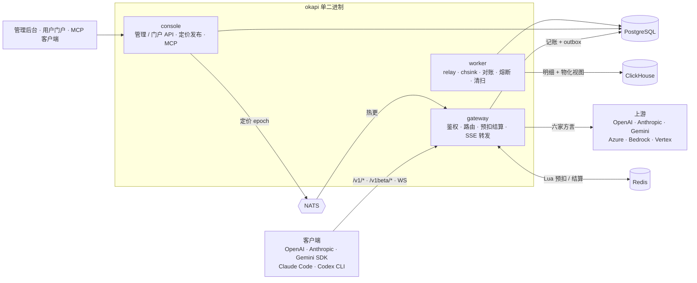

# Okapi

[](https://github.com/qiaojinxia/okapi/actions/workflows/ci.yml)

AI API 中转网关（[ok-api](https://github.com/qiaojinxia/ok-api) v2 重构）：Rust 单二进制三角色
（gateway / console / worker），倍率计费模型，PostgreSQL + Redis（+ 可选 ClickHouse / NATS），
React 19 管理后台与用户门户。

一句话：把多家上游 LLM 供应商收敛成一个 OpenAI / Anthropic / Gemini 兼容入口，按倍率精确计费，
每一分钱可解释。

## 为什么是 Okapi

- **每一分钱可解释。** 金额全程 i64 micro-USD 定点，计费路径禁浮点（CI 守卫拦截）；每笔账落一份可回放的
  `pricing_snapshot`；门户里任意一笔账单能展开成逐步算式，管理员改价前有定价模拟器预览新旧差异。
- **一个入口，四种协议互转。** 入口 OpenAI / Anthropic `/v1/messages` / Gemini / Responses，上游 OpenAI /
  Anthropic / Gemini / Azure / Bedrock / Vertex 任意组合；`reasoning_effort`、`thinking`、`reasoning:{…}`
  三种写法归一成一条内部指令再按渠道方言展开——客户端不必知道这次会路由到哪家。
- **账目安全到多副本。** Redis Lua 原子预扣 → 上游调用 → usage 结算 → PG 事件溯源 + outbox；失败原额退款；
  三方对账（事件重放 ↔ Redis 热余额 ↔ PG 快照）并可按账本修复；采集上游成本算毛利，负毛利自动熔断。
- **自用订阅凭证也能进网关。** 站长自己的 Claude Pro / Max、ChatGPT Codex 订阅经 OAuth 登录成渠道，
  token 刷新走四步锁；Claude Code / Codex CLI 直接切到网关（实验性）。
- **AI 直接管网关。** console 内置 MCP 服务（Streamable HTTP），22 个工具按 RBAC 裁剪；写操作过三道闸
  （站点总开关 + 权限点 + dry-run / confirm）。
- **单二进制，热路径干净。** `okapi gateway|console|worker|all` 一个二进制跑任意组合；gateway 只碰
  Redis 与上游，零跨服务调用。容器 8 vCPU 压测 json 10874 / stream 10402 RPS 全 0 错误，SSE 2 万条持有
  120s 无泄漏。

## 架构一图



## 功能清单

已实现的打勾；未打勾的是明确列入待办、尚未落地的项。逐项验收记录见
[IMPLEMENTATION.md](IMPLEMENTATION.md) §11 / §13，自动化用例覆盖见
[docs/verification-checklist.md](docs/verification-checklist.md)。

### 数据面：入口协议

- [x] `/v1/chat/completions` 流式 + 非流式，SSE 首字前缓冲与 failover
- [x] Anthropic `/v1/messages` 原生入口（+ `count_tokens`，x-api-key 鉴权，错误壳对齐）
- [x] Gemini `/v1beta/models/{model}:generateContent | streamGenerateContent` 原生入口（Bearer / `x-goog-api-key` / `?key=`）
- [x] `/v1/responses` 原生直转（保住 previous_response_id / 内置工具 / reasoning）+ 自动降级 ChatCompletions
- [x] `/v1/embeddings`、`/v1/rerank`（Jina / Cohere 形状）
- [x] `/v1/images/generations | edits`（per_call × n）、`/v1/audio/speech | transcriptions | translations`
- [x] `/v1/videos` 提交 / 轮询 / 下载（per_call × seconds，任务按用户隔离，上游失败退款）
- [x] OpenAI Realtime WebSocket 桥接（per-key 连接租约，断开时按累计 usage 结算）
- [x] `/pass/{channel_id}/*` 自定义透传（路径前缀白名单 + 按次计费，禁零费裸透传）
- [x] `/v1/models`、new-api 兼容余额端点 `/v1/dashboard/billing/*`
- [ ] 图片 variations；任务型异步中转（Midjourney / Suno 形态）

### 上游供应商

- [x] OpenAI / OpenAI 兼容、Anthropic、Gemini、Azure OpenAI（部署名映射）
- [x] AWS Bedrock（SigV4 或 Bedrock API key，EventStream 流解码）
- [x] Google Vertex AI（服务账号 JWT 换 token；Claude rawPredict、Gemini generateContent）
- [x] Claude Pro / Max、ChatGPT Codex 订阅凭证 OAuth 登录成渠道（实验性，只路由 chat 族）
- [x] 渠道级出站代理 + 自定义请求头；请求字段剥离 / 注入；上游响应头白名单
- [x] 上游模型发现（fetch-models）、上游余额查询、上游倍率在线同步（fetch / apply，不自动改价）
- [x] 渠道凭证 AES-GCM 信封加密、上游 URL SSRF 校验
- [ ] Bedrock 非 Anthropic 模型（Converse 转换）

### reasoning 与模型修饰符

- [x] `reasoning_effort` / `thinking` / `reasoning:{effort,max_tokens}` 三写法归一，按 openai / anthropic / gemini 方言展开
- [x] 模型名修饰符 `模型名@effort:high`、`-thinking-128` 后缀，变体可单独定价
- [x] thinking-to-content（客户端不支持 reasoning 输出时转正文）
- [x] 按上游实际响应模型计费、service_tier 档位倍率（只降不升）

### 路由与容错

- [x] 渠道池 + 优先级加权 / least_latency 策略，能力感知过滤，成本感知权重
- [x] 三层会话粘性、双层并发控制、重试矩阵（全局缺省 + 渠道级覆盖）
- [x] key 级状态机（冷却 / 限流 / 配额耗尽 / 失效）与冷却到期自动恢复
- [x] 首字前跨渠道 failover；首字后同渠道换 key 重试，不串流
- [x] 请求级路由偏好（OpenRouter 形状）、路由诊断器
- [x] 结算积压背压闸（超上界 503，不预扣不打上游）、优雅下线（SIGTERM 排水后再退出）
- [x] 多副本一致：在途计数汇总、路由失效广播、定价 epoch 热更

### 计费与账本

- [x] 三种计价模式（倍率 / 阶梯 / 按次）× 分组倍率 × 用户系数
- [x] 四类修饰器规则（量级 / 时段 / 折扣 / 负载加价），每步落快照
- [x] 缓存读 / 写双轴、音频 token 独立倍率、媒体乘数
- [x] Redis Lua 原子预扣 → usage 结算 → PG 同事务记账 + outbox
- [x] 失败原额退款、按日志退款 / 调整打标、`request_id` 幂等
- [x] 三方对账 + 按账本修复热余额；DLQ 处置
- [x] 上游成本采集与毛利、负毛利自动熔断（可手动解除）
- [x] 订阅套餐（周期配额池，订阅池优先）、余额有效期、邀请返利
- [x] 限流四件套：分组级 `[rpm, rph]`、key 级 RPD / 日 token 上限、用户×模型 RPM、无效 key 每 IP 限流
- [ ] `reserve` 侧 Redis 缺键回源兜底；gateway 微批组提交（等压测确认 PG 写瓶颈）

### 用户、身份与安全

- [x] 邮箱密码（argon2id）+ 邮件验证码 / 找回密码（SMTP）
- [x] GitHub / Discord / LinuxDO 预设 + 任意标准 OAuth2 / OIDC 自定义接入
- [x] TOTP 两步验证、Turnstile 注册风控、注册策略与邀请赠送
- [x] web 会话列举 / 单条吊销 / 一键全吊 / 会话数上限
- [x] RBAC 权限点 + 三内置角色 + 自定义角色；渠道属主 own / all；分组可见性矩阵；代客操作
- [x] Team 层（成员限额、分账、团队 key）
- [x] key 级 IP 白名单 + 转发头信任闸（信任代理 CIDR / Edge key 两模式）
- [x] 关键接口每 IP 限流（登录 / 注册 / TOTP / 兑换）
- [x] 审计日志与登录审计
- [x] 单用户模式（release 下需二次确认）
- [ ] Telegram 登录、LDAP；内容记录三态

### 运营与控制面

- [x] 渠道 / 池 / 模型 / 定价 / 规则 / 分组 / 用户 / 套餐 / 兑换码 / 团队 / 角色 全量 CRUD
- [x] 定价 epoch 发布 + NATS 广播热更；new-api 倍率 JSON 一键导入
- [x] 支付闭环：epay（支付宝 / 微信）+ Stripe Checkout，回调验签与幂等
- [x] 兑换码（限用户 / 限 IP / 兑套餐，并发核销恰一成功）、站点公告
- [x] 通知多路（webhook / email）× 事件订阅 × 频率限制
- [x] 用量分析立方体（ClickHouse）：趋势 / 拆解 / 流向三视图，质量看板，经营报表
- [x] 日志检索、对账页、缓存清理、Setup 初始化向导

### MCP（AI 远程管理）

- [x] Streamable HTTP，协议 `2025-06-18`，Bearer key 鉴权
- [x] 22 个精选工具按调用方 RBAC 过滤：普通用户 5 个只读，超管全量
- [x] 写工具三道闸：站点级总开关（缺省关）+ `mcp.write` 权限点 + dry-run / confirm 两段式

### 前端

- [x] 管理后台 + 用户门户 + 公开价格页同一 SPA，按角色分区
- [x] 账单解释器、定价模拟器、Playground 试用台（控制面同源中继）
- [x] 新手引导与接入指南；密钥一键导入 Claude Code / Codex（cc-switch）、NextChat、Cherry Studio
- [x] i18n zh-CN / en（守卫零裸文案、中英键对齐）、暗色主题、响应式
- [x] Playwright e2e：冒烟（真实 console）+ 交互（接口桩）

### 部署与迁移

- [x] 单二进制多角色，前端产物 `embed-web` 嵌入
- [x] Docker Compose 单机 / 多角色双 profile，K8s manifests（gateway HPA），Nginx SSE 反代模板
- [x] `okapi migrate newapi` / `okapi migrate okapi-old` 双源迁移（幂等、dry-run）
- [x] 压测：容器 8 vCPU json 10874 / stream 10402 RPS 全 0 错误
- [ ] 裸金属正式压测

明确不做：长尾供应商专属渠道（OpenAI 兼容通道覆盖）、订阅账号池转售、后台一键自升级、
沙盒插件运行时、内置敏感词中间件（交前置 WAF / 审核 API）。

## 本地开发

```bash
bash scripts/dev-deps.sh up     # 起 PG + Redis + CH + NATS 开发容器（不在本机装服务）
cp .env.example .env            # sqlx 编译期校验与运行时共用
bash scripts/dev-reset.sh       # 重建库 + 灌演示数据（改了 migrations 后必跑）
cargo run --bin okapi -- all    # 单进程跑齐三角色
```

控制台 http://127.0.0.1:8081（`dev-reset.sh` 会打印演示超管账号与管理 key），网关 http://127.0.0.1:8080。
改前端要热更新的话，`cd frontend && pnpm dev`，vite 会把 API 代理到 8081。

验证：

```bash
cargo test --workspace                                   # 全量用例（依赖上面的开发容器）
cargo clippy --workspace --all-targets -- -D warnings
bash scripts/guard-no-float.sh                           # 计费红线：禁浮点/禁 panic
bash scripts/guard-i18n.sh && python3 scripts/guard-i18n-keys.py   # 前端文案守卫
cd frontend && pnpm build && npx playwright test smoke   # 前端构建 + e2e 冒烟
```

分层执行入口（静态守卫 → 单元 → 集成 → e2e → 部署形态 → 性能）见 [docs/verification-checklist.md](docs/verification-checklist.md)。

## 部署

```bash
docker compose -f deploy/docker-compose.yml --profile single up -d   # 单机（okapi all）
docker compose -f deploy/docker-compose.yml --profile multi  up -d   # 多角色
kubectl apply -f deploy/k8s/okapi.yaml                                # K8s（gateway 带 HPA）
```

`deploy/nginx-sse.conf` 是前置反代模板（SSE 不缓冲、长超时、来源 IP 头归一化）。

**横向扩展前必须核两件事**：

1. **连接数**。每个 pod 各开一套 PG 池，总连接 = Σ(副本数 × `OKAPI_PG_POOL`)。
   走缺省 16 时 gateway 10 + console 2 + worker 1 就是 208 条，而 PG 缺省
   `max_connections=100`——扩到一半开始耗尽，且现象是 acquire 超时而非"连不上"。
   manifest 里已按副本上限配死（12 / 8 / 16），改 HPA 上限时记得一起改。
2. **信任来源**。不配 `OKAPI_TRUSTED_PROXIES`，转发头一律不作数（只认 socket 对端），
   `client_ip` 会变成 Ingress 的地址、key 级 IP 白名单会误拒。容器里反代与网关不同 IP，
   必须显式配网段；CDN 场景可改用 `OKAPI_EDGE_KEY`。

worker 保持单副本即可：周期任务（对账 / 清扫 / 分区 / 冷却恢复）不互斥，多副本只是重复劳动；
只有 chsink 吞吐不够时才值得加（relay/chsink 走 `SKIP LOCKED` + JetStream durable，多副本安全）。

主要环境变量见 [.env.example](.env.example)，每项都带了"为什么要有它"的注释。

## MCP 接入

console 角色内置 MCP 服务（Streamable HTTP，协议 `2025-06-18`），可直接挂到任意 MCP 客户端：

```bash
claude mcp add --transport http okapi http://127.0.0.1:8081/mcp \
  --header "Authorization: Bearer <你的 API key>"
```

工具按调用方的 RBAC 权限点过滤：普通用户 key 看到 5 个只读工具（余额 / 用量 / 密钥 /
价目 / 账单解释），超管看到 22 个（含平台 KPI、渠道健康、日志检索、对账、DLQ、全链路诊断、
建渠道 / 调余额 / 改价等写操作）。

写工具走三道闸：站点级 `mcp_write_enabled` 总开关（**缺省关**）+ `mcp.write` 权限点 +
dry-run/confirm 两段式。总开关关闭时，写工具既不出现在 `tools/list`，直接调用也会被拒。

## 文档

| 文档 | 内容 |
| --- | --- |
| [DESIGN.md](DESIGN.md) | 调研结论、倍率计费模型 v3、前端设计 |
| [IMPLEMENTATION.md](IMPLEMENTATION.md) | 选型定案、架构、里程碑与逐项验收（§11 是改动流水账） |
| [docs/database.md](docs/database.md) | 存储层唯一权威（PG / Redis / ClickHouse / NATS） |
| [docs/verification-checklist.md](docs/verification-checklist.md) | 模块 × 维度覆盖矩阵、分层执行入口与执行记录 |
| [docs/perf-report.md](docs/perf-report.md) | 压测方法与结论 |

## 工作区布局

```
crates/
  okapi-domain     # 金额（i64 micro-USD）/ tokens / 计费状态机
  okapi-pricing    # PriceBook 编译器 + 修饰器栈 + ArcSwap 热更
  okapi-ledger     # Redis Lua 预扣/结算 + PG 事件溯源 + outbox
  okapi-providers  # Provider trait + 按方向拆的协议转换 + Bedrock / Vertex / OAuth
  okapi-store      # sqlx / fred / clickhouse / async-nats 薄封装
  okapi-api        # OpenAI 兼容 DTO + 错误码 + 权限点清单
bins/okapi         # 单二进制多角色入口：okapi gateway|console|worker|all|migrate
frontend/          # React 19 SPA（管理后台 + 用户门户 + 公开价格页）
```
